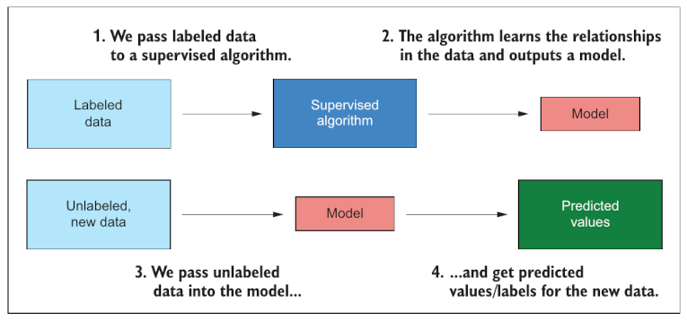
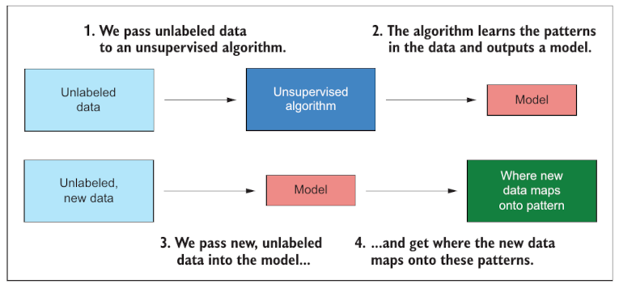
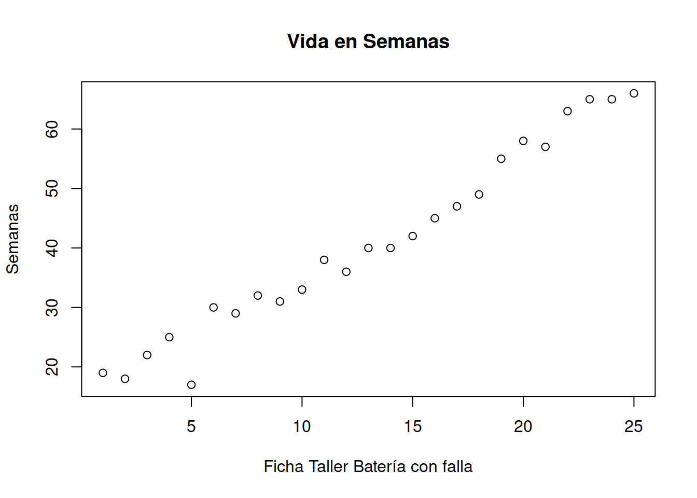
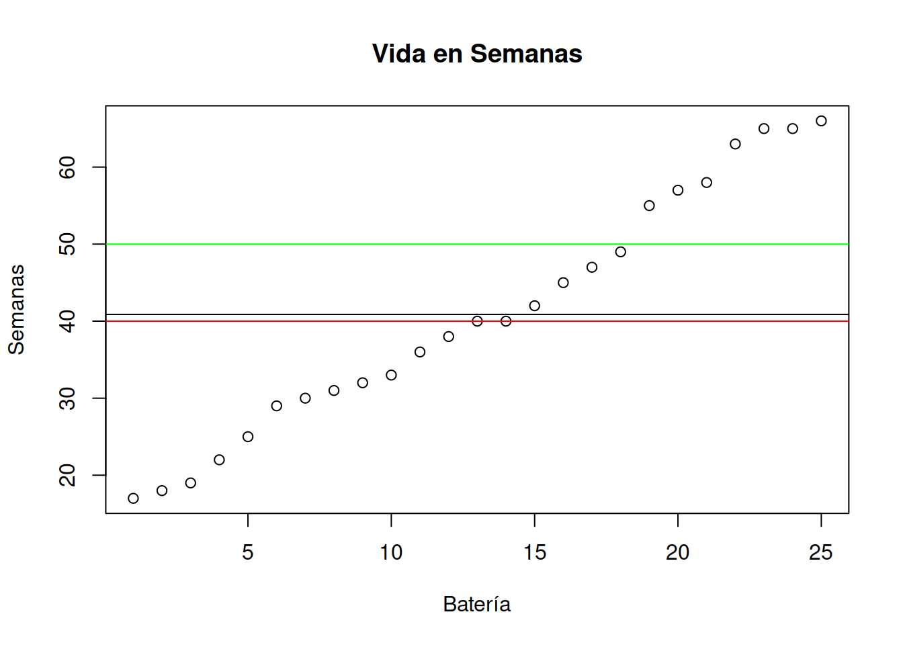
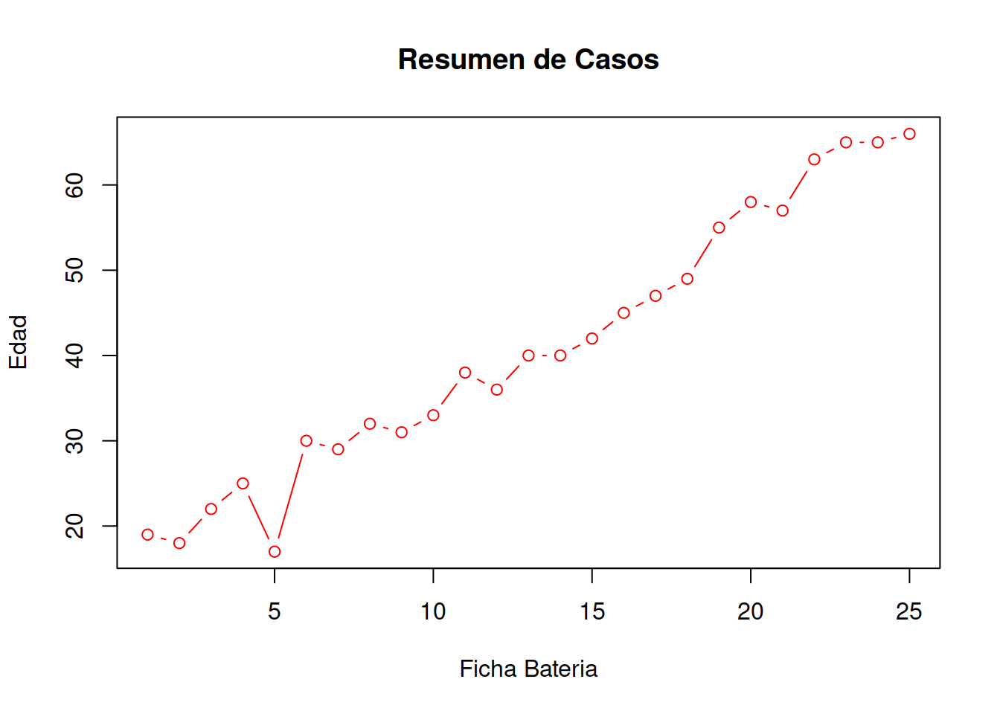
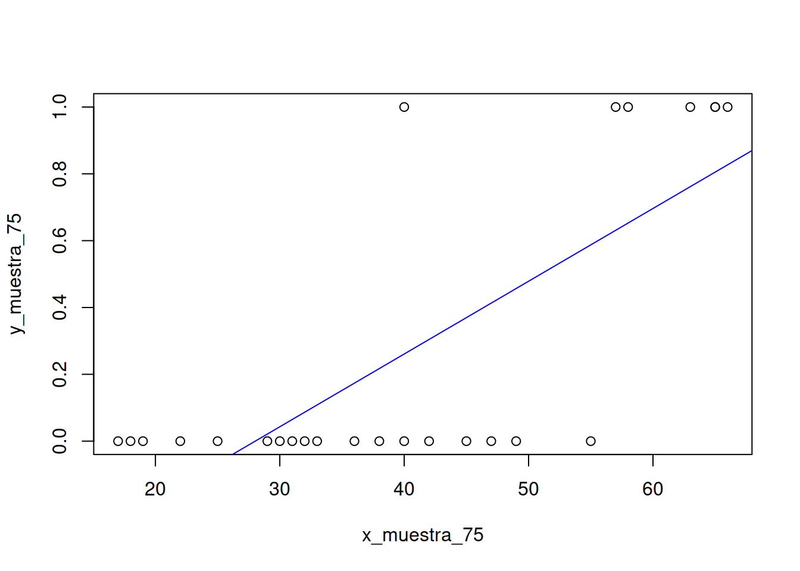
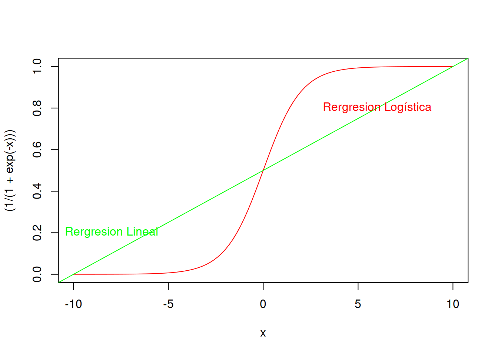

# Data_Analitics

A lo largo de este curso desarrollaremos una serie de tópicos que son novedosos y omnipresentes en la Ingeniería Industrial 4.0. Muchos de ellos han estado presente en el pasado, tales como los métodos estadísticos. Pero solamente han capturado la atención de gobiernos, academia y empresas cuando las arquitecturas del hardware, más los avances de datos disponibles en la nube han logrado superar las barreras de los estancos que los límites que el papel nos imponía. Gran parte de los cimientos de la inteligencia artificial se remontan a los años 50 del siglo XX, autores como **GEORGE BOOLE** en 1854  sentaron las bases de esta disciplina.
En 1950 **ALAN TURING** Propone en su ensayo Computing Machinery and Intelligence el Test de Turing, una prueba de comunicación verbal hombre-máquina que evalúa la capacidad de las segundas de hacerse pasar por humanos.

Luego en 1956 **JOHN MCCARTHY** El informático acuña por primera vez el término “Inteligencia Artificial”, durante la Conferencia de Darmouth, evento considerado el germen de la disciplina, para finalizar con **MARVIN MINSKY** que en 1969 escribe el libro perceptores, el trabajo fundamental del análisis de las redes neuronales artificiales.

En estos días hay dos lenguajes de propósito general que se están imponiendo en el terreno de abordar y aplicar los conceptos de **Analítica de Datos**.

El primero de ellos es *Python*, que sin dudas veras que ha tenido repercución y éxito, aún cuando no ha llegado a ser parte del Sylabus de todas las carreras de ingeniería industrial. 

El otro lengunaje, que a mi leal entender es más rápidamente asimilable con los ingenieros industriales es *R-Cran*.

## Bibliografía Recomendada


## Desambiguación de conceptos

Se suele utilizar como sinónimos, pero son diferentes conceptos

* Analítica de Datos
* Machine Learning
* Deep Learning
* Business Intelligence
* Minería de Datos
* Inteligencia Artificial

Todos ellos tienen un factor en común, el uso del un dataset, hardware y software, pero si bien tienen similitudes son bastantes distintos.

Veamos una aproximación al problema partiendo de los modelos estadísticos.



Cualquier estadístico que usemos (T-Studen, Distribución Normal, Criterio de máxima verosimilitud, etc) puede ser obordado con el uso de computadora tomando datos etiquetados (que tienen una columna que muestra de que tipo son), luego con un algoritmo apropiado podemos construir un modelo.

En analítica de datos invertimos el proceso.
Tomando datos sin etiquetar los sometemos al análisis de un modelo y predecimos que resultado de obtendría en un mundo físico a partir de los datos que son abstracción de ese mundo.

Así:

* Predecir cuando se romperá un eje
* Encontrar en que categoría de la flota sería conveniente incorporar un camión nuevo
* Determinar antes de cerrar una transacción electrónica virtual la probabilidad de fraude
* Etc.

Son ejemplos de lo que se puede hacer con analítica de datos.@ehrlinger_treating_2018



En inteligencia artificial el proceso es muy semejante. A diferencia del caso anterior no tenemos un algorítmo que puede crear el modelo en base a las etiquetas de los datos. En este caso se opera en forma no supervisada. para crear un modelo.
El resultado de la inteligencia artificial es un modelo que nos entrega datos y a partir de datos que el tomó para entrenarse y nos muestra patrones de semejanza entre los datos de entrenamiento y los de prueba.

Es una práctica habitual crear modelos de IA utilizando un dataset y remuestrear (sampling) usando el 25% de los datos para entrenar y el 75% para predecir y evaluar la calidad del modelo.

Ejemplos de este tipo de modelos son los árboles de decisión y su entrenamiento

Por último tenemos el abordaje de machine learning. [@dinh-tuan_maia_2019]


## Data Analitycs

La analítica de datos permite a las organizaciones analizar todos sus datos (en tiempo real, históricos, no estructurados, estructurados, cualitativos) para identificar patrones y generar conocimientos para informar y, en algunos casos, automatizar decisiones, conectando la inteligencia y la acción. Las mejores soluciones actuales respaldan el proceso analítico de un extremo a otro, desde el acceso, la preparación y la analítica de datos hasta la operatividad de los análisis y el seguimiento de los resultados.

Según TIBCO, la analítica de datos permite a las organizaciones transformar digitalmente su empresa y su cultura, volviéndose más innovadoras y con visión de futuro en la toma de decisiones. Más allá del monitoreo y la generación de informes tradicionales de KPI para encontrar patrones ocultos en los datos, las organizaciones potenciadas por algoritmos son los nuevos innovadores y líderes empresariales.

Al cambiar el paradigma más allá de los datos para conectar los conocimientos con la acción, las empresas podrán crear experiencias personalizadas para los clientes, crear productos digitales conectados, optimizar las operaciones y aumentar la productividad de los empleados, pero el tratamiento que asegure la calidad de la informació nes y será a aprtir de este momento un factor clave de éxito.[@lee_recent_2014]

Con la analítica colaborativa de datos, las empresas permiten que todos contribuyan al éxito empresarial, desde ingenieros de datos y científicos de datos, hasta desarrolladores y analistas empresariales, e incluso profesionales y líderes empresariales. La analítica colaborativa de datos también incentiva a quienes están dentro y fuera de una organización a conectarse y colaborar. Por ejemplo, los científicos de datos pueden trabajar en estrecha colaboración con un cliente para ayudarlo a resolver sus problemas en tiempo real utilizando la interfaz de usuario altamente colaborativa de la analítica moderna del mundo de hoy.

La analítica de datos impulsa a las empresas a avanzar mediante la introducción de algoritmos en todas partes para optimizar los momentos comerciales críticos, como un cliente que ingresa a su tienda, un equipo a punto de fallar u otros eventos que podrían significar la diferencia entre ganar o perder negocios. La analítica de datos se aplica a todas las industrias, incluidas las de servicios financieros y seguros, fabricación, energía, transporte, viajes y logística, atención médica y otras. La analítica de datos puede ayudar a predecir y manejar interrupciones, optimizar rutas, brindar un servicio proactivo al cliente, realizar ofertas inteligentes de venta cruzada, predecir fallas inminentes de equipos, administrar el inventario en tiempo real, optimizar los precios y prevenir el fraude.

## ¿Qué dimensiones engloba el concepto de AD?

* Automatización de Reportes
* Inteligencia de Negocios
* Preparción de datos (Data Wrangling)
* Visualización de Datos y Conocimiento
* Analítica Geoespacial (GIS)
* Analítica productiva (predictiva y prescriptiva)
* Machine Learning
* Analítica en tiempo real


## ¿Cómo utilizar la analítica de datos: el proceso analítico?

1. Comprenda el problema empresarial.
2. Recopile/identifique datos relevantes para el problema.
3. Prepare los datos para el análisis.
4. Analice los datos para generar conocimientos.
5. Implemente/ponga en funcionamiento los análisis y los modelos.
6. Supervise y optimice el rendimiento.

### Dataset o Información base

Tomaremos un dataset simple, que nos muestra la cantidad de semanas que un pack de baterias de un autoelevador fue capaz de tomar carga como para resistir las operaciones durante toda una jornada de trabajo sin necesidad de recargarse o ser cambiado. Fuente [apte_data_1997]

Baterias Varta 75| Edad (semanas)| Ensayo Cortocircuito |
----------------------|:----:|----------------:|
1 | 19 | 0
2 | 18 | 0
3 | 22 | 0
4 | 25 | 0
5 | 17 | 0
6 | 30 | 0
7 | 29 | 0
8 | 32 | 0
9 | 31 | 0
10| 33 | 0
11| 38 | 0
12| 36 | 0
13| 40 | 1
14| 40 | 0
15| 42 | 0
16| 45 | 0
17| 47 | 0
18| 49 | 0
19| 55 | 0
20| 58 | 1
21| 57 | 1
22| 63 | 1
23| 65 | 1
24| 65 | 1
25| 66 | 1


> Trucos:
>
> Puedes cargar los datos en un vecto con el comando **Edad_75 <- scan()** . tipea uno a uno los valores de edad y luego dos veces seguidas *Enter* para finalizar el proceso.
> 
> En los siguientes capítulos veremos como capturar de fuentes de datos como .xls

Baterias Siemens 1005| Edad (semanas) | Ensayo de Cortocircuito |
----------------------|:----:|----------------:|
1 | 19 | 0
2 | 18 | 0
3 | 22 | 0
4 | 25 | 0
5 | 17 | 0
6 | 30 | 0
7 | 29 | 0
8 | 32 | 0
9 | 31 | 0
10| 33 | 0
11| 38 | 1
12| 36 | 0
13| 40 | 1
14| 40 | 0
15| 42 | 1
16| 45 | 0
17| 47 | 1
18| 49 | 0
19| 55 | 0
20| 58 | 1
21| 57 | 1
22| 63 | 1
23| 65 | 1
24| 65 | 1
25| 66 | 1
26| 69 | 1
27| 70 | 1
28| 71 | 1
29| 75 | 1
30| 86 | 1
31| 79 | 1
32| 88 | 1
33| 89 | 0
34| 92 | 1
35| 84 | 1

## Tratamiento y captura de la información


```r
datos_75 <- c(1 , 19 , 0,
2 , 18 , 0,
3 , 22 , 0,
4 , 25 , 0,
5 , 17 , 0,
6 , 30 , 0,
7 , 29 , 0,
8 , 32 , 0,
9 , 31 , 0,
10, 33 , 0,
11, 38 , 0,
12, 36 , 0,
13, 40 , 1,
14, 40 , 0,
15, 42 , 0,
16, 45 , 0,
17, 47 , 0,
18, 49 , 0,
19, 55 , 0,
20, 58 , 1,
21, 57 , 1,
22, 63 , 1,
23, 65 , 1,
24, 65 , 1,
25, 66 , 1)
Muestra_75 <- matrix(datos_75, ncol = 3, byrow = TRUE)
Muestra_75
#>       [,1] [,2] [,3]
#>  [1,]    1   19    0
#>  [2,]    2   18    0
#>  [3,]    3   22    0
#>  [4,]    4   25    0
#>  [5,]    5   17    0
#>  [6,]    6   30    0
#>  [7,]    7   29    0
#>  [8,]    8   32    0
#>  [9,]    9   31    0
#> [10,]   10   33    0
#> [11,]   11   38    0
#> [12,]   12   36    0
#> [13,]   13   40    1
#> [14,]   14   40    0
#> [15,]   15   42    0
#> [16,]   16   45    0
#> [17,]   17   47    0
#> [18,]   18   49    0
#> [19,]   19   55    0
#> [20,]   20   58    1
#> [21,]   21   57    1
#> [22,]   22   63    1
#> [23,]   23   65    1
#> [24,]   24   65    1
#> [25,]   25   66    1
```

Obtener el la edad de la batería con nro de inventario 3


```r
Muestra_75[3,2]
#> [1] 22
```

Nos interesa saber si la vida en semanas de nuestras baterias compradas coincide con los valores publicados en el sitio web del fabricantes. Se considera que una batería tiene una vida últil mientras al aplicarle una carga completa ella pueda resistir todo el turno de 8 horas sin necesidad de ser reemplazada.


Obtener las edades de la muestra


```r
plot ((Muestra_75[ ,2]), main= "Vida en Semanas",xlab="Ficha Taller Batería con falla", ylab= "Semanas")
```



Promedio de vida

```r
vida_media_muestra <- mean(Muestra_75[,2])
vida_media_muestra
#> [1] 40.88
```


```r
plot (sort(Muestra_75[ ,2]), main= "Vida en Semanas",xlab="Batería", ylab= "Semanas")
abline(h=vida_media_muestra)
abline(h=40,col="red")
abline(h=50,col="green")
```


La línea roja muestra la duración mínima por contrato garantizada por el fabricante. La línea verde indica la duración máxima de la carga e indica si el producto conserva el electrolito original. Se puede extender la duración de la carga con otro electrolíto no original, pero no tendrá garantía del fabricante en caso de fallas.


### Muestra de Historial de Carga


```r
plot(Muestra_75[ , 1:2],main = "Resumen de Casos",xlab = "Ficha Bateria",ylab="Edad", type="b", col="RED")
```



## Histogramas de Edades


```r
hist(Muestra_75[ ,2],breaks = 10, main = "Histogramas de edades")
```


## Gráficos de Densidad

También conocido como gráfico de densidad de Kernel y gráfico de densidad de traza.

Un gráfico de densidad visualiza la distribución de datos en un intervalo o período de tiempo continuo. Este gráfico es una variación de un Histograma que usa el suavizado de cerner para trazar valores, permitiendo distribuciones más suaves al suavizar el ruido. Los picos de un gráfico de densidad ayudan a mostrar dónde los valores se concentran en el intervalo.

Una ventaja de los gráficos de densidad sobre los histogramas es que son mejores para determinar la forma de distribución porque no se ven afectados por el número de contenedores utilizados (cada barra utilizada en un histograma típico). Un histograma que consta de solo 4 compartimientos no producirá una forma de distribución lo suficientemente distinguible como lo haría un histograma de 20 compartimientos. Sin embargo, con los gráficos de densidad esto no es un problema.


La función de densidad puede calcularse fácilmene en R-Cran con el siguiente comando


```r
density(Muestra_75[ ,2])
#> 
#> Call:
#> 	density.default(x = Muestra_75[, 2])
#> 
#> Data: Muestra_75[, 2] (25 obs.);	Bandwidth 'bw' = 7.394
#> 
#>        x                y            
#>  Min.   :-5.183   Min.   :5.383e-05  
#>  1st Qu.:18.159   1st Qu.:2.474e-03  
#>  Median :41.500   Median :1.246e-02  
#>  Mean   :41.500   Mean   :1.070e-02  
#>  3rd Qu.:64.841   3rd Qu.:1.698e-02  
#>  Max.   :88.183   Max.   :2.186e-02
```
 Dado que es un objeto de R a partir del resultado de los cuantiles es posible plotear directamente la función invocada
 
 

```r
plot(density(Muestra_75[ ,2]), main = "Gráfico de Densidad", ylab="Cantidad relativa de muestras",xlab="Edad")
```


 
###  Gráfica conjunta de Histograma y Densidad 


```r
hist(Muestra_75[ ,2], # histogram
    breaks = 3,
     col="peachpuff", # column color
 border="black",
 prob = TRUE, # show densities instead of frequencies
 xlab = "Edad",
 main = "Distribución Edades de la Muestra")
lines(density(Muestra_75[ ,2]), # density plot
 lwd = 2, # thickness of line
 col = "chocolate3")
```


## Varianza de Muestra y Población

La varianza de una población está expresada por la ecuación

$$\sigma^2 = \sum_{i=1}^{n} \frac {(x_i – \mu)^2} {N}   $$


La varianza (de la muestra puede ser calculada con el comando

      var(Muestra_75[ ,2])


Dato que la muestra siempre tiene un número considerablemente menor de individuos que la población la expresión que se usa para calcular la varianza de la muestra es distinta.

Varianza de la **muestra** es 

$$ s^2 = \sum_{i=1}^{n} \frac {(x_i – \bar{x})^2} {n-1}  $$

Puede encontrarse la varianza de la población sustituyendo los valores como se indica a continuación:


```r
var_muestra <- var(Muestra_75 [ ,2])
var_muestra
#> [1] 244.61
n <- length(Muestra_75[ ,2])
n
#> [1] 25
n_over_n_1 <- n/(n-1)
n_over_n_1
#> [1] 1.041667
```
Con esto valores podemos calcular la varianza de la población con la siguiente codificación


$$ \sigma = \frac {S} {n} $$ 


```r
var_poblacion <- var(Muestra_75[ ,2]) / n
var_poblacion
#> [1] 9.7844
```

El desvio estandar de la meustra es


```r
dsm <- sd({Muestra_75[ ,2]})
dsm
#> [1] 15.64001
```
En tanto que el desvió estándar de la población es


```r
dsp <- sqrt(var_poblacion)
dsp
#> [1] 3.128003
```
Una forma más elegante de presentar estos resultados parciales puede conseguirse con el uso de la función ***sprintf()**


```r
sprintf("Varianza muestral =%s, Varianza poblacional = %s", var_muestra, var_poblacion )
#> [1] "Varianza muestral =244.61, Varianza poblacional = 9.7844"
```


Un valor que es interesante calcular para comparar con la muestra es el desvío porcentual calculado como $dsp_{\%}= \frac{dsp}{n}$


```r
dspp_75 <- dsp/n
dspp_75
#> [1] 0.1251201
```


## Repetir en análisis para la muestra Siemens 1005

::: {.blackbox data-latex=""}
::: {.center data-latex=""}
**Tarea !**
:::

Siempre comenzaremos nuestro trabajo con un análisis exploratorio básico, tal como hemos señalado.
En este caso no hemos descartado ningún individuo de la muestra, pero sería conveniente hacerlo.
El comando ***boxplot()*** te permitirá hacer una inspección rápida.
Adisionalmente prueba el comando ***summary()*** para analizar la distribución de cunatiles y datos faltantes.
::::


## Construcción de un modelo

::: {.infobox .caution data-latex="{caution}"}
**Nota!**

En esta parte comenzaremos a desarrollar un modelo.
:::

En la ficha del fabricante de baterías, se indica que el hecho de sustituir el electrolíto original por otro que no sea el oficial y que en general contiene antimonio puede ser en primera instancia considerado como un factor que prolonga la vida útil de la batería y amplía el rango de su ciclo de carga/descarga.

Sin embrago el fabricante advierte del peligro potencial de cáncer de próstata que el antimonio presenta para el personal técnico que opera las baterías y para el conductor del vehículo. 

Vale recordar que las placas de plomo tienen en su aleación antimonio y a medida que se van envejeciendo liberan antimonio al electrolito, que aún cuando sea en concentraciones bajas, son capaces de afctar la salud. Por este motivo podríamos inferir que hay una correlación entre la vida útil de las baterías y la aparición de síntomas de cáncer de próstata.


Utilizaremos una hipótesis simple. El modelo de regresión lineal podría ayudarnos a predecir para esta población a que edad deberíamos comenzar el diagnóstico de antígeno prostático en el personal afectado a las tareas que se relacionan con las baterías.

También realizaremos una comprobación basada en el modelo para saber si ha habido cambios significativos en los síntomas atribuibles al uso del antimonio.

Como se puede ver, no recurrimos aún a la medicina, pero nos planteamos una hipótesis sobre las implicancias del antimonio y la salud y el objetivo es otorgarle al médico una recomendación para que tenga una alerta temprana, sin que esto afirme o desmienta hechos científicos sobre los que no tenemos capacidad para diagnostiras enfermedades y nos limitamos a prevenirlas. 


## Hipótesis o pregunta de investigación

El proceso de investigación científica repetible parte de este tipo de premisa. Es un proceso iterativo de aproximación y revelación. [@al-abassi_industrial_2020] Comenzaremos con una pregunta de investigación. *¿Será posible utilizar un modelo de regresión lineal para entender el comportamiento de estos datos?*. Esta pregunta con el tiempo podrá ser formulada como una afirmación. Este proceso debe tener una investigación preliminar. De esteo modo podríamos expresar algo como *El modelo de regresión lineal, que es muy utilizado en inteligencia artificial podrá darme respuestas a dos preguntas clave de este problema*

1- El modelo regresión lineal puede predecir la probabilidad de aparición temprana de cáncer.
2- Es posible utilizar el modelo construido para comparar dos poblaciones.

## Bases de un modelo IA de regresión lienal

Para trabajar en este sentido R-Cran tiene posibilidades de desarrollar modelos de regresión lineal en un sólo comando. A pesar de ello construiremos un modelo desde CERO para entender como se procede en Inteligencia Artificial. [@wang_industrial_2018]

Todo modelo de regresión se basa en hallar los parámetros $a$ y $b$ de una ecuación de una recta.

$$ y = a*x + b $$

> Donde: y es un número que varía entre 1 y 0
>
> 1 señala que se trata de un caso probable positivo, en tanto que
>
> 0 señala que es poco probable la aparición de cancer.

Para poder hallar los valores de estas variable o ***parámetros del modelo*** deberíamos utilizar los datos. En realidad con solamente dos datos de la muestra podríamos encontrar una recta que pase por estos dos puntos. Lo más aconsejable es no utilizar sólo dos, sino todos los puntos. 
Esto implica plantear un problema de dos ecuaciones con dos incógnitas y en rigor el método de los mínimos cuadrados sería lo más indicado.

Siguiendo con la idea de la construcción artesanal del modelo podemos decir que encontrando un punto significativo del modelo por el que pase la recta podremos agregar alguna estrategia para hallar la pendiente y con esos datos calcular $a$ y $b$.

## Puntos significativos de modelo

Un punto significativo podría ser la moda de las edades y la moda de la variable categórica [1,0]. 
Se puede demostrar que en el modelo de regresión de los mínimos cuadrados este punto es el promedio de $\overline{x}$ y el promedio de $\overline{y}$.
Pero existen otros valores **verosímiles** (Ver criterios de máxima verosimilitud [de Ronald Fisher](https://es.wikipedia.org/wiki/M%C3%A1xima_verosimilitud)).


### Cácluo de x  e y significativos

> Valor de y verosimil


```r
index_ymax <- which.max(Muestra_75[ ,3])
ymax <- Muestra_75[index_ymax,3]

index_ymin <- which.min(Muestra_75[ ,3])
ymin <- Muestra_75[index_ymin,3]

y_sig <- (ymax-ymin) /2

y_sig 
#> [1] 0.5
```


> Valor de x verosimil


```r
index_xmax <- which.max(Muestra_75[ ,2])
xmax <- Muestra_75[index_xmax,2]
xmax
#> [1] 66
index_xmin <- which.min(Muestra_75[ ,2])
xmin <- Muestra_75[index_xmin,2]
xmin
#> [1] 17

x_sig <- (xmax-xmin)

x_sig 
#> [1] 49
```

El punto de coordenadas [24.5 , 0.5] es un punto por el que debe pasar la recta que construiremos.

### Cáclulo de la pendiente

em valor $a$ representa la pendiente de la recta. De modo que con los $\Delta{x}$ y $\Delta{y}$ podremos calcularlo facilmente


```r
a <- ((ymax-ymin)/(xmax-xmin))
a
#> [1] 0.02040816
```
> $a$ = valor de la pendiente es 0.02040816

Pendiente en grados


```r
atan(a)
#> [1] 0.02040533
```


### Cáclulo de la ordenada al origen.

Para calcular la ordenada al origen basta con poner $x=\overline{x}$ del punto significativo que hemos adoptado en la formula de la recta usando el $a$ calculado y despejar $b$

$$ y = a *x +b$$
$$ b = y-a*x$$
Cáclulo de b


```r
y_sig
#> [1] 0.5
x_sig
#> [1] 49
a
#> [1] 0.02040816

b <- y_sig-(a*x_sig)
b
#> [1] -0.5
```
### Gráfica


```r
plot(Muestra_75[ ,2],Muestra_75[ ,3], main = "Dignóstico Preliminar", ylab="Diagnóstico + -", xlab="Edad")
abline(h=y_sig, col="red")
abline(v=x_sig,col="red")
abline(b,a)
```


## Modelo de regresión lineal generalizado

En realidad este trabajo que hemos hecho puede ser realizado con solamente un comando en R-Cran. 

Construiremos el dataset

```r
x_muestra_75 <- Muestra_75[ ,2]
y_muestra_75 <- Muestra_75[ ,3]
mrlg <- as.data.frame( cbind(x_muestra_75,y_muestra_75))
```

Construcción del modelo lineal


```r
mi_formula <- y_muestra_75 ~ x_muestra_75
modelo_2 <-  lm (mi_formula, data=mrlg)
modelo_2
#> 
#> Call:
#> lm(formula = mi_formula, data = mrlg)
#> 
#> Coefficients:
#>  (Intercept)  x_muestra_75  
#>     -0.61021       0.02178
modelo_2$coefficients[2]
#> x_muestra_75 
#>   0.02177616
modelo_2$coefficients[1]
#> (Intercept) 
#>  -0.6102094
```
Como vemos nos dice que la ordenada al origen es  -0.610 y la pendiente es 0.021 muy parecidas a los valores $a$ y $b$ que obtuvimos antes.


```r
plot(mrlg)
abline(modelo_2,col="blue")
```




## Modelo de regresión logística

Una de las cosas destacables del uso de IA es que puedo recurrir a muchos modelos para interpretar o predecir el comportamiento de los datos. Puedo generar **(entrenar)** el modelo o modelos y utilizar algún mecanismo de medición de la calidad de cada modelo y en base a ello utilizar IA para seleccionar el que más se adapta a ***mis datos***.

Hay una distribución de probabilidades llamada *Distribución Logística* que puede utilizarse (del mismo modo que la distribución lineal se usa para el modelo de regresión lineal generalizado) para armar una regresión lineal logística.

La forma típica de la distribución logística normalizada tiene la siguiente ecuación paramétrica y luce como se ve en el ejemplo.

$$ \sigma(x)= \frac{e^x}{(e^x+1)} = \frac{1}{1+e^{-x}}$$


```r
curve((1/(1+exp(-x))),-10,10,col ="red")
abline(0.5,0.05,col="green")
text(-8,0.2,"Rergresion Lineal",col="green")
text(6,0.8,"Rergresion Logística",col="red")
```



Como pude verse el modelo de regresión logística es mas sensible a los datos y proporcional resultados más verosímiles, pero aún mantienen error admisible. De todos modos esta análisis visual nos indica que ya tenemos una alternativa que es mejor que nuestro modelo lineal inicial.

La función de distribución de probabilidad acumulada de la regresión logística es:

$$g(F(x))=  ln \left[ \frac{F(x)}{1-F(x)} \right] = \beta^0 + \beta_1*x $$
Al igual que en la regresión lineal es posible (aplicando logaritmos) encontrar los parámetros $\beta_0$ y $\beta_1$ con solamente cuatro datos en la muestra. El error será inadmisible, pero es algo parecido a armar una regresión lineal con sólo dos muestras. 


