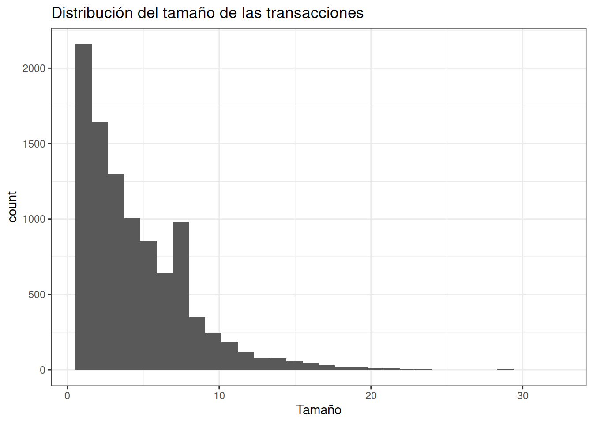
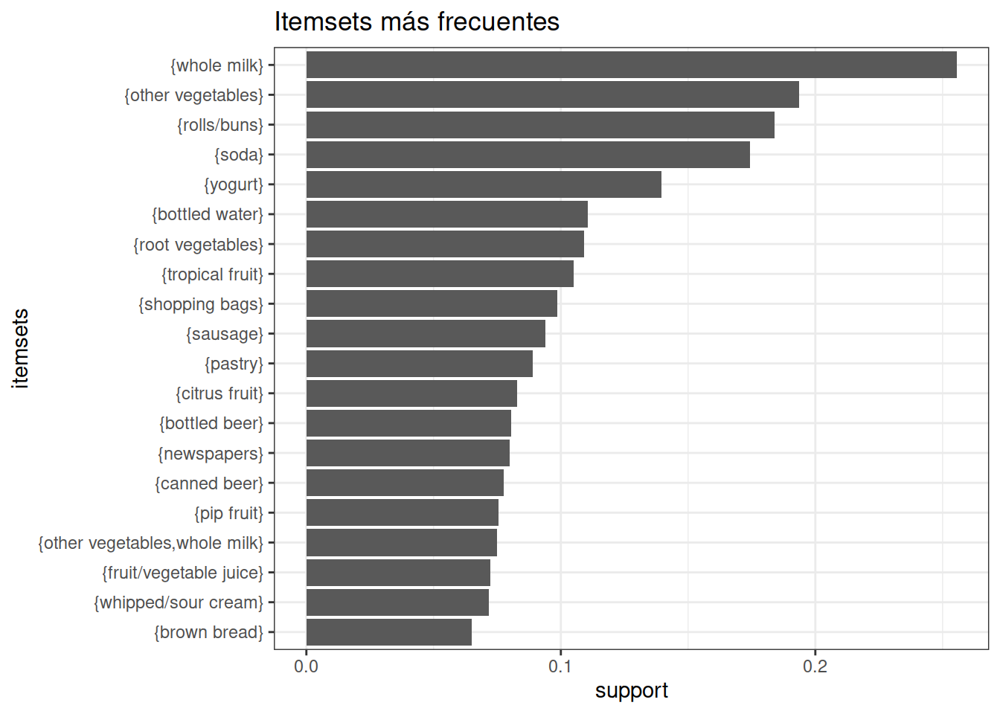
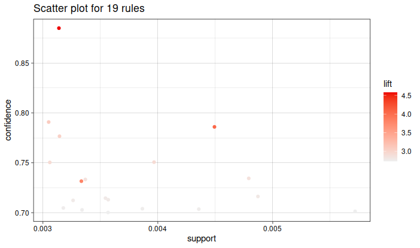
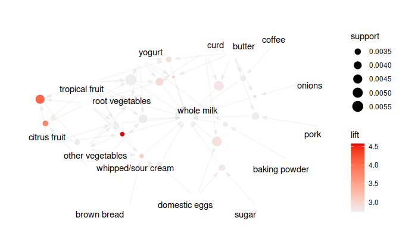

# Patrones de asociación

## Introducción


Los algoritmos de reglas de asociación tienen como objetivo encontrar relaciones dentro un conjunto de transacciones, en concreto, items o atributos que tienden a ocurrir de forma conjunta. En este contexto, el término transacción hace referencia a cada grupo de eventos que están asociados de alguna forma, por ejemplo:

* El pedido de la compra en un supermercado.

* Los libros que compra un cliente en una librería.

* Las páginas web visitadas por un usuario.

* Las características que aparecen de forma conjunta.

* Cómo ordenar los repuestos en el almacén de un taller de mantenimiento

* Disposición de insumos para la ayuda humanitaria

* El protfolio de iniciativas de innovación (Metodo TRIZ)


## Formatos del dataset

Los datos que se necesitan pueden venir especificados en dos formatos denominados lista corta o lista larga (matricial)

### Lista corta


```r
datos_crudo <- c(1,1,1,2,2,3,3,"5W40","Filtro Aceite","Filtro Aire","Correa Distr","Bomba de Agua","Filtro Nafta","Limpia Inyectores")
lista_corta <- matrix(datos_crudo,ncol=2, byrow=FALSE)
dimnames(lista_corta) <- list(salida = c(1,2,3,4,5,6,7) , producto = c("ticket","producto") )
lista_corta
#>       producto
#> salida ticket producto           
#>      1 "1"    "5W40"             
#>      2 "1"    "Filtro Aceite"    
#>      3 "1"    "Filtro Aire"      
#>      4 "2"    "Correa Distr"     
#>      5 "2"    "Bomba de Agua"    
#>      6 "3"    "Filtro Nafta"     
#>      7 "3"    "Limpia Inyectores"
```

Este el el formato utilizado habitualmente por las bases de datos de salida de almacenes, especialmente utilizado en los archivos csv de SAP.


### Lista corta


```r
datos_m <- c(1,1,1,0,0,0,0, 0,0,0,1,1,0,0, 0,0,0,0,0,1,1)
lista_larga <- matrix(datos_m,nrow=3,byrow=TRUE)
lista_larga
#>      [,1] [,2] [,3] [,4] [,5] [,6] [,7]
#> [1,]    1    1    1    0    0    0    0
#> [2,]    0    0    0    1    1    0    0
#> [3,]    0    0    0    0    0    1    1
dimnames(lista_larga) <- list(ticket = c(1,2,3) , producto = c("5W40","Filtro Aceite","Filtro Aire","Correa Distr","Bomba de Agua","Filtro Nafta","Limpia Inyectores"))

lista_larga
#>       producto
#> ticket 5W40 Filtro Aceite Filtro Aire Correa Distr
#>      1    1             1           1            0
#>      2    0             0           0            1
#>      3    0             0           0            0
#>       producto
#> ticket Bomba de Agua Filtro Nafta Limpia Inyectores
#>      1             0            0                 0
#>      2             1            0                 0
#>      3             0            1                 1
```


A cada uno de los eventos o elementos que forman parte de una transacción (ticket) se le conoce como item y a un conjunto de ellos itemset. Una transacción puede estar formada por uno o varios items, en el caso de ser varios, cada posible subconjunto de ellos es un itemset distinto. Por ejemplo, la transacción $T = {A,B,C}$ está formada por 3 items **(A, B y C)** y sus posibles itemsets son: *{A,B,C}, {A,B}, {B,C}, {A,C}, {A}, {B} y {C}*.

Una regla de asociación se define como una implicación del tipo “si $X entonces Y” (X⇒Y
)$, donde $X e Y$ son itemsets o items individuales. El lado izquierdo de la regla recibe el nombre de antecedente o lenft-hand-side (LHS) y el lado derecho el nombre de consecuente o right-hand-side (RHS). Por ejemplo, la regla *{A,B} => {C}* significa que, cuando ocurren A y B, también ocurre C.

Existen varios algoritmos diseñados para identificar itemsets frecuentes y reglas de asociación. A continuación, se describen algunos de los más utilizados.


## Apriori


Apriori fue uno de los primeros algoritmos desarrollados para la búsqueda de reglas de asociación y sigue siendo uno de los más empleados, tiene dos etapas:

Identificar todos los itemsets que ocurren con una frecuencia por encima de un determinado límite (itemsets frecuentes).

Convertir esos itemsets frecuentes en reglas de asociación.

Con la finalidad de ilustrar el funcionamiento del algoritmo, se emplea un ejemplo sencillo. Supóngase la siguiente base de datos de un centro comercial en la que cada fila es una transacción. En este caso, el término transacción hace referencia a todos los productos comprados bajo un mismo ticket (misma cesta de la compra). Las letras A, B, C y D hacen referencia a 4 productos (items) distintos.

## Transacción

* {A, B, C, D}
* {A, B, D}
* {A, B}
* {B, C, D}
* {B, C}
* {C, D}
* {B, D}

Antes de entrar en los detalles del algoritmo, conviene definir una serie de conceptos:

Soporte: El soporte del item o itemset X es el número de transacciones que contienen X dividido entre el total de transacciones.

$$ Sop_x = \frac{itemset_x}{itemset_{total}}$$

Confianza: La confianza de una regla “Si X entonces Y” se define acorde a la ecuación

$$confianza(X=>Y)=\frac{soporte(unión(X,Y))}{soporte(X)},$$
donde unión(XY) es el itemset que contienen todos los items de X y de Y. La confianza se interpreta como la probabilidad $P(Y|X)$, es decir, la probabilidad de que una transacción que contiene los items de $X$, también contenga los items de $Y$.


Volviendo al ejemplo del centro comercial, puede observarse que, el artículo A, aparece en 3 de las 7 transacciones, el artículo B en 6 y ambos artículos juntos en 3. El soporte del item {A} es por lo tanto del 43%, el del item {B} del 86% y del itemset {A, B} del 43%. De las 3 transacciones que incluyen A, las 3 incluyen B, por lo tanto, la regla “clientes que compran el artículo A también compran B”, se cumple, acorde a los datos, un 100% de las veces. Esto significa que la confianza de la regla {A => B} es del 100%.

Encontrar itemsets frecuentes (itemsets con una frecuencia mayor o igual a un determinado soporte mínimo) no es un proceso trivial debido la explosión combinatoria de posibilidades, sin embargo, una vez identificados, es relativamente directo generar reglas de asociación que presenten una confianza mínima. El algoritmo Apriori hace una búsqueda exhaustiva por niveles de complejidad (de menor a mayor tamaño de itemsets). Para reducir el espacio de búsqueda aplica la norma de “si un itemset no es frecuente, ninguno de sus supersets (itemsets de mayor tamaño que contengan al primero) puede ser frecuente”. Visto de otra forma, si un conjunto es infrecuente, entonces, todos los conjuntos donde este último se encuentre, también son infrecuentes. Por ejemplo, si el itemset {A,B} es infrecuente, entonces, {A,B,C} y {A,B,E} también son infrecuentes ya que todos ellos contienen {A,B}.

El funcionamiento del algoritmo es sencillo, se inicia identificando los items individuales que aparecen en el total de transacciones con una frecuencia por encima de un mínimo establecido por el usuario. A continuación, se sigue una estrategia bottom-up en la que se extienden los candidatos añadiendo un nuevo item y se eliminan aquellos que contienen un subconjunto infrecuente o que no alcanzan el soporte mínimo. Este proceso se repite hasta que el algoritmo no encuentra más ampliaciones exitosas de los itemsets previos o cuando se alcanza un tamaño máximo.

Se procede a identificar los itemsets frecuentes y, a partir de ellos, crear reglas de asociación.

Transacción

* {A, B, C, D}
* {A, B, D}
* {A, B}
* {B, C, D}
* {B, C}
* {C, D}
* {B, D}

Para este problema se considera que un item o itemset es frecuente si aparece en un mínimo de 3 transacciones, es decir, su soporte debe de ser igual o superior a 3/7 = 0.43. Se inicia el algoritmo identificando todos los items individuales (itemsets de un único item) y calculando su soporte.

**Itemset (k=1)	Ocurrencias	Soporte**

Itemset | Ocurrencia | Soporte
--------+------------+---------
{A}|	3|	0.43
{B}|	6|	0.86
{C}|	4|	0.57
{D}|	5|	0.71


Todos los itemsets de tamaño k = 1 tienen un soporte igual o superior al mínimo establecido, por lo que todos superan la fase de filtrado (poda).

A continuación, se generan todos los posibles itemsets de tamaño k = 2 que se pueden crear con los itemsets que han superado el paso anterior y se calcula su soporte.

Itemset (k=2)	Ocurrencias	Soporte

Itemset | Ocurrencia | Soporte
--------+------------+---------
{A, B}|	3	|0.43
{A, C}|	1	|0.14
{A, D}|	2	|0.29
{B, C}|	3	|0.43
{B, D}|	4	|0.57
{C, D}|	3	|0.43

Los itemsets {A, B}, {B, C}, {B, D} y {C, D} superan el límite de soporte, por lo que son frecuentes. Los itemsets {A, C} y {A, D} no superan el soporte mínimo por lo que se descartan. Además, cualquier futuro itemset que los contenga también será descartado ya que no puede ser frecuente por el hecho de que contiene un subconjunto infrecuente.

Itemset (k=2)	Ocurrencias	Soporte

Itemset | Ocurrencia | Soporte
--------+------------+---------
{A, B}|	3	|0.43
{B, C}|	3	|0.43
{B, D}|	4	|0.57
{C, D}|	3	|0.43

Se repite el proceso, esta vez creando itemsets de tamaño k = 3.

Itemset (k=3)

Itemset | Ocurrencia | Soporte
--------+------------+---------
{A, B, C} | etc.    |etc.
{A, B, D} |         |
{B, C, D} |         |
{C, D, A} |         |


Los itemsets {A, B, C}, {A, B, D} y {C, D, A} contienen subconjuntos infrecuentes, por lo que son descartados. Para los restantes se calcula su soporte.

Itemset (k=3)	Ocurrencias	Soporte

Itemset | Ocurrencia | Soporte
--------+------------+---------
{B, C, D}|	2	|0.29


El items {B, C, D} no supera el soporte mínimo por lo que se considera infrecuente. Al no haber ningún nuevo itemset frecuente, se detiene el algoritmo.

Como resultado de la búsqueda se han identificado los siguientes itemsets frecuentes:

Itemset frecuentes

* {A, B}
* {B, C}
* {B, D}
* {C, D}

El siguiente paso es crear las reglas de asociación a partir de cada uno de los itemsets frecuentes. De nuevo, se produce una explosión combinatoria de posibles reglas ya que, de cada itemset frecuente, se generan tantas reglas como posibles particiones binarias. En concreto, el proceso seguido es el siguiente:

Por cada itemset frecuente I, obtener todos los posibles subsets de I.

1.1 Para cada subset s de I, crear la regla $“s => (I-s)”$

Descartar todas las reglas que no superen un mínimo de confianza.

Supóngase que se desean únicamente reglas con una confianza igual o superior a 0.7, es decir, que la regla se cumpla un 70% de las veces. Tal y como se describió anteriormente, la confianza de una regla se calcula como el soporte del itemset formado por todos los items que participan en la regla, dividido por el soporte del itemset formado por los items del antecedente.

## Reglas	Confianza	Confianza

Regla      | Ecuación                  | Valor
-----------+---------------------------+--------------------
{A} => {B}|	soporte{A, B} / soporte {A}|	0.43 / 0.43 = 1
{B} => {A}|	soporte{A, B} / soporte {B}|	0.43 / 0.86 = 0.5
{B} => {C}|	soporte{B, C} / soporte {B}|	0.43 / 0.86 = 0.5
{C} => {B}|	soporte{B, C} / soporte {C}|	0.43 / 0.57 = 0.75
{B} => {D}|	soporte{B, D} / soporte {B}|	0.43 / 0.86 = 0.5
{D} => {B}|	soporte{B, D} / soporte {D}|	0.43 / 0.71 = 0.6
{C} => {D}|	soporte{C, D} / soporte {C}|	0.43 / 0.57 = 0.75
{D} => {C}|	soporte{C, D} / soporte {D}|	0.43 / 0.71 = 0.6

De todas las posibles reglas, únicamente {C} => {D} y {C} => {B} superan el límite de confianza.


La principal desventaja de algoritmo Apriori es el número de veces que se tienen que escanear los datos en busca de los itemsets frecuentes, en concreto, el algoritmo escanea todas las transacciones un total de kmax
+1, donde:

**kmax**  es el tamaño máximo de itemset permitido. Esto hace que el algoritmo Apriori no pueda aplicarse en situaciones con millones de registros, sin embargo, se han desarrollado adaptaciones (FP-growth, Eclat, Hash-Based, partitioning, etc) que solucionan esta limitación.


## FP-Growth


Los investigadores Han et al. propusieron en el 2000 un nuevo algoritmo llamado FP-Growth que permite extraer reglas de asociación a partir de itemsets frecuentes pero, a diferencia del algoritmo Apriori, estos se identifican sin necesidad de generar candidatos para cada tamaño.

En términos generales, el algoritmo emplea una estructura de árbol (Frequent Pattern Tree) donde almacena toda la información de las transacciones. Esta estructura permite comprimir la información de una base de datos de transacciones hasta 200 veces, haciendo posible que pueda ser cargada en memoria RAM. Una vez que la base de datos ha sido comprimida en una estructura FP-Tree, se divide en varias bases de datos condicionales, cada una asociada con un patrón frecuente. Finalmente, cada partición se analiza de forma separada y se concatenan los resultados obtenidos. En la mayoría de casos, FP-Growth es más rápido que Apriori.


## Eclat


En el 2000, Zaki propuso un nuevo algoritmo para encontrar patrones frecuentes (itemsets frecuentes) llamado Equivalence Class Transformation (Eclat). La principal diferencia entre este algoritmo y Apriori es la forma en que se escanean y analizan los datos. El algoritmo Apriori emplea transacciones almacenadas de forma horizontal, es decir, todos los elementos que forman una misma transacción están en la misma línea. El algoritmo Eclat, sin embargo, analiza las transacciones en formato vertical, donde cada línea contiene un item y las transacciones en las que aparece ese item.

Para ilustrar el funcionamiento del algoritmo Eclat, se muestra un ejemplo simplificado. La siguiente tabla contiene la información de las transacciones en formato horizontal. El soporte mínimo para considerar un itemset frecuente es del 20%.


Transacción	| Items
------------+------
T1|	i4,i5
T2|	i1,i3,i4,i5
T3|	i1,i3,i5
T4|	i3,i4
T5|	i3,i4
T6|	i4,i5
T7|	i2,i3,i5
T8|	i2,i5
T9|	i3,i4,i5

En primer lugar, el algoritmo identifica los items que aparecen en el conjunto de todas las transacciones y los emplea para crear la primera columna de una nueva tabla. A continuación, se añade a cada item el identificador de las transacciones en las que aparece y se calcula su soporte. La siguiente tabla muestra el resultado de reestructurar los datos de formato horizontal a vertical.

Itemset (k = 1)	Transacciones	Soporte

Itemset | Ocurrencia | Soporte
--------+------------+---------
{i1}|	T2,T3|	0.22
{i2}|	T7,T8|	0.22
{i3}|	T2,T3,T4,T5,T7,T9|	0.66
{i4}|	T1,T2,T4,T5,T6,T9|	0.66
{i5}|	T1,T2,T3,T6,T7,T8,T9|	0.77

Calculando todas las posibles intersecciones de la columna Transacciones de la tabla k=1 se obtienen los itemsets de longitud k+1.

Itemset (k = 2)	Transacciones	Soporte

Itemset | Ocurrencia | Soporte
--------+------------+---------
{i1,i3}|	T2,T3|	0.22
{i1,i4}|	T2|	0.11
{i1,i5}|	T2,T3|	0.22
{i2,i3}|	T7|	0.11
{i2,i5}|	T7,T8|	0.22
{i3,i4}|	T2,T4,T5,T9|	0.44
{i3,i5}|	T2,T3,T7,T9|	0.44
{i4,i5}|	T1,T2,T6,T9|	0.44

De nuevo, con las intersecciones de las transacciones de la tabla Itemset (k = 2) se obtienen los itemsets k = 3. Gracias al principio downward closure, no es necesario realizar la intersección de {i1,i5} e {i4,i5} ya que {i1,i4} no es frecuente y por lo tanto tampoco lo es {i1,i4,i5}.

Itemset (k = 3)	Transacciones	Soporte

Itemset | Ocurrencia | Soporte
--------+------------+---------
{i1,i3,i5}|	T2,T3|	0.22
{i3,i4,i5}|	T2,T9|	0.22

El algoritmo finaliza cuando no hay más itemsets frecuentes.

Cabe destacar que, el algoritmo Eclat, permite la identificación de itemsets frecuentes pero no genera reglas de asociación. A pesar de ello, una vez identificados los itemsets frecuentes, se puede aplicar la segunda parte del algoritmo Apriori para obtenerlas.


## Arules package de R-Cran


El paquete de R arules implementa el algoritmo Apriori para la identificación de itemsets frecuentes y la creación de reglas de asociación a través de la función apriori(). También implementa el algoritmo Eclat con la función eclat().

Tanto $apriori()$ como $eclat()$ reciben como argumento un objeto transaction con los datos de las transacciones, un argumento parameter que determina las características de los itemsets o reglas generadas (por ejemplo, el soporte mínimo) y un argumento control que determina el comportamiento del algoritmo (por ejemplo, ordenación de los resultados). La función apriori() también se incluye el argumento aparence que impone restricciones sobre las reglas generadas, por ejemplo, crear solo reglas que contengan un determinado item. El resultado de ambas funciones es un objeto de tipo association que puede ser manipulado con toda una serie de funciones que ofrece arules. Entre las principales destacan:

**summary():** muestra un resumen de los resultados.

**inspect():** muestra los resultados.

**length():** número de elementos (reglas o itemsets) almacenados.

**items():** extrae los items que forman un itemset o una regla. En el caso de reglas, combina los items de antecedente (LHS) y del consecuente (RHS). .

**sort():** ordena los resultados.

**subset:** filtrado de los resultados.


## Ejemplo ticket de supermercado


Supóngase que se dispone del registro de todas las compras que se han realizado en un supermercado. El objetivo del análisis es identificar productos que tiendan a comprarse de forma conjunta para así poder situarlos en posiciones cercanas dentro de la tienda y maximizar la probabilidad de que los clientes compren.

Para este ejemplo se emplea el set de datos Groceries del paquete arules, que contiene un registro de todas las ventas realizadas por un supermercado durante 30 días. En total se dispone de 9835 transacciones formadas por combinaciones de 169 productos. El objeto Groceries almacena la información en un formato propio de este paquete (descrito más adelante). Para representar mejor lo que suele ocurrir en la práctica, se ha reestructurado la información en formato de tabla. Los datos pueden encontrarse en Github.


```r
library(tidyverse)
#> ── Attaching packages ─────────────────── tidyverse 1.3.1 ──
#> ✔ ggplot2 3.4.2     ✔ purrr   1.0.1
#> ✔ tibble  3.2.1     ✔ dplyr   1.1.1
#> ✔ tidyr   1.3.0     ✔ stringr 1.5.0
#> ✔ readr   2.1.2     ✔ forcats 0.5.1
#> ── Conflicts ────────────────────── tidyverse_conflicts() ──
#> ✖ dplyr::filter() masks stats::filter()
#> ✖ dplyr::lag()    masks stats::lag()
library(readr)
datos <- read_csv("https://themys.sid.uncu.edu.ar/rpalma/R-cran/Analitica_Industrial/datos_groceries.csv")
#> Rows: 43367 Columns: 2
#> ── Column specification ────────────────────────────────────
#> Delimiter: ","
#> chr (1): item
#> dbl (1): id_compra
#> 
#> ℹ Use `spec()` to retrieve the full column specification for this data.
#> ℹ Specify the column types or set `show_col_types = FALSE` to quiet this message.

# datos <- read_csv(file = "datos_groceries.csv", col_names = TRUE)
head(datos)
#> # A tibble: 6 × 2
#>   id_compra item               
#>       <dbl> <chr>              
#> 1         1 citrus fruit       
#> 2         1 semi-finished bread
#> 3         1 margarine          
#> 4         1 ready soups        
#> 5         2 tropical fruit     
#> 6         2 yogurt
```


Cada línea del archivo contiene la información de un item y el identificador de la transacción (compra) a la que pertenece. Esta es la estructura en la que comúnmente se almacenan los datos dentro de una base de datos y que, en el ámbito de las transacciones, recibe el nombre de tabla larga o single. Otra forma en la que se pueden encontrar los datos de transacciones es en formato matriz o tabla ancha, en el que cada fila contiene todos los items que forman parte de una misma transacción, este formato recibe el nombre de cesta o basket.

Tal y como se ha definido previamente, el concepto de transacción hace referencia al conjunto de items o eventos que ocurren de forma conjunta. Para este caso de estudio, compras de supermercado, cada transacción está formada por todos los productos que se compran a la vez, es decir, el vínculo de unión no es el cliente sino cada una de las “cestas de la compra”. Por ejemplo, la transacción con id_compra == 14 está formada por 3 items.


```r
datos %>% filter(id_compra == 14) %>% pull(item)
#> [1] "frankfurter" "rolls/buns"  "soda"
```


### Lectura de datos


Con la función read.transactions() se pueden leer directamente los datos de archivos tipo texto y almacenarlos en un objeto de tipo transactions, que es la estructura de almacenamiento que emplea arules. Esta función tiene los siguientes argumentos:

**file:** nombre del archivo que se quiere leer.

**format:** estructura en la que se encuentran almacenados los datos, “basket” si cada línea del archivo es una transacción completa, o “single” si cada línea representa un item.

**sep:** tipo de separación de los campos.

**cols:** si el formato es de tipo “basket”, un entero que indica la columna que contiene el identificador de las transacciones. Para el formato “single”, es un vector con los nombres (o posiciones) de las dos columnas que identifican las transacciones y los items, respectivamente.

**rm.duplicates:** valor lógico indicando si se eliminan los items duplicados en una misma transacción. Por lo general, es conveniente eliminarlos, el interés suele estar en qué items ocurren de forma conjunta, no en qué cantidad.

**quote:** carácter que se utiliza como comillas.

**skip:** número de líneas que hay que saltar desde el comienzo del fichero.

Es importante recordar que los objetos de tipo transactions solo trabajan con información booleana, es decir, con la presencia o no de cada uno de los items en la transacción. Por lo tanto, si el set de datos contiene variables numéricas, estas deben de ser discretizadas en intervalos o niveles. Para discretizar una variable numérica, se puede emplear la función discretize() o bien otras alternativas como la función case_when() del paquete dplyr.

Los objetos transactions, se almacenan internamente como un tipo de matriz binaria. Se trata de una matriz de valores 0/1, con una fila por cada transacción, en este caso cada compra, y una columna por cada posible item, en este caso productos. La posición de la matriz (i,j) tiene el valor 1 si la transacción i contiene el item j.


```r
# IMPORTACIÓN DIRECTA DE LOS DATOS A UN OBJETO TIPO TRANSACTION
# ==============================================================================
library(arules)
#> Loading required package: Matrix
#> 
#> Attaching package: 'Matrix'
#> The following objects are masked from 'package:tidyr':
#> 
#>     expand, pack, unpack
#> 
#> Attaching package: 'arules'
#> The following object is masked from 'package:dplyr':
#> 
#>     recode
#> The following objects are masked from 'package:base':
#> 
#>     abbreviate, write
transacciones <- read.transactions(file = "datos_groceries.csv",
                                   format = "single",
                                   sep = ",",
                                   header = TRUE,
                                   cols = c("id_compra", "item"),
                                   rm.duplicates = TRUE)
transacciones
#> transactions in sparse format with
#>  9835 transactions (rows) and
#>  169 items (columns)

colnames(transacciones)[1:5]
#> [1] "abrasive cleaner" "artif. sweetener" "baby cosmetics"  
#> [4] "baby food"        "bags"

rownames(transacciones)[1:5]
#> [1] "1"    "10"   "100"  "1000" "1001"
```


También es posible convertir un objeto dataframe en uno de tipo transactions con la función as(dataframe, "transactions"). Para lograrlo, primero hay que convertir el dataframe en una lista en la que cada elemento contiene los items de una transacción. Este proceso puede ser muy lento si el dataframe tiene muchos registros, por lo que suele ser mejor crear un archivo de texto con los datos e importarlo mediante read.transactions().


```r
# CONVERSIÓN DE UN DATAFRAME A UN OBJETO TIPO TRANSACTION
# ==============================================================================
# Se convierte el dataframe a una lista en la que cada elemento  contiene los
# items de una transacción
datos_split <- split(x = datos$item, f = datos$id_compra)
transacciones <- as(datos_split, Class = "transactions")
transacciones
#> transactions in sparse format with
#>  9835 transactions (rows) and
#>  169 items (columns)
```

Otra alternativa es convertir el dataframe en una matriz 0/1 en la que cada fila es una transacción y cada columna uno de los posibles items.


```r


# CONVERSIÓN DE UNA MATRIZ A UN OBJETO TIPO TRANSACTION
# ==============================================================================
datos_matriz <- datos %>%
                as.data.frame() %>%
                mutate(valor = 1) %>%
                spread(key = item, value = valor, fill = 0) %>%
                column_to_rownames(var = "id_compra") %>%
                as.matrix()
transacciones <- as(datos_matriz, Class = "transactions")
transacciones
#> transactions in sparse format with
#>  9835 transactions (rows) and
#>  169 items (columns)
```


Exploración de items


Uno de los primeros análisis que conviene realizar cuando se trabaja con transacciones es explorar su contenido y tamaño, es decir, el número de items que las forman y cuáles son. Mediante la función inspect() se muestran los items que forman cada transacción.


```r
inspect(transacciones[1:5])
#>     items                       transactionID
#> [1] {citrus fruit,                           
#>      margarine,                              
#>      ready soups,                            
#>      semi-finished bread}                   1
#> [2] {coffee,                                 
#>      tropical fruit,                         
#>      yogurt}                                2
#> [3] {whole milk}                            3
#> [4] {cream cheese,                           
#>      meat spreads,                           
#>      pip fruit,                              
#>      yogurt}                                4
#> [5] {condensed milk,                         
#>      long life bakery product,               
#>      other vegetables,                       
#>      whole milk}                            5
```


También es posible mostrar los resultados en formato de dataframe con la función DATAFRAME() o con as(transacciones, "dataframe").


```r
df_transacciones <- as(transacciones, Class = "data.frame")
# Para que el tamaño de la tabla se ajuste mejor, se convierte el dataframe a tibble
as.tibble(df_transacciones) %>% head()
#> Warning: `as.tibble()` was deprecated in tibble 2.0.0.
#> ℹ Please use `as_tibble()` instead.
#> ℹ The signature and semantics have changed, see
#>   `?as_tibble`.
#> This warning is displayed once every 8 hours.
#> Call `lifecycle::last_lifecycle_warnings()` to see where
#> this warning was generated.
#> # A tibble: 6 × 2
#>   items                                        transactionID
#>   <chr>                                        <chr>        
#> 1 {citrus fruit,margarine,ready soups,semi-fi… 1            
#> 2 {coffee,tropical fruit,yogurt}               2            
#> 3 {whole milk}                                 3            
#> 4 {cream cheese,meat spreads,pip fruit,yogurt} 4            
#> 5 {condensed milk,long life bakery product,ot… 5            
#> 6 {abrasive cleaner,butter,rice,whole milk,yo… 6
```


Para extraer el tamaño de cada transacción se emplea la función size().


```r
tamanyos <- size(transacciones)
summary(tamanyos)
#>    Min. 1st Qu.  Median    Mean 3rd Qu.    Max. 
#>   1.000   2.000   3.000   4.409   6.000  32.000
```


Cuantiles 


```r
quantile(tamanyos, probs = seq(0,1,0.1))
#>   0%  10%  20%  30%  40%  50%  60%  70%  80%  90% 100% 
#>    1    1    1    2    3    3    4    5    7    9   32
```


Tamaños


```r
data.frame(tamanyos) %>%
  ggplot(aes(x = tamanyos)) +
  geom_histogram() +
  labs(title = "Distribución del tamaño de las transacciones",
       x = "Tamaño") +
  theme_bw()
#> `stat_bin()` using `bins = 30`. Pick better value with
#> `binwidth`.
```




La gran mayoría de clientes compra entre 3 y 4 productos y el 90% de ellos compra como máximo 9.

El siguiente análisis básico consiste en identificar cuáles son los items más frecuentes (los que tienen mayor soporte) dentro del conjunto de todas las transacciones. Con la función itemFrequency() se puede extraer esta información de un objeto tipo transactions. El nombre de esta función puede causar confusión. Por “frecuencia” se hace referencia al soporte de cada item, que es la fracción de transacciones que contienen dicho item respecto al total de todas las transacciones. Esto es distinto a la frecuencia de un item respecto al total de items, de ahí que la suma de todos los soportes no sea 1.


```r
frecuencia_items <- itemFrequency(x = transacciones, type = "relative")
frecuencia_items %>% sort(decreasing = TRUE) %>% head(5)
#>       whole milk other vegetables       rolls/buns 
#>        0.2555160        0.1934926        0.1839349 
#>             soda           yogurt 
#>        0.1743772        0.1395018
```


Si se indica el argumento type = "absolute", la función itemFrequency() devuelve el número de transacciones en las que aparece cada item.


```r
frecuencia_items <- itemFrequency(x = transacciones, type = "absolute")
frecuencia_items %>% sort(decreasing = TRUE) %>% head(5)
#>       whole milk other vegetables       rolls/buns 
#>             2513             1903             1809 
#>             soda           yogurt 
#>             1715             1372
```


El listado anterior muestra que los 5 productos que más se venden son: whole milk, other vegetables, rolls/buns y soda.

Es muy importante estudiar cómo se distribuye el soporte de los items individuales en un conjunto de transacciones antes identificar itemsets frecuentes o crear reglas de asociación, ya que, dependiendo del caso, tendrá sentido emplear un límite de soporte u otro. Por lo general, cuando el número de posibles items es muy grande (varios miles) prácticamente todos los artículos son raros, por lo que los soportes son muy bajos.


### Itemsets


Con la función apriori() se puede aplicar el algoritmo Apriori a un objeto de tipo transactions y extraer tanto itemsets frecuentes como reglas de asociación que superen un determinado soporte y confianza. Los argumentos de esta función son:

**data:** un objeto del tipo transactions o un objeto que pueda ser convertido a tipo transactions, por ejemplo un dataframe o una matriz binaria.

**parameter:** lista en la que se indican los parámetros del algoritmo.

**support:** soporte mínimo que debe tener un itemset para ser considerado frecuente. Por defecto es 0.1.

**minlen:** número mínimo de items que debe tener un itemset para ser incluido en los resultados. Por defecto 1.

**maxlen:** número máximo de items que puede tener un itemset para ser incluido en los resultados. Por defecto 10.

**target:** tipo de resultados que debe de generar el algoritmo, pueden ser “frequent itemsets”, “maximally frequent itemsets”, “closed frequent itemsets”, “rules” o “hyperedgesets”.

**confidence:** confianza mínima que debe de tener una regla para ser incluida en los resultados. Por defecto 0.8.

**maxtime:** tiempo máximo que puede estar el algoritmo buscando subsets. Por defecto 5 segundos.

**appearance:** lista que permite definir patrones para restringir el espacio de búsqueda, por ejemplo, especificando qué items pueden o no pueden aparecer.

**control:** lista que permite modificar aspectos internos de algoritmo como la ordenación de los itemsets, si se construye un árbol con las transacciones, aspectos relacionados con el uso de memoria, etc.

Se procede a extraer aquellos itemsets, incluidos los formados por un único item, que hayan sido comprados al menos 30 veces. En un caso real, este valor sería excesivamente bajo si se tiene en cuenta la cantidad total de transacciones, sin embargo, se emplea 30 para que en los resultados aparezcan un número suficiente de itemsets y reglas de asociación que permitan mostrar las posibilidades de análisis que ofrece el paquete arules.


```r
soporte <- 30 / dim(transacciones)[1]
itemsets <- apriori(data = transacciones,
                    parameter = list(support = soporte,
                                     minlen = 1,
                                     maxlen = 20,
                                     target = "frequent itemset"))
#> Apriori
#> 
#> Parameter specification:
#>  confidence minval smax arem  aval originalSupport maxtime
#>          NA    0.1    1 none FALSE            TRUE       5
#>     support minlen maxlen            target  ext
#>  0.00305033      1     20 frequent itemsets TRUE
#> 
#> Algorithmic control:
#>  filter tree heap memopt load sort verbose
#>     0.1 TRUE TRUE  FALSE TRUE    2    TRUE
#> 
#> Absolute minimum support count: 30 
#> 
#> set item appearances ...[0 item(s)] done [0.00s].
#> set transactions ...[169 item(s), 9835 transaction(s)] done [0.01s].
#> sorting and recoding items ... [136 item(s)] done [0.00s].
#> creating transaction tree ... done [0.01s].
#> checking subsets of size 1 2 3 4 5 done [0.01s].
#> sorting transactions ... done [0.00s].
#> writing ... [2226 set(s)] done [0.00s].
#> creating S4 object  ... done [0.00s].
```


```r
summary(itemsets)
#> set of 2226 itemsets
#> 
#> most frequent items:
#>       whole milk other vegetables           yogurt 
#>              556              468              316 
#>  root vegetables       rolls/buns          (Other) 
#>              251              241             3536 
#> 
#> element (itemset/transaction) length distribution:sizes
#>    1    2    3    4    5 
#>  136 1140  850   98    2 
#> 
#>    Min. 1st Qu.  Median    Mean 3rd Qu.    Max. 
#>   1.000   2.000   2.000   2.412   3.000   5.000 
#> 
#> summary of quality measures:
#>     support             count        
#>  Min.   :0.003050   Min.   :  30.00  
#>  1st Qu.:0.003660   1st Qu.:  36.00  
#>  Median :0.004779   Median :  47.00  
#>  Mean   :0.007879   Mean   :  77.49  
#>  3rd Qu.:0.007219   3rd Qu.:  71.00  
#>  Max.   :0.255516   Max.   :2513.00  
#> 
#> includes transaction ID lists: FALSE 
#> 
#> mining info:
#>           data ntransactions    support confidence
#>  transacciones          9835 0.00305033          1
#>                                                                                                                      call
#>  apriori(data = transacciones, parameter = list(support = soporte, minlen = 1, maxlen = 20, target = "frequent itemset"))
```


Se han encontrado un total de 2226 itemsets frecuentes que superan el soporte mínimo de 0.003908286, la mayoría de ellos (1140) formados por dos items. En el siguiente listado se muestran los 20 itemsets con mayor soporte que, como cabe esperar, son los formados por items individuales (los itemsets de menor tamaño).


Se muestran los top 20 itemsets de mayor a menor soporte


```r
top_20_itemsets <- sort(itemsets, by = "support", decreasing = TRUE)[1:20]
inspect(top_20_itemsets)
#>      items                          support    count
#> [1]  {whole milk}                   0.25551601 2513 
#> [2]  {other vegetables}             0.19349263 1903 
#> [3]  {rolls/buns}                   0.18393493 1809 
#> [4]  {soda}                         0.17437722 1715 
#> [5]  {yogurt}                       0.13950178 1372 
#> [6]  {bottled water}                0.11052364 1087 
#> [7]  {root vegetables}              0.10899847 1072 
#> [8]  {tropical fruit}               0.10493137 1032 
#> [9]  {shopping bags}                0.09852567  969 
#> [10] {sausage}                      0.09395018  924 
#> [11] {pastry}                       0.08896797  875 
#> [12] {citrus fruit}                 0.08276563  814 
#> [13] {bottled beer}                 0.08052872  792 
#> [14] {newspapers}                   0.07981698  785 
#> [15] {canned beer}                  0.07768175  764 
#> [16] {pip fruit}                    0.07564820  744 
#> [17] {other vegetables, whole milk} 0.07483477  736 
#> [18] {fruit/vegetable juice}        0.07229283  711 
#> [19] {whipped/sour cream}           0.07168277  705 
#> [20] {brown bread}                  0.06487036  638
```


```r
as(top_20_itemsets, Class = "data.frame") %>%
  ggplot(aes(x = reorder(items, support), y = support)) +
  geom_col() +
  coord_flip() +
  labs(title = "Itemsets más frecuentes", x = "itemsets") +
  theme_bw()
```




Si se quieren excluir del análisis los itemsets formados únicamente por un solo item, se puede, o bien aplicar de nuevo la función apriori() especificando minlen = 2, o filtrar los resultados con la función size().
 Se muestran los 20 itemsets más frecuentes formados por más de un item.


```r
inspect(sort(itemsets[size(itemsets) > 1], decreasing = TRUE)[1:20])
#>      items                               support    count
#> [1]  {other vegetables, whole milk}      0.07483477 736  
#> [2]  {rolls/buns, whole milk}            0.05663447 557  
#> [3]  {whole milk, yogurt}                0.05602440 551  
#> [4]  {root vegetables, whole milk}       0.04890696 481  
#> [5]  {other vegetables, root vegetables} 0.04738180 466  
#> [6]  {other vegetables, yogurt}          0.04341637 427  
#> [7]  {other vegetables, rolls/buns}      0.04260295 419  
#> [8]  {tropical fruit, whole milk}        0.04229792 416  
#> [9]  {soda, whole milk}                  0.04006101 394  
#> [10] {rolls/buns, soda}                  0.03833249 377  
#> [11] {other vegetables, tropical fruit}  0.03589222 353  
#> [12] {bottled water, whole milk}         0.03436706 338  
#> [13] {rolls/buns, yogurt}                0.03436706 338  
#> [14] {pastry, whole milk}                0.03324860 327  
#> [15] {other vegetables, soda}            0.03274021 322  
#> [16] {whipped/sour cream, whole milk}    0.03223183 317  
#> [17] {rolls/buns, sausage}               0.03060498 301  
#> [18] {citrus fruit, whole milk}          0.03050330 300  
#> [19] {pip fruit, whole milk}             0.03009659 296  
#> [20] {domestic eggs, whole milk}         0.02999492 295
```


## Filtrado de itemsets


Una vez que los itemsets frecuentes han sido identificados mediante el algoritmo Apripori, pueden ser filtrados con la función subset(). Esta función recibe dos argumentos: un objeto itemset o rules y una condición lógica que tienen que cumplir las reglas/itemsets para ser seleccionados. La siguiente tabla muestra los operadores permitidos:

Operador |	Significado
---------+-------------
&|	AND
%in%|	contiene cualquier de los siguientes elementos
%ain%|	contiene todos de los siguientes elementos
%pin%|	contiene parcialmente los siguientes elementos


Como esta función tiene el mismo nombre que una función del paquete básico de R, para evitar errores, es conveniente especificar el paquete donde se encuentra.

Se procede a identificar aquellos itemsets frecuentes que contienen el item newspapers.


```r
itemsets_filtrado <- arules::subset(itemsets,
                                    subset = items %in% "newspapers")
itemsets_filtrado
#> set of 80 itemsets
inspect(itemsets_filtrado[1:10])
#>      items                                  support    
#> [1]  {newspapers}                           0.079816980
#> [2]  {meat, newspapers}                     0.003050330
#> [3]  {newspapers, sliced cheese}            0.003152008
#> [4]  {newspapers, UHT-milk}                 0.004270463
#> [5]  {newspapers, oil}                      0.003152008
#> [6]  {newspapers, onions}                   0.003152008
#> [7]  {hygiene articles, newspapers}         0.003050330
#> [8]  {newspapers, sugar}                    0.003152008
#> [9]  {newspapers, waffles}                  0.004168785
#> [10] {long life bakery product, newspapers} 0.003457041
#>      count
#> [1]  785  
#> [2]   30  
#> [3]   31  
#> [4]   42  
#> [5]   31  
#> [6]   31  
#> [7]   30  
#> [8]   31  
#> [9]   41  
#> [10]  34
```


Se repite el proceso pero, esta vez, con aquellos itemsets que contienen newspapers y whole milk.


```r
itemsets_filtrado <- arules::subset(itemsets,
                                    subset = items %ain% c("newspapers", "whole milk"))
itemsets_filtrado
#> set of 16 itemsets

inspect(itemsets_filtrado[1:10])
#>      items                                    support    
#> [1]  {newspapers, whole milk}                 0.027351296
#> [2]  {chocolate, newspapers, whole milk}      0.003152008
#> [3]  {brown bread, newspapers, whole milk}    0.004067107
#> [4]  {margarine, newspapers, whole milk}      0.003152008
#> [5]  {butter, newspapers, whole milk}         0.003152008
#> [6]  {newspapers, pastry, whole milk}         0.003863752
#> [7]  {citrus fruit, newspapers, whole milk}   0.003355363
#> [8]  {newspapers, sausage, whole milk}        0.003050330
#> [9]  {bottled water, newspapers, whole milk}  0.004067107
#> [10] {newspapers, tropical fruit, whole milk} 0.005083884
#>      count
#> [1]  269  
#> [2]   31  
#> [3]   40  
#> [4]   31  
#> [5]   31  
#> [6]   38  
#> [7]   33  
#> [8]   30  
#> [9]   40  
#> [10]  50
```


Puede observarse que muchos itemsets están a su vez contenidos en itemsets de orden superior, es decir, existen itemsets que son subsets de otros. Para identificar cuáles son, o cuales no lo son, se puede emplear la función is.subset(). Encontrar los itemsets que son subsets de otros itemsets implica comparar todos los pares de itemsets y determinar si uno está contenido en el otro. La función is.subset() realiza comparaciones entre dos conjuntos de itemsets y devuelve una matriz lógica que determina si el itemset de la fila está contenido en cada itemset de las columnas.


Para encontrar los subsets dentro de un conjunto de itemsets, se compara el
conjunto de itemsets con sigo mismo.

```r
subsets <- is.subset(x = itemsets, y = itemsets, sparse = FALSE)

# Para conocer el total de itemsets que son subsets de otros itemsets se cuenta el número total de TRUE en la matriz resultante.

# La suma de una matriz lógica devuelve el número de TRUEs
sum(subsets)
#> [1] 11038
```


## Reglas de asociación


Para crear las reglas de asociación se sigue el mismo proceso que para obtener itemsets frecuentes pero, además de especificar un soporte mínimo, se tiene que establecer una confianza mínima para que una regla se incluya en los resultados. En este caso, se emplea una confianza mínima del 70%.


```r
soporte <- 30 / dim(transacciones)[1]
reglas <- apriori(data = transacciones,
                  parameter = list(support = soporte,
                                   confidence = 0.70,
                                   # Se especifica que se creen reglas
                                   target = "rules"))
#> Apriori
#> 
#> Parameter specification:
#>  confidence minval smax arem  aval originalSupport maxtime
#>         0.7    0.1    1 none FALSE            TRUE       5
#>     support minlen maxlen target  ext
#>  0.00305033      1     10  rules TRUE
#> 
#> Algorithmic control:
#>  filter tree heap memopt load sort verbose
#>     0.1 TRUE TRUE  FALSE TRUE    2    TRUE
#> 
#> Absolute minimum support count: 30 
#> 
#> set item appearances ...[0 item(s)] done [0.00s].
#> set transactions ...[169 item(s), 9835 transaction(s)] done [0.01s].
#> sorting and recoding items ... [136 item(s)] done [0.00s].
#> creating transaction tree ... done [0.01s].
#> checking subsets of size 1 2 3 4 5 done [0.01s].
#> writing ... [19 rule(s)] done [0.00s].
#> creating S4 object  ... done [0.00s].

reglas
#> set of 19 rules
summary(reglas)
#> set of 19 rules
#> 
#> rule length distribution (lhs + rhs):sizes
#> 3 4 5 
#> 7 9 3 
#> 
#>    Min. 1st Qu.  Median    Mean 3rd Qu.    Max. 
#>   3.000   3.000   4.000   3.789   4.000   5.000 
#> 
#> summary of quality measures:
#>     support           confidence        coverage       
#>  Min.   :0.003050   Min.   :0.7000   Min.   :0.003559  
#>  1st Qu.:0.003203   1st Qu.:0.7047   1st Qu.:0.004525  
#>  Median :0.003559   Median :0.7164   Median :0.004982  
#>  Mean   :0.003767   Mean   :0.7373   Mean   :0.005143  
#>  3rd Qu.:0.004169   3rd Qu.:0.7500   3rd Qu.:0.005592  
#>  Max.   :0.005694   Max.   :0.8857   Max.   :0.008134  
#>       lift           count      
#>  Min.   :2.740   Min.   :30.00  
#>  1st Qu.:2.758   1st Qu.:31.50  
#>  Median :2.804   Median :35.00  
#>  Mean   :3.044   Mean   :37.05  
#>  3rd Qu.:2.984   3rd Qu.:41.00  
#>  Max.   :4.578   Max.   :56.00  
#> 
#> mining info:
#>           data ntransactions    support confidence
#>  transacciones          9835 0.00305033        0.7
#>                                                                                                    call
#>  apriori(data = transacciones, parameter = list(support = soporte, confidence = 0.7, target = "rules"))
```


Se han identificado un total de 19 reglas, la mayoría de ellas formadas por 4 items en el antecedente (parte izquierda de la regla).


```r
inspect(sort(x = reglas, decreasing = TRUE, by = "confidence"))
#>      lhs                      rhs                    support confidence    coverage     lift count
#> [1]  {citrus fruit,                                                                               
#>       root vegetables,                                                                            
#>       tropical fruit,                                                                             
#>       whole milk}          => {other vegetables} 0.003152008  0.8857143 0.003558719 4.577509    31
#> [2]  {butter,                                                                                     
#>       root vegetables,                                                                            
#>       yogurt}              => {whole milk}       0.003050330  0.7894737 0.003863752 3.089723    30
#> [3]  {citrus fruit,                                                                               
#>       root vegetables,                                                                            
#>       tropical fruit}      => {other vegetables} 0.004473818  0.7857143 0.005693950 4.060694    44
#> [4]  {brown bread,                                                                                
#>       other vegetables,                                                                           
#>       root vegetables}     => {whole milk}       0.003152008  0.7750000 0.004067107 3.033078    31
#> [5]  {butter,                                                                                     
#>       onions}              => {whole milk}       0.003050330  0.7500000 0.004067107 2.935237    30
#> [6]  {curd,                                                                                       
#>       tropical fruit,                                                                             
#>       yogurt}              => {whole milk}       0.003965430  0.7500000 0.005287239 2.935237    39
#> [7]  {curd,                                                                                       
#>       domestic eggs}       => {whole milk}       0.004778851  0.7343750 0.006507372 2.874086    47
#> [8]  {butter,                                                                                     
#>       tropical fruit,                                                                             
#>       yogurt}              => {whole milk}       0.003355363  0.7333333 0.004575496 2.870009    33
#> [9]  {root vegetables,                                                                            
#>       tropical fruit,                                                                             
#>       whipped/sour cream}  => {other vegetables} 0.003355363  0.7333333 0.004575496 3.789981    33
#> [10] {butter,                                                                                     
#>       curd}                => {whole milk}       0.004880529  0.7164179 0.006812405 2.803808    48
#> [11] {domestic eggs,                                                                              
#>       sugar}               => {whole milk}       0.003558719  0.7142857 0.004982206 2.795464    35
#> [12] {other vegetables,                                                                           
#>       root vegetables,                                                                            
#>       tropical fruit,                                                                             
#>       yogurt}              => {whole milk}       0.003558719  0.7142857 0.004982206 2.795464    35
#> [13] {baking powder,                                                                              
#>       yogurt}              => {whole milk}       0.003253686  0.7111111 0.004575496 2.783039    32
#> [14] {tropical fruit,                                                                             
#>       whipped/sour cream,                                                                         
#>       yogurt}              => {whole milk}       0.004372140  0.7049180 0.006202339 2.758802    43
#> [15] {citrus fruit,                                                                               
#>       other vegetables,                                                                           
#>       root vegetables,                                                                            
#>       tropical fruit}      => {whole milk}       0.003152008  0.7045455 0.004473818 2.757344    31
#> [16] {butter,                                                                                     
#>       pork}                => {whole milk}       0.003863752  0.7037037 0.005490595 2.754049    38
#> [17] {butter,                                                                                     
#>       coffee}              => {whole milk}       0.003355363  0.7021277 0.004778851 2.747881    33
#> [18] {domestic eggs,                                                                              
#>       other vegetables,                                                                           
#>       whipped/sour cream}  => {whole milk}       0.003558719  0.7000000 0.005083884 2.739554    35
#> [19] {root vegetables,                                                                            
#>       tropical fruit,                                                                             
#>       yogurt}              => {whole milk}       0.005693950  0.7000000 0.008134215 2.739554    56
```


## Evaluación de las reglas


Además de la confianza y el soporte, existen otras métricas que permiten cuantificar la calidad de las reglas y la probabilidad de que reflejen relaciones reales. Algunas de las más empleadas son:

**Lift:** el estadístico lift compara la frecuencia observada de una regla con la frecuencia esperada simplemente por azar (si la regla no existe realmente). El valor lift de una regla “si X, entonces Y” se obtiene acorde a la siguiente ecuación:
soporte(union(X,Y))soporte(X) * soporte(Y)
Cuanto más se aleje el valor de lift de 1, más evidencias de que la regla no se debe a un artefacto aleatorio, es decir, mayor la evidencia de que la regla representa un patrón real.

**Coverage:** es el soporte de la parte izquierda de la regla (antecedente). Se interpreta como la frecuencia con la que el antecedente aparece en el conjunto de transacciones.

**Fisher exact test:** devuelve el p-value asociado a la probabilidad de observar la regla solo por azar.

Con la función interestMeasure() se pueden calcular más de 20 métricas distintas para un conjunto de reglas creadas con la función apriori().


```r
metricas <- interestMeasure(reglas, measure = c("coverage", "fishersExactTest"),
                            transactions = transacciones)
metricas
#>       coverage fishersExactTest
#> 1  0.004575496     1.775138e-10
#> 2  0.004067107     7.502990e-11
#> 3  0.004982206     1.990017e-11
#> 4  0.004778851     1.582670e-10
#> 5  0.006812405     2.857678e-15
#> 6  0.006507372     1.142131e-15
#> 7  0.005490595     5.673757e-12
#> 8  0.005287239     1.003422e-13
#> 9  0.004067107     8.092894e-12
#> 10 0.004575496     2.336708e-11
#> 11 0.003863752     7.584014e-12
#> 12 0.005083884     5.006888e-11
#> 13 0.004575496     5.680562e-15
#> 14 0.006202339     2.037822e-13
#> 15 0.005693950     1.301061e-21
#> 16 0.008134215     7.433712e-17
#> 17 0.004473818     5.003096e-10
#> 18 0.003558719     1.459542e-18
#> 19 0.004982206     1.990017e-11
coverage
#> standardGeneric for "coverage" defined from package "arules"
#> 
#> function (x, transactions = NULL, reuse = TRUE) 
#> standardGeneric("coverage")
#> <bytecode: 0x561e295cf9a8>
#> <environment: 0x561e295bd580>
#> Methods may be defined for arguments: x, transactions, reuse
#> Use  showMethods(coverage)  for currently available ones.
```


Estas nuevas métricas pueden añadirse al objeto que contiene las reglas.


```r
quality(reglas) <- cbind(quality(reglas), metricas)
# inspect(sort(x = reglas, decreasing = TRUE, by = "confidence"))
df_reglas <- as(reglas, Class = "data.frame") 
df_reglas %>% as.tibble() %>% arrange(desc(confidence)) %>% head()
#> # A tibble: 6 × 8
#>   rules   support confidence coverage  lift count coverage.1
#>   <chr>     <dbl>      <dbl>    <dbl> <dbl> <int>      <dbl>
#> 1 {citru… 0.00315      0.886  0.00356  4.58    31    0.00356
#> 2 {butte… 0.00305      0.789  0.00386  3.09    30    0.00386
#> 3 {citru… 0.00447      0.786  0.00569  4.06    44    0.00569
#> 4 {brown… 0.00315      0.775  0.00407  3.03    31    0.00407
#> 5 {butte… 0.00305      0.75   0.00407  2.94    30    0.00407
#> 6 {curd,… 0.00397      0.75   0.00529  2.94    39    0.00529
#> # ℹ 1 more variable: fishersExactTest <dbl>
rules
#> function (rhs, lhs, itemLabels = NULL, quality = data.frame()) 
#> {
#>     if (!is(lhs, "itemMatrix")) 
#>         lhs <- encode(lhs, itemLabels = itemLabels)
#>     if (!is(rhs, "itemMatrix")) 
#>         rhs <- encode(rhs, itemLabels = itemLabels)
#>     new("rules", lhs = lhs, rhs = rhs, quality = quality)
#> }
#> <bytecode: 0x561e1fd7e578>
#> <environment: namespace:arules>
```


## Filtrado de reglas


Cuando se crean reglas de asociación, pueden ser interesantes únicamente aquellas que contienen un determinado conjunto de items en el antecedente o en el consecuente. Con arules existen varias formas de seleccionar solo determinadas reglas.


### Restringir las reglas que se crean

Es posible restringir los items que aparecen en el lado izquierdo y/o derecho de la reglas a la hora de crearlas, por ejemplo, supóngase que solo son de interés reglas que muestren productos que se vendan junto con other vegetables. Esto significa que el item other vegetables, debe aparecer en el lado derecho (rhs).


```r
soporte <- 30 / dim(transacciones)[1]
reglas_vegetables <- apriori(data = transacciones,
                             parameter = list(support = soporte,
                                              confidence = 0.70,
                                              # Se especifica que se creen reglas
                                              target = "rules"),
                             appearance = list(rhs = "other vegetables"))
#> Apriori
#> 
#> Parameter specification:
#>  confidence minval smax arem  aval originalSupport maxtime
#>         0.7    0.1    1 none FALSE            TRUE       5
#>     support minlen maxlen target  ext
#>  0.00305033      1     10  rules TRUE
#> 
#> Algorithmic control:
#>  filter tree heap memopt load sort verbose
#>     0.1 TRUE TRUE  FALSE TRUE    2    TRUE
#> 
#> Absolute minimum support count: 30 
#> 
#> set item appearances ...[1 item(s)] done [0.00s].
#> set transactions ...[169 item(s), 9835 transaction(s)] done [0.01s].
#> sorting and recoding items ... [136 item(s)] done [0.00s].
#> creating transaction tree ... done [0.01s].
#> checking subsets of size 1 2 3 4 5 done [0.01s].
#> writing ... [3 rule(s)] done [0.00s].
#> creating S4 object  ... done [0.00s].
```


```r
summary(reglas_vegetables)
#> set of 3 rules
#> 
#> rule length distribution (lhs + rhs):sizes
#> 4 5 
#> 2 1 
#> 
#>    Min. 1st Qu.  Median    Mean 3rd Qu.    Max. 
#>   4.000   4.000   4.000   4.333   4.500   5.000 
#> 
#> summary of quality measures:
#>     support           confidence        coverage       
#>  Min.   :0.003152   Min.   :0.7333   Min.   :0.003559  
#>  1st Qu.:0.003254   1st Qu.:0.7595   1st Qu.:0.004067  
#>  Median :0.003355   Median :0.7857   Median :0.004575  
#>  Mean   :0.003660   Mean   :0.8016   Mean   :0.004609  
#>  3rd Qu.:0.003915   3rd Qu.:0.8357   3rd Qu.:0.005135  
#>  Max.   :0.004474   Max.   :0.8857   Max.   :0.005694  
#>       lift           count     
#>  Min.   :3.790   Min.   :31.0  
#>  1st Qu.:3.925   1st Qu.:32.0  
#>  Median :4.061   Median :33.0  
#>  Mean   :4.143   Mean   :36.0  
#>  3rd Qu.:4.319   3rd Qu.:38.5  
#>  Max.   :4.578   Max.   :44.0  
#> 
#> mining info:
#>           data ntransactions    support confidence
#>  transacciones          9835 0.00305033        0.7
#>                                                                                                                                                 call
#>  apriori(data = transacciones, parameter = list(support = soporte, confidence = 0.7, target = "rules"), appearance = list(rhs = "other vegetables"))
```


```r
inspect(reglas_vegetables)
#>     lhs                     rhs                    support confidence    coverage     lift count
#> [1] {root vegetables,                                                                           
#>      tropical fruit,                                                                            
#>      whipped/sour cream} => {other vegetables} 0.003355363  0.7333333 0.004575496 3.789981    33
#> [2] {citrus fruit,                                                                              
#>      root vegetables,                                                                           
#>      tropical fruit}     => {other vegetables} 0.004473818  0.7857143 0.005693950 4.060694    44
#> [3] {citrus fruit,                                                                              
#>      root vegetables,                                                                           
#>      tropical fruit,                                                                            
#>      whole milk}         => {other vegetables} 0.003152008  0.8857143 0.003558719 4.577509    31
```


Esto mismo puede hacerse con el lado izquierdo (lhs) o en ambos (both).


## Filtrar reglas creadas

También es posible filtrar las reglas una vez que han sido creadas. Por ejemplo, se procede a filtrar aquellas reglas que contienen other vegetables y citrus fruit en el antecedente.


```r
filtrado_reglas <- subset(x = reglas,
                          subset = lhs %ain% c("other vegetables","citrus fruit"))
inspect(filtrado_reglas)
#>     lhs                    rhs              support confidence    coverage     lift count    coverage fishersExactTest
#> [1] {citrus fruit,                                                                                                    
#>      other vegetables,                                                                                                
#>      root vegetables,                                                                                                 
#>      tropical fruit}    => {whole milk} 0.003152008  0.7045455 0.004473818 2.757344    31 0.004473818     5.003096e-10
```


## Reglas maximales

Un itemset es maximal si no existe otro itemset que sea su superset. Una regla de asociación se define como regla maximal si está generada con un itemset maximal. Con la función is.maximal() se pueden identificar las reglas maximales.


```r
reglas_maximales <- reglas[is.maximal(reglas)]
reglas_maximales
#> set of 17 rules

inspect(reglas_maximales[1:10])
#>      lhs                    rhs              support confidence    coverage     lift count    coverage fishersExactTest
#> [1]  {baking powder,                                                                                                   
#>       yogurt}            => {whole milk} 0.003253686  0.7111111 0.004575496 2.783039    32 0.004575496     1.775138e-10
#> [2]  {butter,                                                                                                          
#>       onions}            => {whole milk} 0.003050330  0.7500000 0.004067107 2.935237    30 0.004067107     7.502990e-11
#> [3]  {domestic eggs,                                                                                                   
#>       sugar}             => {whole milk} 0.003558719  0.7142857 0.004982206 2.795464    35 0.004982206     1.990017e-11
#> [4]  {butter,                                                                                                          
#>       coffee}            => {whole milk} 0.003355363  0.7021277 0.004778851 2.747881    33 0.004778851     1.582670e-10
#> [5]  {butter,                                                                                                          
#>       curd}              => {whole milk} 0.004880529  0.7164179 0.006812405 2.803808    48 0.006812405     2.857678e-15
#> [6]  {curd,                                                                                                            
#>       domestic eggs}     => {whole milk} 0.004778851  0.7343750 0.006507372 2.874086    47 0.006507372     1.142131e-15
#> [7]  {butter,                                                                                                          
#>       pork}              => {whole milk} 0.003863752  0.7037037 0.005490595 2.754049    38 0.005490595     5.673757e-12
#> [8]  {curd,                                                                                                            
#>       tropical fruit,                                                                                                  
#>       yogurt}            => {whole milk} 0.003965430  0.7500000 0.005287239 2.935237    39 0.005287239     1.003422e-13
#> [9]  {brown bread,                                                                                                     
#>       other vegetables,                                                                                                
#>       root vegetables}   => {whole milk} 0.003152008  0.7750000 0.004067107 3.033078    31 0.004067107     8.092894e-12
#> [10] {butter,                                                                                                          
#>       tropical fruit,                                                                                                  
#>       yogurt}            => {whole milk} 0.003355363  0.7333333 0.004575496 2.870009    33 0.004575496     2.336708e-11
```


## Reglas redundantes

Dos reglas son idénticas si tienen el mismo antecedente (parte izquierda) y consecuente (parte derecha). Supóngase ahora que una de estas reglas tiene en su antecedente los mismos items que forman el antecedente de la otra, junto con algunos items más. La regla más genérica se considera redundante, ya que no aporta información adicional. En concreto, se considera que una regla X => Y es redundante si existe un subset X’ tal que existe una regla X’ => Y cuyo soporte es mayor.

$X => Y$ es redundante si existe un subset X’ tal que: conf(X’ -> Y) >= conf(X -> Y)


```r
reglas_redundantes <- reglas[is.redundant(x = reglas, measure = "confidence")]
reglas_redundantes
#> set of 0 rules
```


Para este ejemplo no se detectan reglas redundantes.


## Transacciones que verifican una determinada regla

Una vez identificada una determinada regla, puede ser interesante recuperar todas aquellas transacciones en las que se cumple. A continuación, se recuperan aquellas transacciones para las que se cumple la regla con mayor confianza de entre todas las encontradas.


```r
# Se identifica la regla con mayor confianza
as(reglas, "data.frame") %>%
  arrange(desc(confidence)) %>%
  head(1) %>%
  pull(rules)
#> [1] "{citrus fruit,root vegetables,tropical fruit,whole milk} => {other vegetables}"
```


Las transacciones que cumplen esta regla son todas aquellas que contienen los items: citrus fruit, root vegetables, tropical fruit, whole milk y other vegetables.


```r
filtrado_transacciones <- subset(x = transacciones,
                                 subset = items %ain% c("citrus fruit",
                                                        "root vegetables",
                                                        "tropical fruit",
                                                        "whole milk",
                                                        "other vegetables"))
filtrado_transacciones
#> transactions in sparse format with
#>  31 transactions (rows) and
#>  169 items (columns)

inspect(filtrado_transacciones[1:3])
#>     items                    transactionID
#> [1] {berries,                             
#>      bottled water,                       
#>      butter,                              
#>      citrus fruit,                        
#>      hygiene articles,                    
#>      napkins,                             
#>      other vegetables,                    
#>      root vegetables,                     
#>      rubbing alcohol,                     
#>      tropical fruit,                      
#>      whole milk}                      596 
#> [2] {bottled water,                       
#>      citrus fruit,                        
#>      curd,                                
#>      dessert,                             
#>      frozen meals,                        
#>      frozen vegetables,                   
#>      fruit/vegetable juice,               
#>      grapes,                              
#>      napkins,                             
#>      other vegetables,                    
#>      pip fruit,                           
#>      root vegetables,                     
#>      specialty chocolate,                 
#>      tropical fruit,                      
#>      UHT-milk,                            
#>      whipped/sour cream,                  
#>      whole milk}                      1122
#> [3] {beef,                                
#>      beverages,                           
#>      butter,                              
#>      candles,                             
#>      chicken,                             
#>      citrus fruit,                        
#>      cream cheese,                        
#>      curd,                                
#>      domestic eggs,                       
#>      flour,                               
#>      frankfurter,                         
#>      ham,                                 
#>      hard cheese,                         
#>      hygiene articles,                    
#>      liver loaf,                          
#>      margarine,                           
#>      mayonnaise,                          
#>      other vegetables,                    
#>      pasta,                               
#>      roll products,                       
#>      rolls/buns,                          
#>      root vegetables,                     
#>      sausage,                             
#>      skin care,                           
#>      soft cheese,                         
#>      soups,                               
#>      specialty fat,                       
#>      sugar,                               
#>      tropical fruit,                      
#>      whipped/sour cream,                  
#>      whole milk,                          
#>      yogurt}                          1217
```


        


## Información sesión


```r
sesion_info <- devtools::session_info()
dplyr::select(
  tibble::as_tibble(sesion_info$packages),
  c(package, loadedversion, source)
)
#> # A tibble: 95 × 3
#>    package    loadedversion source        
#>    <chr>      <chr>         <chr>         
#>  1 arules     1.7-6         CRAN (R 4.1.2)
#>  2 assertthat 0.2.1         CRAN (R 4.0.1)
#>  3 backports  1.4.1         CRAN (R 4.1.2)
#>  4 bit        4.0.4         CRAN (R 4.0.2)
#>  5 bit64      4.0.5         CRAN (R 4.0.2)
#>  6 bookdown   0.33          CRAN (R 4.1.2)
#>  7 broom      0.7.12        CRAN (R 4.1.2)
#>  8 bslib      0.4.2         CRAN (R 4.1.2)
#>  9 cachem     1.0.7         CRAN (R 4.1.2)
#> 10 callr      3.7.3         CRAN (R 4.1.2)
#> # ℹ 85 more rows
```


## Visualizacion de las reglas

para visualizar los graficos interactivos utiliza la funcion


    library(arulesViz)

    plot(reglas)




    plot(reglas, method = "graph")



Basado en el texto de:

Reglas de asociación y algoritmo Apriori con R by Joaquín Amat Rodrigo, available under a Attribution 4.0 International (CC BY 4.0) at https://www.cienciadedatos.net/documentos/43_reglas_de_asociacion

