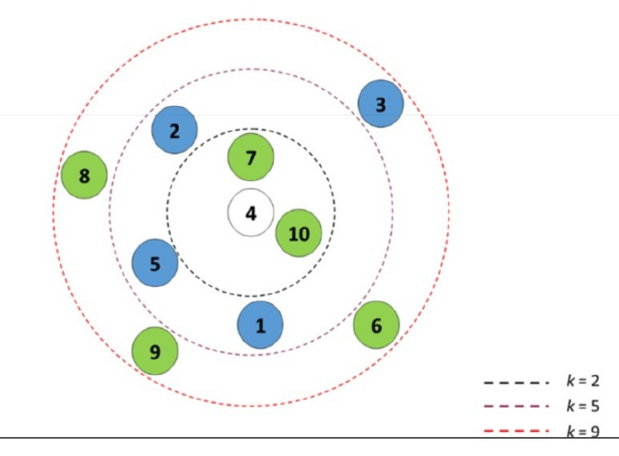
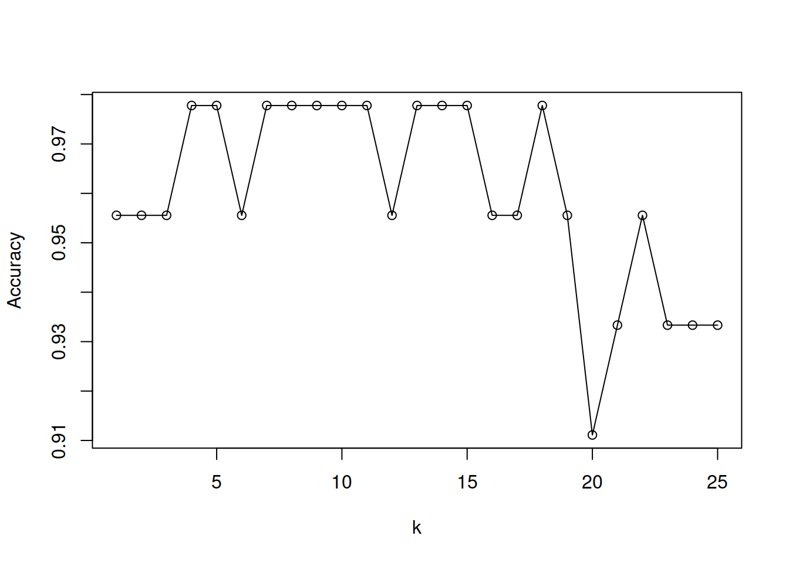

# Clasificación con KNN

## Carga de dataset y exploración

Como es habitual el internet de las cosas industriales amenudo puede generar datos que van cambiando minuto a minuto. Por ello se hace necesario tener un mecanismo para tomarlos desde la fuente que lo genera en forma inmediata, cada vez que querramos realizar un reporte automático o análisis exploratorio del mismo.


```r
library(readr)
performance_scm <- read_delim("https://themys.sid.uncu.edu.ar/rpalma/R-cran/scm_perform.csv",     delim = ";", escape_double = FALSE, col_types = cols(Performance = col_factor(levels = c("good", "fair", "poor"))), locale = locale(decimal_mark = ",",         grouping_mark = "."), trim_ws = TRUE)
```


Carga de Bibliotecas Utilizadas


```r
library(e1071) # svm navie bayes
library(class) # knn
library(caret) # Construcción de Modelos
#> Loading required package: ggplot2
#> Loading required package: lattice
library(neuralnet) # Redes Neuronales
library(randomForest) # Random Forest
#> randomForest 4.7-1.1
#> Type rfNews() to see new features/changes/bug fixes.
#> 
#> Attaching package: 'randomForest'
#> The following object is masked from 'package:ggplot2':
#> 
#>     margin
library(ggplot2) # Representacion del conocimiento
library(gridExtra) # Ploteo
#> 
#> Attaching package: 'gridExtra'
#> The following object is masked from 'package:randomForest':
#> 
#>     combine
```


## Entrenamiento y prueba

Separaremos los datos en dos conjuntos aleatorios

* Dataset de Entrenamiento
* Dataset de Prueba

Los datos puede ser elegidos aleatoriamente con el comando sample.
En nuestro caso emplearemos la proporción $70/30$
70% Para entrenar 30% para test (preuba). Esto debería dejaronos 105 observaciones en un conjunto y 45 en el otro.

Para que podamos repetir el experimento con los mismos datos fijaremos la semilla y así obtener resultado parecidos. [@ur_rehman_role_2019]


```r
set.seed(831)
inTrain.C <- createDataPartition(performance_scm$Performance,p=.7,list = FALSE)
```

Ahora partiremos el dataset utilizando como índice inTrain.C


```r
training.C <- performance_scm[inTrain.C, ]
testing.C <- performance_scm[-inTrain.C, ]

```

Podemos ver la tabla de resultados contenidos con este comando


```r
table(training.C$Performance)
#> 
#> good fair poor 
#>   35   35   35
```

Del mismo modo podemos ver el dataset de pruebas


```r
table(testing.C$Performance)
#> 
#> good fair poor 
#>   15   15   15
```

## Ajuste del modelo

Realizaremos una tabla de contingencia o matriz de confusión


|             |Actual +        | Actual - |
|-------------|----------------|----------|
|**Predic +** | True Positivo  | False Positivo|
|**Predic -** | False Positivo | True Negativo|

## Mediciones Model-level 

### Accuracy
Mide la proporción de predicciones correctas y no es extraño encontrarlo como porcentaje. Su rango va de 0 a 100% . A valor más alto mejor preformance del modelo. [@geng_big_2019]

$$Accuracy = \frac {TP + TN}{TP+TN+FP+FN} $$

### Error-Rate
Mide la proporción de instancias mal clasificadas sobre el total de instancias. También es frecuente su uso como porcentaje en el rango 0% a 100%. El valor más bajo es el más conveniente, al contrario que el de Acurracy

$$ErorRate = \frac{FP + FN}{TP+TN+FP+FN} = 1- Accuracy$$


## Class-Level Mesures

### Precisión
Mide cuantas predicciones hechas fueron correctas respecto del total de predicciones emitidas.

$$Precision = \frac{CorrectPredic}{TotalPredic}$$

### Recall o rememoración
Estima cuantas predicciones para una clase dada son correctas contra el total de casos predichos en la clase (entrenamiento y test)

$$Recall = \frac{CorrectPredic}{TotalActual}$$
### Métrica-F
Estima la bondad de clasificación para una clase dada. Se compara el total de casos correctamente clasificados contra el balance en la precisión y rememoración (recall). El valor máximo de F-Messure es igual a 1

$$F1Messure = 2*\frac{Precision * Recall}{Precision * Recall} $$

## Subreentrenado Sobreentrenado


## k Nearest Neighbor kNN

En kNN la similaridd o distancia entre observaciones es utilizada para clasificar los elementos de una muestra o población.
Tipicamente usamos la distancia Euclídea en el espacio n dimensional. El modo más común de clasificación de un grupo es con el k-ésimo vecino(s) más próximo(s) en base a datos etiquetados.[@hubauer_analysis_2013]

Se dice que kNN es una instanciación antes que un método basado en modelo, significando esto que en realidad no se crea un modelo para clasificar.




Eligiendo un k grande, se reduce el impacto de la varianza causada por el "ruido" aleatorio de los datos, pero esto puede sesgar el aprendizaje de ignorar patrones pequeños, pero significativos.

Se suele utilizar una regla de facto para elegir k, que es la raíz cuadrada del número de observaciones del set de entrenamiento redondeado hacia arriba

$$k =\sqrt{n_{training}}$$

Para el dataset de performance logística se tiene


```r
k.choice <- ceiling(sqrt(nrow(training.C)))
k.choice
#> [1] 11
```

Utilizar un número impar para $k$ es una buena práctica, porque evita caer en empate al seleccionar la etiqueta dominante.

Utilizaremos la función $knn()$ del paquete $class$ para construir lo que representaría el modelo.


```r
library(class)
knn.pred.C <- knn(train=training.C[ ,1:4] , test=testing.C[ , 1:4], cl=training.C$Performance, k=k.choice)
```

### Testeo de Performace del Algoritmo entrenado

Dado que kNN no precide un modelo no podemos hacer una ponderación o medida de la bondad del ajuste en los datos de entrenamiento, por lo que debemos necesariamente aplicar el modelo a los datos de prueba.[@kabugo_industry_2020]


```r
knn.test.acc <- confusionMatrix(knn.pred.C,testing.C$Performance, mode="prec_recall")
knn.test.acc
#> Confusion Matrix and Statistics
#> 
#>           Reference
#> Prediction good fair poor
#>       good   15    0    0
#>       fair    0   14    0
#>       poor    0    1   15
#> 
#> Overall Statistics
#>                                           
#>                Accuracy : 0.9778          
#>                  95% CI : (0.8823, 0.9994)
#>     No Information Rate : 0.3333          
#>     P-Value [Acc > NIR] : < 2.2e-16       
#>                                           
#>                   Kappa : 0.9667          
#>                                           
#>  Mcnemar's Test P-Value : NA              
#> 
#> Statistics by Class:
#> 
#>                      Class: good Class: fair Class: poor
#> Precision                 1.0000      1.0000      0.9375
#> Recall                    1.0000      0.9333      1.0000
#> F1                        1.0000      0.9655      0.9677
#> Prevalence                0.3333      0.3333      0.3333
#> Detection Rate            0.3333      0.3111      0.3333
#> Detection Prevalence      0.3333      0.3111      0.3556
#> Balanced Accuracy         1.0000      0.9667      0.9833
```

## Buenas prácticas en kNN

* Normalizar los valores

Dado que kNN se basa en las distancias puede haber un error de influencia si  una columna tiene magnitudes muy diferentes a otra. [@zhou_industrial_2021]


```r
boxplot(performance_scm[ ,1:4])
```


Basados en el gráfico boxplot deberíamos transfomar el recorrido de las variables al rango $[0,1]$.

$$ \frac{x-min(x)}{max(x)-min(x)}$$
Noramlizaremos los datos


```r
perf_escalado <-apply(performance_scm[ ,1:4], 2, function (x) (x-min(x))/(max(x)-min(x)) )
perf_escalado <- data.frame(perf_escalado, performance_scm$Performance)
```

Ahora podemos hacer el gráfico con los valores escalados


```r
boxplot(perf_escalado[ ,1:4], main="Gráfico de cajas Predictores Escalados", las=2)
```


Alternativamente de puede usar z-scores, que están estandarizados con la media entorno a 0 y el desvío estandard.

$$Z= \frac{x-u}{\sigma} $$


```r
perf_z <- apply(performance_scm[ ,1:4],2, function(x) (x-mean(x)) / (sd(x))  )
perf_z <- data.frame(perf_z,performance_scm$Performance)
```


Vista del gráfico normalizado


```r
boxplot(perf_z[ ,1:4])
```


## Evaitar sobre entrenamiento


### Variando k

Dado que kNN es un algoritmo de aprendizaje peresozo, pero eficiente a la hora de hacer predicciones (pues en realidad no hay aprendizaje formal), resulta interesante probar el efecto de variar los valores de k y ver cómo impacta en los resultados obtenidos y la performance de entrenamiento.


```r
save <- list()
for (i in 1:25){
  knn.pred.C.l <- knn(train = training.C[ ,1:4], test=testing.C[ ,1:4], cl=training.C$Performance, k=i)
  save[[i]] <-confusionMatrix(knn.pred.C.l, testing.C$Performance, mode="prec_recall")$overall[1] 
  
}
save <-do.call(rbind,save)
plot(1:25,save, xlab="k", ylab="Accuracy", type="o")
```




