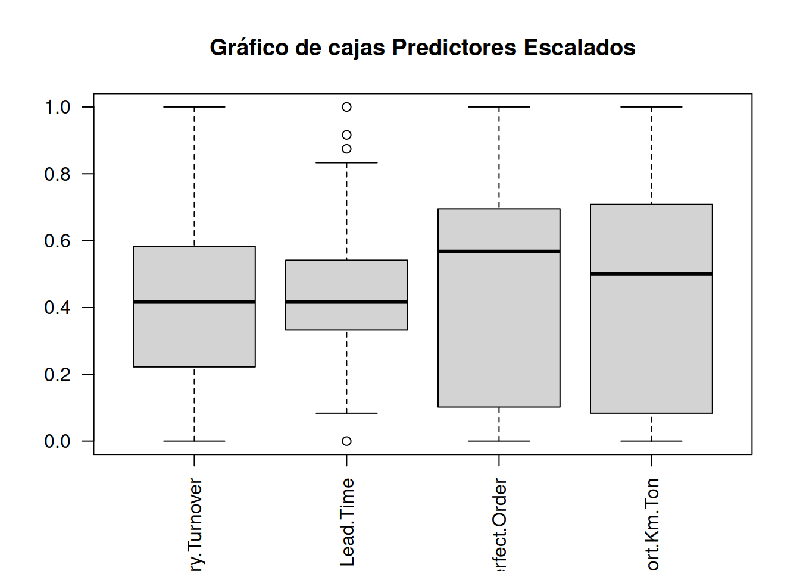

# Algoritmo del vecino más próximo

kNN (k-nearest neighbors). El algoritmo kNN es un método de aprendizaje automático supervisado utilizado para la clasificación y la regresión. Se basa en la idea de que los puntos de datos similares tienden a agruparse en grupos o regiones en el espacio de características. [@borgi_data_2017]

En el caso de la clasificación, kNN asigna una etiqueta a un punto de datos desconocido basándose en las etiquetas de sus vecinos más cercanos. La "k" en kNN se refiere al número de vecinos más cercanos que se toman en cuenta para tomar una decisión de clasificación. Por ejemplo, si k = 3, entonces el algoritmo considerará las etiquetas de los 3 puntos más cercanos y asignará al punto desconocido la etiqueta que sea más común entre esos 3 vecinos.

El proceso básico del algoritmo kNN es el siguiente:

Calcula la distancia entre el punto de datos desconocido y todos los demás puntos de datos en el conjunto de entrenamiento. La distancia más comúnmente utilizada es la distancia euclidiana, pero también se pueden utilizar otras medidas de distancia.

Selecciona los k puntos más cercanos al punto de datos desconocido en función de la distancia calculada en el paso anterior.

En el caso de clasificación, cuenta las etiquetas de los k vecinos más cercanos y asigna al punto desconocido la etiqueta más común entre ellos. En el caso de regresión, se puede tomar un promedio ponderado de los valores de los k vecinos más cercanos para obtener una estimación del valor desconocido. [@lee_industrial_2015]

Es importante tener en cuenta que el valor de k en kNN es un parámetro ajustable y debe ser seleccionado cuidadosamente. Un valor pequeño de k puede llevar a decisiones inestables y más susceptibles a ruido, mientras que un valor grande de k puede suavizar las fronteras entre las clases y puede perder detalles más finos en los datos.

El algoritmo kNN es relativamente simple y fácil de implementar, pero puede ser computacionalmente costoso cuando se tienen conjuntos de datos grandes, ya que implica calcular distancias para cada punto en el conjunto de entrenamiento. Además, kNN no captura patrones globales en los datos, ya que toma decisiones basadas únicamente en los puntos de datos más cercanos.

## ¿Que relación tiene con k-means

El algoritmo k-means es otro método utilizado en analítica de datos y big-data.

Luego veremos en detalle que es k-means. Lo importante ahora es no confundir estos conseptos que tienen nombres parecidos.

El algoritmo k-means es otro método utilizado en aprendizaje automático no supervisado para agrupar datos en conjuntos llamados "clusters". Aunque k-means y k-nearest neighbors (kNN) tienen un nombre similar debido al uso de la letra "k", son algoritmos diferentes con enfoques distintos.

Mientras que kNN es un algoritmo de aprendizaje supervisado utilizado para clasificación y regresión, k-means es un algoritmo de aprendizaje no supervisado utilizado para agrupamiento. Su objetivo principal es encontrar grupos o clusters en los datos sin tener información previa de las etiquetas o clases a las que pertenecen los datos.

La idea básica detrás de k-means es asignar cada punto de datos a uno de los k clusters existentes, donde k es un número predeterminado definido por el usuario. El algoritmo itera para encontrar los centroides de los clusters de manera que se minimice la distancia total entre los puntos de datos y sus centroides correspondientes. En cada iteración, se recalculan los centroides y se reasignan los puntos de datos a los clusters más cercanos.

Una diferencia clave entre kNN y k-means es que kNN utiliza la información de etiquetas para tomar decisiones de clasificación o regresión, mientras que k-means agrupa los datos en base a la proximidad espacial sin utilizar información de etiquetas. En k-means, los puntos de datos se agrupan en función de la similitud de sus características.

En resumen, kNN es un algoritmo de aprendizaje supervisado utilizado para clasificación y regresión, mientras que k-means es un algoritmo de aprendizaje no supervisado utilizado para agrupamiento. Ambos algoritmos tienen en común el uso del parámetro "k", pero se aplican de manera diferente y tienen objetivos distintos en el análisis de datos.[@yang_paradigm_2022]


## Bibliografía recomendada


## Carga de dataset y exploración


```r
library(readr)
performance_scm <- read_delim("https://themys.sid.uncu.edu.ar/rpalma/R-cran/scm_perform.csv",     delim = ";", escape_double = FALSE, col_types = cols(Performance = col_factor(levels = c("good", "fair", "poor"))), locale = locale(decimal_mark = ",",         grouping_mark = "."), trim_ws = TRUE)
```


Carga de Bibliotecas Utilizadas


```r
library(e1071) # svm navie bayes
library(class) # knn
library(caret) # Construcción de Modelos
#> Loading required package: ggplot2
#> Loading required package: lattice
library(neuralnet) # Redes Neuronales
library(randomForest) # Random Forest
#> randomForest 4.7-1.1
#> Type rfNews() to see new features/changes/bug fixes.
#> 
#> Attaching package: 'randomForest'
#> The following object is masked from 'package:ggplot2':
#> 
#>     margin
library(ggplot2) # Representacion del conocimiento
library(gridExtra) # Ploteo
#> 
#> Attaching package: 'gridExtra'
#> The following object is masked from 'package:randomForest':
#> 
#>     combine
```

## Entrenamiento y prueba

Separaremos los datos en dos conjuntos aleatorios

* Dataset de Entrenamiento
* Dataset de Prueba

Los datos puede ser elegidos aleatoriamente con el comando sample.
En nuestro caso emplearemos la proporción $70/30$
70% Para entrenar 30% para test (preuba). Esto debería dejaronos 105 observaciones en un conjunto y 45 en el otro.

Para que podamos repetir el experimento con los mismos datos fijaremos la semilla y así obtener resultado parecidos


```r
set.seed(831)
inTrain.C <- createDataPartition(performance_scm$Performance,p=.7,list = FALSE)
```

Ahora partiremos el dataset utilizando como índice inTrain.C


```r
training.C <- performance_scm[inTrain.C, ]
testing.C <- performance_scm[-inTrain.C, ]

```

Podemos ver la tabla de resultados contenidos con este comando


```r
table(training.C$Performance)
#> 
#> good fair poor 
#>   35   35   35
```

Del mismo modo podemos ver el dataset de pruebas


```r
table(testing.C$Performance)
#> 
#> good fair poor 
#>   15   15   15
```

## Ajuste del modelo

Realizaremos una tabla de contingencia o matriz de confusión


|             |Actual +        | Actual - |
|-------------|----------------|----------|
|**Predic +** | True Positivo  | False Positivo|
|**Predic -** | False Positivo | True Negativo|

## Mediciones Model-level 

### Accuracy
Mide la proporción de predicciones correctas y no es extraño encontrarlo como porcentaje. Su rango va de 0 a 100% . A valor más alto mejor preformance del modelo

$$Accuracy = \frac {TP + TN}{TP+TN+FP+FN} $$

### Error-Rate
Mide la proporción de instancias mal clasificadas sobre el total de instancias. También es frecuente su uso como porcentaje en el rango 0% a 100%. El valor más bajo es el más conveniente, al contrario que el de Acurracy

$$ErrorRate = \frac{FP + FN}{TP+TN+FP+FN} = 1- Accuracy$$


## Class-Level Mesures

### Precisión
Mide cuantas predicciones hechas fueron correctas respecto del total de predicciones emitidas.

$$Precision = \frac{CorrectPredic}{TotalPredic}$$

### Recall o rememoración
Estima cuantas predicciones para una clase dada son correctas contra el total de casos predichos en la clase (entrenamiento y test)

$$Recall = \frac{CorrectPredic}{TotalActual}$$
### Métrica-F
Estima la bondad de clasificación para una clase dada. Se compara el total de casos correctamente clasificados contra el balance en la precisión y rememoración (recall). El valor máximo de F-Messure es igual a 1

$$F1Messure = 2*\frac{Precision - Recall}{Precision * Recall} $$

## Subreentrenado Sobreentrenado


## k Nearest Neighbor kNN

En kNN la similaridd o distancia entre observaciones es utilizada para clasificar los elementos de una muestra o población.
Tipicamente usamos la distancia Euclídea en el espacio n dimensional. El modo más común de clasificación de un grupo es con el k-ésimo vecino(s) más próximo(s) en base a datos etiquetados.

Se dice que kNN es una instanciación antes que un método basado en modelo, significando esto que en realidad no se crea un modelo para clasificar.


Eligiendo un k grande, se reduce el impacto de la varianza causada por el "ruido" aleatorio de los datos, pero esto puede sesgar el aprendizaje de ignorar patrones pequeños, pero significativos.

Se suele utilizar una regla de facto para elegir k, que es la raíz cuadrada del número de observaciones del set de entrenamiento redondeado hacia arriba

$$k =\sqrt{n_{training}}$$

Para el dataset de performance logística se tiene


```r
k.choice <- ceiling(sqrt(nrow(training.C)))
k.choice
#> [1] 11
```

Utilizar un número impar para $k$ es una buena práctica, porque evita caer en empate al seleccionar la etiqueta dominante.

Utilizaremos la función $knn()$ del paquete $class$ para construir lo que representaría el modelo.


```r
library(class)
knn.pred.C <- knn(train=training.C[ ,1:4] , test=testing.C[ , 1:4], cl=training.C$Performance, k=k.choice)
```

### Testeo de Performace del Algoritmo entrenado

Dado que kNN no precide un modelo no podemos hacer una ponderación o medida de la bondad del ajuste en los datos de entrenamiento, por lo que debemos necesariamente aplicar el modelo a los datos de prueba.


```r
knn.test.acc <- confusionMatrix(knn.pred.C,testing.C$Performance, mode="prec_recall")
knn.test.acc
#> Confusion Matrix and Statistics
#> 
#>           Reference
#> Prediction good fair poor
#>       good   15    0    0
#>       fair    0   14    0
#>       poor    0    1   15
#> 
#> Overall Statistics
#>                                           
#>                Accuracy : 0.9778          
#>                  95% CI : (0.8823, 0.9994)
#>     No Information Rate : 0.3333          
#>     P-Value [Acc > NIR] : < 2.2e-16       
#>                                           
#>                   Kappa : 0.9667          
#>                                           
#>  Mcnemar's Test P-Value : NA              
#> 
#> Statistics by Class:
#> 
#>                      Class: good Class: fair Class: poor
#> Precision                 1.0000      1.0000      0.9375
#> Recall                    1.0000      0.9333      1.0000
#> F1                        1.0000      0.9655      0.9677
#> Prevalence                0.3333      0.3333      0.3333
#> Detection Rate            0.3333      0.3111      0.3333
#> Detection Prevalence      0.3333      0.3111      0.3556
#> Balanced Accuracy         1.0000      0.9667      0.9833
```

## Buenas prácticas en kNN

* Nromalizar los calores

Dado que kNN se basa en las distancias puede haber un error de influencia si  una columna tiene magnitudes muy diferentes a otra. 


```r
boxplot(performance_scm[ ,1:4])
```


Basados en el gráfico boxplot deberíamos transfomar el recorrido de las variables al rango $[0,1]$.

$$ \frac{x-min(x)}{max(x)-min(x)}$$
Noramlizaremos los datos


```r
perf_escalado <-apply(performance_scm[ ,1:4], 2, function (x) (x-min(x))/(max(x)-min(x)) )
perf_escalado <- data.frame(perf_escalado, performance_scm$Performance)
```

Ahora podemos hacer el gráfico con los valores escalados


```r
boxplot(perf_escalado[ ,1:4], main="Gráfico de cajas Predictores Escalados", las=2)
```



Alternativamente de puede usar z-scores, que están estandarizados con la media entorno a 0 y el desvío estandard.

$$Z= \frac{x-u}{\sigma} $$


```r
perf_z <- apply(performance_scm[ ,1:4],2, function(x) (x-mean(x)) / (sd(x))  )
perf_z <- data.frame(perf_z,performance_scm$Performance)
```


Vista del gráfico normalizado


```r
boxplot(perf_z[ ,1:4])
```


### Variando k

Dado que kNN es un algoritmo de aprendizaje peresozo, pero eficiente a la hora de hacer predicciones (pues en realidad no hay aprendizaje formal), resulta interesante probar el efecto de variar los valores de k y ver cómo impacta en los resultados obtenidos y la performance de entrenamiento.


```r
save <- list()
for (i in 1:25){
  knn.pred.C.l <- knn(train = training.C[ ,1:4], test=testing.C[ ,1:4], cl=training.C$Performance, k=i)
  save[[i]] <-confusionMatrix(knn.pred.C.l, testing.C$Performance, mode="prec_recall")$overall[1] 
  
}
save <-do.call(rbind,save)
plot(1:25,save, xlab="k", ylab="Accuracy", type="o")
```


