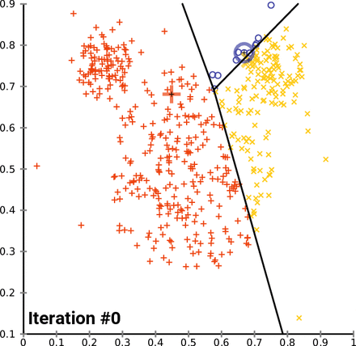

# Agrupación K-Means

En el enfoque de partición de R, las observaciones se dividen en grupos K y se reorganizan para formar los grupos más cohesivos posibles de acuerdo con un criterio dado. Hay dos métodos: K-medias y partición alrededor de mediodes *PAM*. En este artículo, basado en el capítulo 16 de R in Action, Second Edition, el autor Rob Kabacoff analiza la agrupación de K-means.

El algoritmo k-means podría utilizarse en el contexto del mantenimiento industrial.

Supongamos que tienes un conjunto de datos históricos sobre el rendimiento y la vida útil de diferentes componentes de maquinaria en una planta industrial. Estos datos pueden incluir variables como la temperatura de funcionamiento, la vibración, el consumo de energía, la carga de trabajo, entre otros.[@lin_research_2019]

El objetivo sería utilizar el algoritmo k-means para identificar grupos o clusters de componentes que tengan un comportamiento similar en términos de su rendimiento y vida útil. Esto puede ayudar a los ingenieros y operarios de mantenimiento a entender mejor el comportamiento de los componentes y tomar decisiones más informadas sobre el mantenimiento preventivo o la sustitución de los mismos.

El proceso podría seguir los siguientes pasos:

* Preparación de datos: Reunir y preparar los datos históricos relevantes de los componentes de maquinaria. Esto puede incluir la recopilación de variables, como la temperatura, la vibración, el consumo de energía, etc., para cada componente en diferentes momentos.

* Selección de características: Identificar las características relevantes para el análisis. Puedes realizar un análisis de correlación o utilizar el conocimiento experto para seleccionar las variables más significativas que pueden influir en el rendimiento y la vida útil de los componentes.

* Normalización de datos: Normalizar los datos para asegurarse de que todas las características tengan la misma escala y rango. Esto es importante para que todas las variables tengan una influencia equitativa en el algoritmo k-means.

* Elección del número de clusters (k): Determinar el número de clusters que deseas encontrar. Puedes utilizar métodos como el método del codo (elbow method) o la silueta (silhouette) para evaluar diferentes valores de k y seleccionar el más adecuado.

* Aplicación del algoritmo k-means: Ejecutar el algoritmo k-means en los datos normalizados, agrupando los componentes en los k clusters determinados. El algoritmo asignará cada componente al cluster más cercano en función de las características seleccionadas.

* Análisis e interpretación de los resultados: Analizar los resultados del clustering para identificar patrones y comportamientos similares entre los componentes. Puedes examinar las características de cada cluster para entender qué factores pueden estar relacionados con un mayor rendimiento o una vida útil más larga. Esto puede ayudar a tomar decisiones de mantenimiento más precisas y eficientes.

Atención que este es solo un ejemplo de cómo se podría aplicar el algoritmo k-means en el mantenimiento industrial. La selección de variables, la normalización de datos y la interpretación de los resultados pueden variar según el contexto y los objetivos específicos del estudio de mantenimiento. No es lo mismo utilizar esta técnica para mantenimiento en la industria alimenticia que en la industria nuclear. Cada campo de aplicación debería respetar los procedimiento Hazop sugerido por las normas y buenas prácticas recomendadas.


## Bibliografía recomendada


PAM es por lejos el más comunmente utilizado, pero existen otros como *CLARA*, *MELISSA*, y otros tantos que se adaptan a diferentes problemas. En el caso de la localización de las balizas de satélites como el ARSAT e incluso de los nano satélites como el FossaSat-1 (cubesat) este método es muy utilizado. Ver [Satelites para internet de las cosas Industriales](https://www.hackster.io/news/fossasat-1-an-open-source-satellite-for-the-internet-of-things-7f31cab00ef5).
Todas estas tecnologías de satélites de bajo costo están permitiendo mejorar la competitividad y eficiencia de las cadenas de suministros en todo el planeta. En especial esta tipo de tecnología sirve para ver el deterioro de las propiedades alimenticias de cargas en línea y en tiempo real.  A pesar de ello en gran parte de latinoamérica y caribe estas tecnología aún están por descubrirse.
Se han utilizado varios métodos del **skimr()** (un sustituto de **summary()** ), pero el paquete que utilizaremos para esta tarea específica será **cluster()** paquete exitosamente para problemas de congestion de puertos y misiones de vacunación post covid de el paquete :  [ClusteR](https://cran.r-project.org/web/views/Cluster.html)  


## Agrupación K-means 

El método de partición más común es el análisis de clúster de K-means. Conceptualmente, el algoritmo K-means: 

1. Selecciona K centroides (K filas elegidas al azar) 
2. Asigna cada punto de datos a su centroide más cercano 
3. Recalcula los centroides como el promedio de todos los puntos de datos en un clúster (es decir, los centroides son vectores medios de p-longitud, donde p es el número de variables) 
4. Asigna puntos de datos a sus centroides más cercanos 
5. Continúa los pasos 3 y 4 hasta que no se reasignen las observaciones o se alcance el número máximo de iteraciones (R usa 10 como valor predeterminado). [@bezerra_extracting_2019]

Los detalles de implementación de este enfoque pueden variar. R utiliza un algoritmo eficiente de Hartigan y Wong (1979) que divide las observaciones en grupos k de tal manera que la suma de cuadrados de las observaciones a sus centros de clúster asignados es un mínimo. Esto significa que en los pasos 2 y 4, cada observación se asigna al clúster con el valor más pequeño de:

$$ SS_{(k)}= \sum_{i=1}^n  \sum_{j=1}^p( x_{ij}- \bar{x_{kj}}) ²$$
Donde $k$ es un cluster, $x_{ij}$ es el valor de la variable $j ésima$ para la observación $iésima$, y $\bar{x}_{kj}$ es la media de la variable j_{p} para el cluster k_i . 

La agrupación en clústeres K-means puede manejar conjuntos de datos más grandes que los enfoques de clúster jerárquicos. Además, las observaciones no se comprometen permanentemente a un grupo. Se mueven cuando al hacerlo mejora la solución general. Sin embargo, el uso de medioides implica que todas las variables deben ser continuas y el enfoque puede verse gravemente afectado por valores atípicos. Por ejemplo k-means no es aplicable para localización de pallets en sistemas de posición flotante si dentro del edificio hay muros o barreras que impiden la circulación entre racks.[@runkler_data_2020]

También se desempeñan mal en presencia de grupos no convexos (por ejemplo, en forma de U o celdas de manufactura flexible). El formato de la función K-means en R es:

$$kmeans(x, centros)$$ 
donde $x$ es un conjunto de datos numéricos (matriz o data.frame) y $centros$ es el número de clústeres a extraer. Es un parámetro arbitrario que elijo y con el que pruebo o simulo alternativas. Por su bajo costo computacional converge razonablemente bien a una solución. 

La función devuelve la pertenencia de casos al clúster, los centroides, las sumas de cuadrados (dentro, entre y total) y los tamaños de cada clúster.

Dado que el análisis de clústeres de K-medias comienza con k centroides elegidos al azar, se puede obtener una solución diferente cada vez que se invoca la función.
Utilice la función set.seed() para garantizar que los resultados sean reproducibles, en especial si publicas en papers. 


Además, este enfoque de agrupación puede ser sensible a la selección inicial de centroides. La función $kmeans()$ tiene una opción o parámetro $nstart$ que intenta varias configuraciones iniciales e informa sobre la mejor. Por ejemplo, agregando $nstart=25$ generará 25 configuraciones iniciales. Este enfoque a menudo muy recomendable. A diferencia de la agrupación jerárquica, la agrupación en clústeres de *K-means* requiere que el número de clústeres que se extraer se especifique de antemano. Una vez más, el paquete *NbClust()* se puede utilizar como guía para estimar un número inicial de clusters acpetable. Además, puede ser útil un gráfico de las sumas totales de cuadrados dentro de los grupos contra el número de clústeres en una solución de K-means. Una curva en el gráfico puede sugerirnos el número apropiado de clústeres. [@li_nonparametric_2021]

El gráfico se puede producir mediante la siguiente función.


A efectos de sostener un estilo único en los gráficos amenudo conviene crear una función de ploteo en la que repito los parámetros.


```r
wssplot <- function(data, nc=15, seed=1234){
               wss <- (nrow(data)-1)*sum(apply(data,2,var))
               for (i in 2:nc){
                    set.seed(seed)
                    wss[i] <- sum(kmeans(data, centers=i)$withinss)}
                plot(1:nc, wss, type="b", xlab="Número de Clusters",
                     ylab="Suma cuadrática dentro de cada grupo")}
```


El parámetro de datos es el conjunto de datos numéricos que se analizará, $nc$ es el número máximo de grupos a considerar y la semilla es una semilla de número aleatorio. Aquí, se analiza un conjunto de datos que contiene 13 mediciones químicas en 178 muestras de vino italiano. Los datos provienen originalmente del Repositorio de Aprendizaje Automático de la UCI (http://www.ics.uci.edu/~mlearn/MLRepository.html), pero también se pueden acceder a ellos a través del paquete de [rattle](https://cran.r-project.org/web/packages/rattle.data/index.html). 
En el listado se proporciona un análisis de conglomerado de K-means para los datos.[@kumar_colour_2022]


```r
library(readr)
wine <- read_csv("http://archive.ics.uci.edu/ml/machine-learning-databases/wine/wine.data")
#> Rows: 177 Columns: 14
#> ── Column specification ────────────────────────────────────
#> Delimiter: ","
#> dbl (14): 1, 14.23, 1.71, 2.43, 15.6, 127, 2.8, 3.06, .2...
#> 
#> ℹ Use `spec()` to retrieve the full column specification for this data.
#> ℹ Specify the column types or set `show_col_types = FALSE` to quiet this message.
```

*Dimensiones:*

columna | Propiedad
--------+-----------
  1) |Alcohol
 	2) |Ácido Malico
 	3) |Cenizas
	4) |Alcalinidad de las cenizas  
 	5) |Magnecio
	6) |Fenoles Totales 
 	7) |Flavonoides 
 	8) |Fenoles no flavonoides 
 	9) |Proantocianinas 
	10)|Intensidad de Color 
 	11)|Tinte
 	12)|OD280/OD315 de vinos diluídos
 	13)|Prolina          


```r
nombres <- list( "Type", 
  "Alcohol",
"Ácido Malico",
 "Cenizas",
"Alcalinidad de las cenizas"  ,
 "Magnecio",
"Fenoles Totales", 
 "Flavonoides" ,
"Fenoles no flavonoides", 
 "Proantocianinas" ,
	"Intensidad de Color", 
 	"Tinte",
 	"OD280/OD315 de vinos diluídos",
"Prolina"                )


colnames(wine) <- nombres
```


Generaremos un reporte exploratorio automático con la biblioteca skim


```r
library(skimr)
skim(wine)
```


Table: (\#tab:unnamed-chunk-4)Data summary

|                         |     |
|:------------------------|:----|
|Name                     |wine |
|Number of rows           |177  |
|Number of columns        |14   |
|_______________________  |     |
|Column type frequency:   |     |
|numeric                  |14   |
|________________________ |     |
|Group variables          |None |


**Variable type: numeric**

|skim_variable                 | n_missing| complete_rate|   mean|     sd|     p0|    p25|    p50|    p75|    p100|hist  |
|:-----------------------------|---------:|-------------:|------:|------:|------:|------:|------:|------:|-------:|:-----|
|Type                          |         0|             1|   1.94|   0.77|   1.00|   1.00|   2.00|   3.00|    3.00|▆▁▇▁▆ |
|Alcohol                       |         0|             1|  12.99|   0.81|  11.03|  12.36|  13.05|  13.67|   14.83|▂▇▇▇▃ |
|Ácido Malico                  |         0|             1|   2.34|   1.12|   0.74|   1.60|   1.87|   3.10|    5.80|▇▅▂▂▁ |
|Cenizas                       |         0|             1|   2.37|   0.28|   1.36|   2.21|   2.36|   2.56|    3.23|▁▂▇▅▁ |
|Alcalinidad de las cenizas    |         0|             1|  19.52|   3.34|  10.60|  17.20|  19.50|  21.50|   30.00|▁▆▇▃▁ |
|Magnecio                      |         0|             1|  99.59|  14.17|  70.00|  88.00|  98.00| 107.00|  162.00|▅▇▃▁▁ |
|Fenoles Totales               |         0|             1|   2.29|   0.63|   0.98|   1.74|   2.35|   2.80|    3.88|▅▇▇▇▁ |
|Flavonoides                   |         0|             1|   2.02|   1.00|   0.34|   1.20|   2.13|   2.86|    5.08|▆▆▇▂▁ |
|Fenoles no flavonoides        |         0|             1|   0.36|   0.12|   0.13|   0.27|   0.34|   0.44|    0.66|▃▇▅▃▂ |
|Proantocianinas               |         0|             1|   1.59|   0.57|   0.41|   1.25|   1.55|   1.95|    3.58|▃▇▆▂▁ |
|Intensidad de Color           |         0|             1|   5.05|   2.32|   1.28|   3.21|   4.68|   6.20|   13.00|▇▇▃▂▁ |
|Tinte                         |         0|             1|   0.96|   0.23|   0.48|   0.78|   0.96|   1.12|    1.71|▅▇▇▃▁ |
|OD280/OD315 de vinos diluídos |         0|             1|   2.60|   0.71|   1.27|   1.93|   2.78|   3.17|    4.00|▆▃▆▇▂ |
|Prolina                       |         0|             1| 745.10| 314.88| 278.00| 500.00| 672.00| 985.00| 1680.00|▇▇▅▃▁ |


Procederemos a escalar el dataset, que es un poco menos eficiente que normalizar, pero es más rápido y nos muestra algunas de las herramientas de la biblioteca **skimr**. [@chen_evidential_2018]


```r
df <- scale(wine[-1]) 
wssplot(df)     
```


Cargaremos la biblioteca **NbClust()** para usar el método kmeasn que ella proporciona. 


```r
library(NbClust)
set.seed(1234)
nc <- NbClust(df, min.nc=2, max.nc=15, method="kmeans")
```


```
#> *** : The Hubert index is a graphical method of determining the number of clusters.
#>                 In the plot of Hubert index, we seek a significant knee that corresponds to a 
#>                 significant increase of the value of the measure i.e the significant peak in Hubert
#>                 index second differences plot. 
#> 
```


```
#> *** : The D index is a graphical method of determining the number of clusters. 
#>                 In the plot of D index, we seek a significant knee (the significant peak in Dindex
#>                 second differences plot) that corresponds to a significant increase of the value of
#>                 the measure. 
#>  
#> ******************************************************************* 
#> * Among all indices:                                                
#> * 1 proposed 2 as the best number of clusters 
#> * 19 proposed 3 as the best number of clusters 
#> * 1 proposed 9 as the best number of clusters 
#> * 2 proposed 15 as the best number of clusters 
#> 
#>                    ***** Conclusion *****                            
#>  
#> * According to the majority rule, the best number of clusters is  3 
#>  
#>  
#> *******************************************************************
table(nc$Best.n[1,])
#> 
#>  0  1  2  3  9 15 
#>  2  1  1 19  1  2
```
Dado que las variables varían en rango, se estandarizan antes de la agrupación (función $scale()$) es muy importante utiulizarla ya que esta biblioteca es muy sensible al error si no se aplica normalizado.

A continuación, el número de clústeres se determina mediante las funciones *wwsplot()* y $NbClust()$ . La Figura  indica que hay una clara caída en la suma de cuadrados dentro de los grupos cuando se pasa de 1 a 3 grupos. Después de tres clústeres, esta disminución disminuye, lo que sugiere que una solución de 3 clústeres puede ser una buena opción para los datos. 

En la siguiente figura, 14 de los 24 criterios proporcionados por el paquete $NbClust$ sugieren una solución de 3 clústeres. 

Tenga en cuenta que no se pueden calcular los 30 criterios para cada conjunto de datos. Se obtiene una solución final de clúster con la función kmeans() y se imprimen los centroides de clúster. 

Dado que los centroides proporcionados por la función se basan en datos estandarizados, la función $aggregate()$ se utiliza junto con las pertenencias al clúster para determinar las medias variables para cada clúster en la métrica original (o desescalando).


```r
barplot(table(nc$Best.n[1,]), 
          xlab="Numer of Clusters", ylab="Number of Criteria",
          main="Number of Clusters Chosen by 26 Criteria")
```


¿Cuantas muestras hay en cada grupo?


```r
set.seed(1234)
fit.km <- kmeans(df, 3, nstart=25)                           #3
fit.km$size
#> [1] 61 65 51
```

*Dónde estan los centroides?*


```r
fit.km$centers  
#>      Alcohol Ácido Malico    Cenizas
#> 1  0.8333649   -0.3013131  0.3661731
#> 2 -0.9183253   -0.3953334 -0.4905017
#> 3  0.1736447    0.8642504  0.1871775
#>   Alcalinidad de las cenizas    Magnecio Fenoles Totales
#> 1                 -0.6065538  0.56922228      0.88768039
#> 2                  0.1637039 -0.48321576     -0.07114136
#> 3                  0.5168437 -0.06497127     -0.97106500
#>   Flavonoides Fenoles no flavonoides Proantocianinas
#> 1  0.98016451            -0.56173008      0.57583669
#> 2  0.02658937            -0.03709561      0.06509498
#> 3 -1.20624204             0.71915195     -0.77171004
#>   Intensidad de Color      Tinte
#> 1           0.1702296  0.4753467
#> 2          -0.8955790  0.4614076
#> 3           0.9378162 -1.1566204
#>   OD280/OD315 de vinos diluídos    Prolina
#> 1                     0.7753334  1.1296451
#> 2                     0.2823571 -0.7460740
#> 3                    -1.2872265 -0.4002655
```

Mira con detenimiento los valores entregados por $$fit$(...)$$


```r
plot(fit.km$centers)
```


*Matriz de confusión*


```r
ct.km <- table(wine$Type, fit.km$cluster)
ct.km  
#>    
#>      1  2  3
#>   1 58  0  0
#>   2  3 65  3
#>   3  0  0 48
```


Como podemos ver se nos ha indicado que es muy probable que existan **3 categorías** o grupos en los que podemos clasificar o etiquetar este dataset.
La matriz de confusión es muy buena.


