# Clusterización

Una de las cosas interesantes sobre la posibilidad de hacer Inteligencia de Negocios (BI por sus siglas en ingles – Business Intelligence) es que nos permite descubrir patrones no visibles en primera instancia, pero que ayudan a preguntarnos ¿por qué sucede esto?.
En esta serie de ejercicios teóricos, además de familiarizarnos con el lenguaje R-Cran y su uso en Clusters, trataremos de ver como podemos valernos de las bondades del entorno de trabajo para responder a esas preguntas.

Hasta ahora tenemos claro temas referidos al concepto estadísticos clásicos (monovariados), y hemos insinuado algo sobre las estructuras de los entornos multivariados.

## Bibliografía recomendada

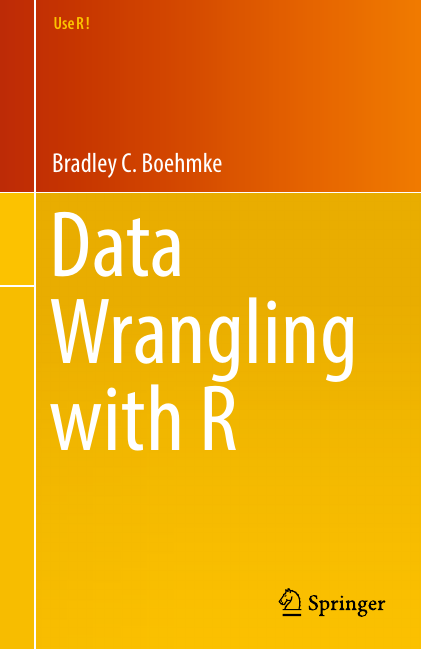

Teniendo en cuenta lo sensible que este mérodo es a el tratamiento previo de los datos (sobre todo a la normalización) es recomendable revisar esta publicación.

Tanto sea para empresas industriales o de servicios en las que sus sistemas de información abarquen los campos de medición y administración de la estrategia o el aspecto operativo; es de crucial importancia determinar los niveles en los que las variables que representan a las perspectivas tengan claramente establecidas sus franjas de flotación. En otras palabras debemos sentar las bases para construir un Cuadro de mando o tablero de control, que no es sólo hacer que luces rojas amarillas y verdes se enciendan en un semáforo, sino tener relevancia para la toma de decisión sobre lo que los datos nos aportan.

Utilizaremos una base de datos ficticia (cualquier semejanza con la realidad es pura coincidencia).

<https://themys.sid.uncu.edu.ar/rpalma/R-cran/UCB/BSC_proveedores.csv>


En ella se ha realizado un estudio sobre varias empresas que son contratistas o proveedores de servicios de alto valor agregado de grandes compañías constructora. Se ha indagado el desempeño de unos 150 contratistas según cuatro dimensiones o indicadores del BSC.

Estas dimensiones están relacionadas con:

* Tecnología
* Normas
* Capital
* Equipamiento

Los datos han sido normalizados tode vez que deberemos comparar unidades de medidas muy disimiles. Por ejemplo la calidad de los recursos humanos no tiene dimensión y el capital estaba expresado en dolares.

### Carga de datos desde archivos externos

Si bien sería posible cargar datos a mano en R-CRAN, no sería práctico hacer lo así.
Todos los datos que se utilizan en este entorno de trabajo se manejan internamente como matrices. Estas matrices de datos (semejantes a bases de datos) se llaman data-frames.

Un data frame podría ser una matriz de una fila por una columna así por ejemplo


      > X <-200 ;
      > Y= 20 ;

      > Y= X+Z

Intente carga dos dataframes a y b con valores numéricos y realizamos la suma de ambos como se muestra en el código.


Esto nos permitiría usar R-CRAN como si se tratase de una calculadora.


## Captura de datos


Cargando datos desde la línea de comando


    Ejecute los comandos "scan()" y luego tipee los números separados por <Enter>.


Para finalizar la carga tipee dos veces <Enter>.

## ¿Desde dónde podemos cargar datos?


Uno de los requisitos para poder cargar datos es que sepamos en que carpeta estamos trabajando.
En este ejercicio veremos como hacer para saber donde estamos parados.


```r
getwd()
#> [1] "/media/rpalma/Datos/2023/Posgrado/R-Cran/Analitica_Datos/UCC"
```


Puedes cambiar tu carpeta (directorio) de trabajo con el comando setwd()

Debes poner entre comillas lo que va dentro del paréntesis 

Prepare un archivo en excel y guardelo con formato csv
"comma separated values" para capturarlo desde R-CRAN.

### Revisión de Datos Ejemplo

Con los siguientes comando importaremos una planilla generada con una hoja de cálculo que contiene las 150 respuestas de las encuestas que se realizaron


```r
library(readr)
#BSC_proveedores <- read_csv("BSC_proveedores.csv")
BSC_proveedores <- read.csv("https://themys.sid.uncu.edu.ar/rpalma/R-cran/UCB/BSC_proveedores.csv")
```


Podemos ver el contenido del dataframe BSC_Proveedores que se llama igual que el archivo de texto separado por comas. Para ello ejecutamos el siguiente comando.


```r
BSC_proveedores [c(1:5 ,70:73, 126:129) ,]
#>       X Tecnologia Normas Capital Equipo       Empresa
#> 1     1        5.1    3.5     1.4    0.2   CNB-Cerveza
#> 2     2        4.9    3.0     1.4    0.2   CNB-Cerveza
#> 3     3        4.7    3.2     1.3    0.2   CNB-Cerveza
#> 4     4        4.6    3.1     1.5    0.2   CNB-Cerveza
#> 5     5        5.0    3.6     1.4    0.2   CNB-Cerveza
#> 70   70        5.6    2.5     3.9    1.1     FARMACORP
#> 71   71        5.9    3.2     4.8    1.8     FARMACORP
#> 72   72        6.1    2.8     4.0    1.3     FARMACORP
#> 73   73        6.3    2.5     4.9    1.5     FARMACORP
#> 126 126        7.2    3.2     6.0    1.8 SOFIA-Avicola
#> 127 127        6.2    2.8     4.8    1.8 SOFIA-Avicola
#> 128 128        6.1    3.0     4.9    1.8 SOFIA-Avicola
#> 129 129        6.4    2.8     5.6    2.1 SOFIA-Avicola
```


## Análisis Exploratorio


Si quisiésemos ver el desempeño respecto a la variable TECNOLOGÍA tendríamos que interponer entre el nombre del dataset el signo pesos y luego el nombre de la columna


```r
BSC_proveedores [c(1:5 ,70:73, 126:129) ,]
#>       X Tecnologia Normas Capital Equipo       Empresa
#> 1     1        5.1    3.5     1.4    0.2   CNB-Cerveza
#> 2     2        4.9    3.0     1.4    0.2   CNB-Cerveza
#> 3     3        4.7    3.2     1.3    0.2   CNB-Cerveza
#> 4     4        4.6    3.1     1.5    0.2   CNB-Cerveza
#> 5     5        5.0    3.6     1.4    0.2   CNB-Cerveza
#> 70   70        5.6    2.5     3.9    1.1     FARMACORP
#> 71   71        5.9    3.2     4.8    1.8     FARMACORP
#> 72   72        6.1    2.8     4.0    1.3     FARMACORP
#> 73   73        6.3    2.5     4.9    1.5     FARMACORP
#> 126 126        7.2    3.2     6.0    1.8 SOFIA-Avicola
#> 127 127        6.2    2.8     4.8    1.8 SOFIA-Avicola
#> 128 128        6.1    3.0     4.9    1.8 SOFIA-Avicola
#> 129 129        6.4    2.8     5.6    2.1 SOFIA-Avicola
```


Repita todo el prceso con el resto de la dimensiones NORMA, CAPITAL, EQUIPO, EMPRESA.


## Historgramas Análisis de Histograma

Veremos como se comportan las muestras (contratistar) utilizando el histograma


```r
hist(BSC_proveedores$Tecnologia)
```

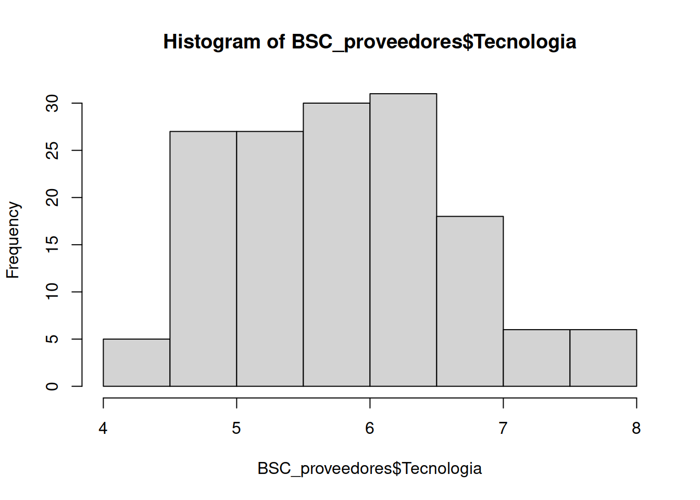


El gráfico nos muestra que hay dos grupos de contratistas (casi 29 ocurrencias en cada uno) con un desempeño de 6 en la variable TECNOLOGÍA . La escala original era de 1 a 10.

Utilizaremos el comando par() que permite dividir el área de ploteo en una matriz especificada por el comando Numero de Columna (nmfrow)

Haga las interpretaciones de estos gráficos.

** Particionado del área de impresión


```r
par(mfrow=c(2,2))
hist(BSC_proveedores$Tecnologia)
hist(BSC_proveedores$Tecnologia)
hist(BSC_proveedores$Capital)
hist(BSC_proveedores$Equipo)
```

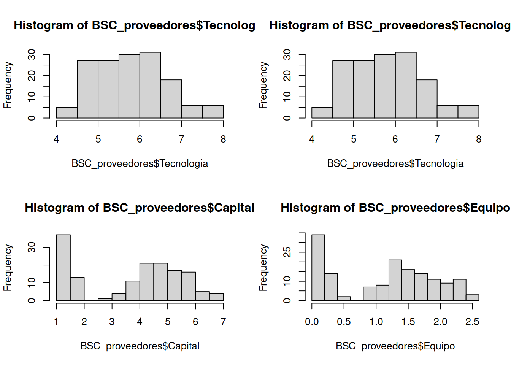


## Gráficos de Densidad

Algunas personas prefieren utilizar la envolvente del histograma que es el gráfico de densidad. [@chomboon_empirical_2015]

<<Density,fig=TRUE>>=


```r

par(mfrow=c(1,1))
plot(density(BSC_proveedores$Equipo))
```

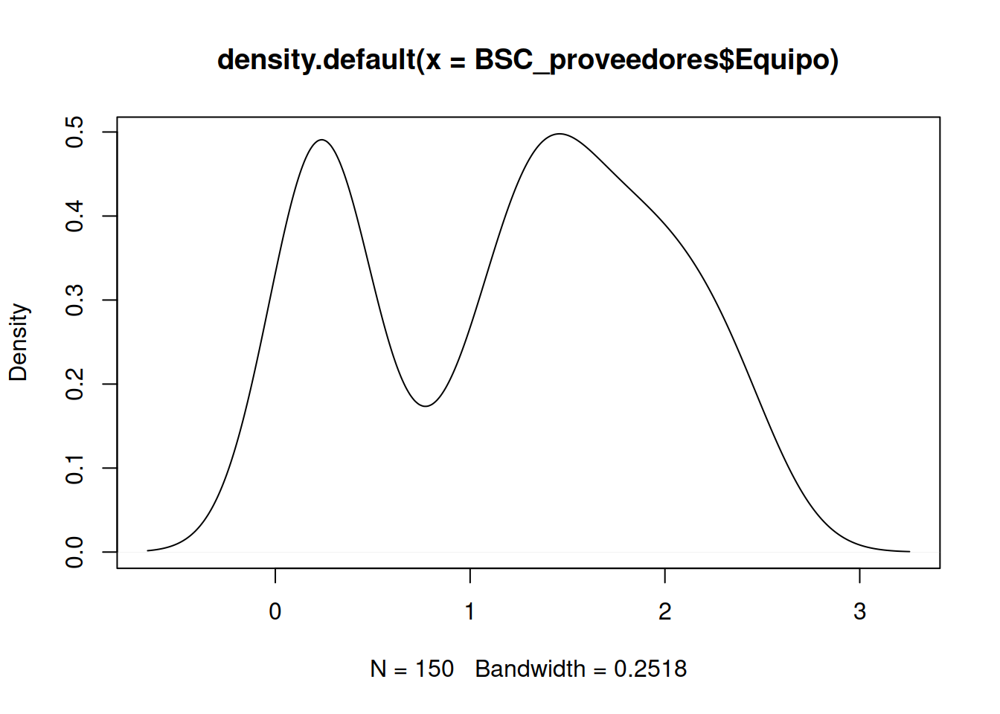


```r
par(mfrow=c(2,2))
plot(density(BSC_proveedores$Tecnologia))
plot(density(BSC_proveedores$Normas))
plot(density(BSC_proveedores$Capital))
plot(density(BSC_proveedores$Equipo))
```

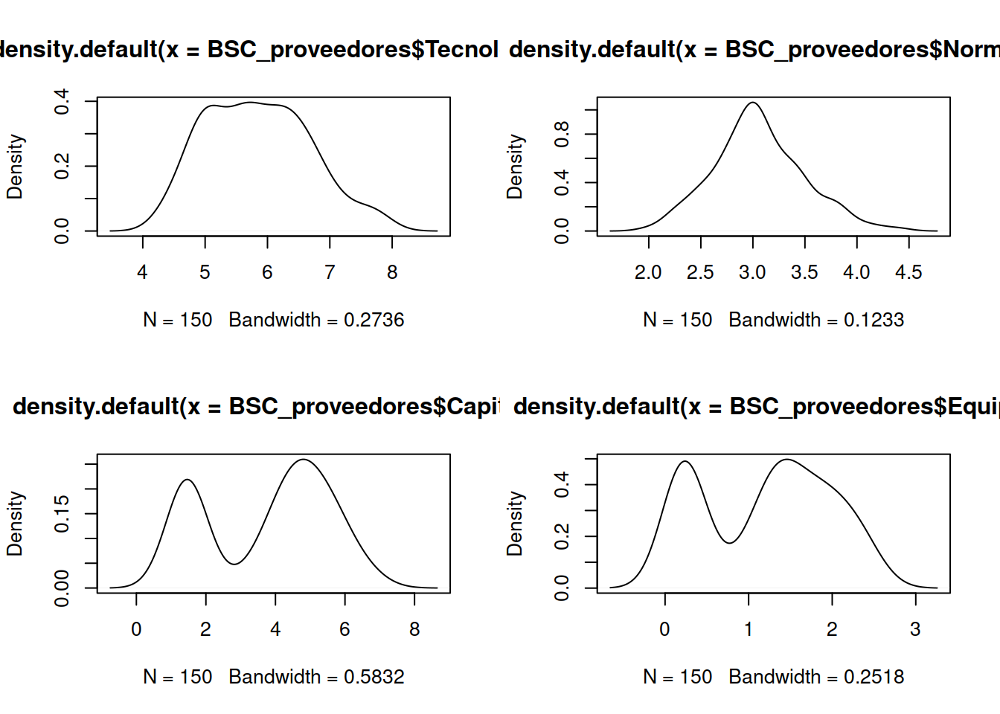


Algunas de estas gráficas ya nos muestran que existen ciertas diferencias entre las contratistas, es como si hubiese diferentes campanas de Gauss que agrupan a las diferentes muestras.


## Gráficas Ralas y Análisis Multivariado


```r
library(car)
#> Loading required package: carData
BSC_Rawdata <- BSC_proveedores[ ,c(2,3,4,5)]
BSC_Rawdata
#>     Tecnologia Normas Capital Equipo
#> 1          5.1    3.5     1.4    0.2
#> 2          4.9    3.0     1.4    0.2
#> 3          4.7    3.2     1.3    0.2
#> 4          4.6    3.1     1.5    0.2
#> 5          5.0    3.6     1.4    0.2
#> 6          5.4    3.9     1.7    0.4
#> 7          4.6    3.4     1.4    0.3
#> 8          5.0    3.4     1.5    0.2
#> 9          4.4    2.9     1.4    0.2
#> 10         4.9    3.1     1.5    0.1
#> 11         5.4    3.7     1.5    0.2
#> 12         4.8    3.4     1.6    0.2
#> 13         4.8    3.0     1.4    0.1
#> 14         4.3    3.0     1.1    0.1
#> 15         5.8    4.0     1.2    0.2
#> 16         5.7    4.4     1.5    0.4
#> 17         5.4    3.9     1.3    0.4
#> 18         5.1    3.5     1.4    0.3
#> 19         5.7    3.8     1.7    0.3
#> 20         5.1    3.8     1.5    0.3
#> 21         5.4    3.4     1.7    0.2
#> 22         5.1    3.7     1.5    0.4
#> 23         4.6    3.6     1.0    0.2
#> 24         5.1    3.3     1.7    0.5
#> 25         4.8    3.4     1.9    0.2
#> 26         5.0    3.0     1.6    0.2
#> 27         5.0    3.4     1.6    0.4
#> 28         5.2    3.5     1.5    0.2
#> 29         5.2    3.4     1.4    0.2
#> 30         4.7    3.2     1.6    0.2
#> 31         4.8    3.1     1.6    0.2
#> 32         5.4    3.4     1.5    0.4
#> 33         5.2    4.1     1.5    0.1
#> 34         5.5    4.2     1.4    0.2
#> 35         4.9    3.1     1.5    0.2
#> 36         5.0    3.2     1.2    0.2
#> 37         5.5    3.5     1.3    0.2
#> 38         4.9    3.6     1.4    0.1
#> 39         4.4    3.0     1.3    0.2
#> 40         5.1    3.4     1.5    0.2
#> 41         5.0    3.5     1.3    0.3
#> 42         4.5    2.3     1.3    0.3
#> 43         4.4    3.2     1.3    0.2
#> 44         5.0    3.5     1.6    0.6
#> 45         5.1    3.8     1.9    0.4
#> 46         4.8    3.0     1.4    0.3
#> 47         5.1    3.8     1.6    0.2
#> 48         4.6    3.2     1.4    0.2
#> 49         5.3    3.7     1.5    0.2
#> 50         5.0    3.3     1.4    0.2
#> 51         7.0    3.2     4.7    1.4
#> 52         6.4    3.2     4.5    1.5
#> 53         6.9    3.1     4.9    1.5
#> 54         5.5    2.3     4.0    1.3
#> 55         6.5    2.8     4.6    1.5
#> 56         5.7    2.8     4.5    1.3
#> 57         6.3    3.3     4.7    1.6
#> 58         4.9    2.4     3.3    1.0
#> 59         6.6    2.9     4.6    1.3
#> 60         5.2    2.7     3.9    1.4
#> 61         5.0    2.0     3.5    1.0
#> 62         5.9    3.0     4.2    1.5
#> 63         6.0    2.2     4.0    1.0
#> 64         6.1    2.9     4.7    1.4
#> 65         5.6    2.9     3.6    1.3
#> 66         6.7    3.1     4.4    1.4
#> 67         5.6    3.0     4.5    1.5
#> 68         5.8    2.7     4.1    1.0
#> 69         6.2    2.2     4.5    1.5
#> 70         5.6    2.5     3.9    1.1
#> 71         5.9    3.2     4.8    1.8
#> 72         6.1    2.8     4.0    1.3
#> 73         6.3    2.5     4.9    1.5
#> 74         6.1    2.8     4.7    1.2
#> 75         6.4    2.9     4.3    1.3
#> 76         6.6    3.0     4.4    1.4
#> 77         6.8    2.8     4.8    1.4
#> 78         6.7    3.0     5.0    1.7
#> 79         6.0    2.9     4.5    1.5
#> 80         5.7    2.6     3.5    1.0
#> 81         5.5    2.4     3.8    1.1
#> 82         5.5    2.4     3.7    1.0
#> 83         5.8    2.7     3.9    1.2
#> 84         6.0    2.7     5.1    1.6
#> 85         5.4    3.0     4.5    1.5
#> 86         6.0    3.4     4.5    1.6
#> 87         6.7    3.1     4.7    1.5
#> 88         6.3    2.3     4.4    1.3
#> 89         5.6    3.0     4.1    1.3
#> 90         5.5    2.5     4.0    1.3
#> 91         5.5    2.6     4.4    1.2
#> 92         6.1    3.0     4.6    1.4
#> 93         5.8    2.6     4.0    1.2
#> 94         5.0    2.3     3.3    1.0
#> 95         5.6    2.7     4.2    1.3
#> 96         5.7    3.0     4.2    1.2
#> 97         5.7    2.9     4.2    1.3
#> 98         6.2    2.9     4.3    1.3
#> 99         5.1    2.5     3.0    1.1
#> 100        5.7    2.8     4.1    1.3
#> 101        6.3    3.3     6.0    2.5
#> 102        5.8    2.7     5.1    1.9
#> 103        7.1    3.0     5.9    2.1
#> 104        6.3    2.9     5.6    1.8
#> 105        6.5    3.0     5.8    2.2
#> 106        7.6    3.0     6.6    2.1
#> 107        4.9    2.5     4.5    1.7
#> 108        7.3    2.9     6.3    1.8
#> 109        6.7    2.5     5.8    1.8
#> 110        7.2    3.6     6.1    2.5
#> 111        6.5    3.2     5.1    2.0
#> 112        6.4    2.7     5.3    1.9
#> 113        6.8    3.0     5.5    2.1
#> 114        5.7    2.5     5.0    2.0
#> 115        5.8    2.8     5.1    2.4
#> 116        6.4    3.2     5.3    2.3
#> 117        6.5    3.0     5.5    1.8
#> 118        7.7    3.8     6.7    2.2
#> 119        7.7    2.6     6.9    2.3
#> 120        6.0    2.2     5.0    1.5
#> 121        6.9    3.2     5.7    2.3
#> 122        5.6    2.8     4.9    2.0
#> 123        7.7    2.8     6.7    2.0
#> 124        6.3    2.7     4.9    1.8
#> 125        6.7    3.3     5.7    2.1
#> 126        7.2    3.2     6.0    1.8
#> 127        6.2    2.8     4.8    1.8
#> 128        6.1    3.0     4.9    1.8
#> 129        6.4    2.8     5.6    2.1
#> 130        7.2    3.0     5.8    1.6
#> 131        7.4    2.8     6.1    1.9
#> 132        7.9    3.8     6.4    2.0
#> 133        6.4    2.8     5.6    2.2
#> 134        6.3    2.8     5.1    1.5
#> 135        6.1    2.6     5.6    1.4
#> 136        7.7    3.0     6.1    2.3
#> 137        6.3    3.4     5.6    2.4
#> 138        6.4    3.1     5.5    1.8
#> 139        6.0    3.0     4.8    1.8
#> 140        6.9    3.1     5.4    2.1
#> 141        6.7    3.1     5.6    2.4
#> 142        6.9    3.1     5.1    2.3
#> 143        5.8    2.7     5.1    1.9
#> 144        6.8    3.2     5.9    2.3
#> 145        6.7    3.3     5.7    2.5
#> 146        6.7    3.0     5.2    2.3
#> 147        6.3    2.5     5.0    1.9
#> 148        6.5    3.0     5.2    2.0
#> 149        6.2    3.4     5.4    2.3
#> 150        5.9    3.0     5.1    1.8
scatterplotMatrix(BSC_Rawdata)
```

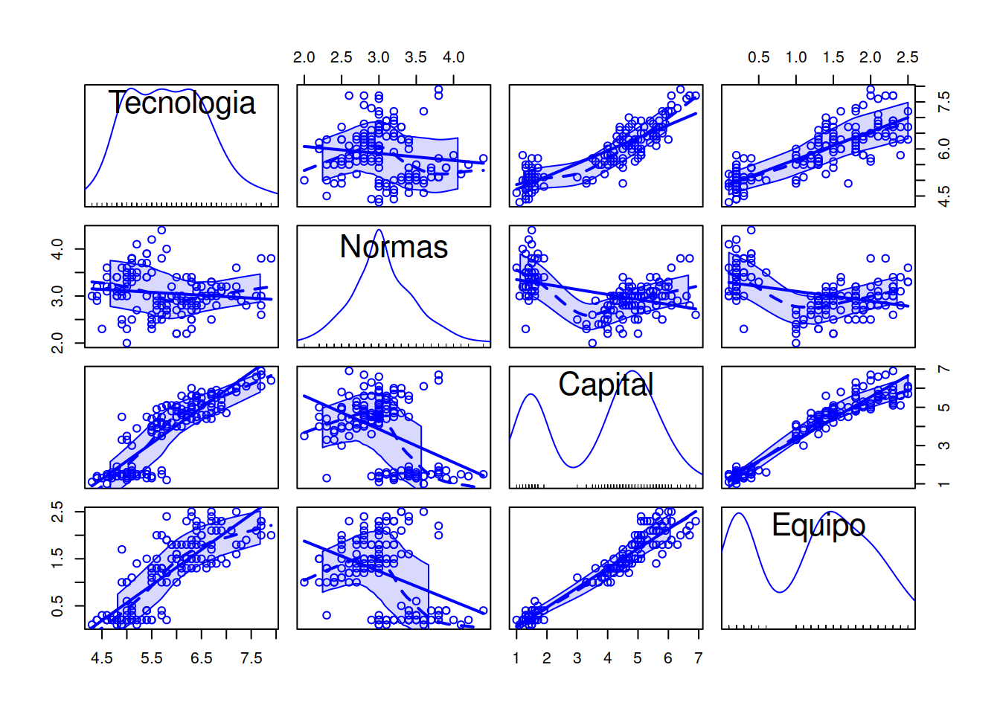


Este tipo de análisis multivariado nos permite construir una matriz de gráficas que en la diagonal principal nos muestra los ya conocidos gráficos de densidad.
Luego cada una de las otras intersecciones nos señala si existe algún tipo de correlación montónica (creciente o decreciente) entre las variables analizadas.
Esto es importante, pues a priori no sabemos si las dimensiones que estamos usando tienen o no relación entre ellas. En otras palabras si las dimensiones o metas tienen correlación quiere decir que podríamos prescindir de una de ellas. 
Así capital y equipo parecen a priori tener alta linealidad en su correlación.[@wang_giant_2023]


Notar también las líneas de puntos que nos marcan el intervalo de confianza que podríamos tener sobre esa variable. Es justamente ese margen el que nos perite establecer la franja de flotación que motiva el paso de verde a amarillo. Si se desplazase a tres veces la varianza estaríamos en rojo.
 


## Mínimo numero de dimensiones

Cuándo nos enfrentamos a situaciones como esta, suele ocurrir que al definir los indicadores nos encontramos con el dilema del gran volumen de datos. Esto no es un problema que provenga tan solo del número de casos que estudiamos con el objeto de conocer el recorrido de una variable, sino más bien por la gran cantidad de variables o calificadores con los que los definimos o estudiamos.
Ya vimos en el caso anterior como dimensiones o variables que tienen distinto nombre no son en realidad más que la misma cosa. 
En el ejemplo anterior la pregunta era si podríamos prescindir de una variable. En este ejercicio trataremos de ver cuantas podemos eliminar. La consigna es Mientras menos variables mejor, y la restricción que impondremos será la de perder variables siempre que podamos seguir describiendo con alto nivel de confianza el comportamiento de todos los casos. Otra mirada sobre el problema podría enunciarse así. “Como puedo saber que valores o recorrido le impondría a la mínima cantidad de variables para calificar como candidato interesante en la nómina de contratistas de las grandes empresas constructoras”. [@adithiyaa_optimal_2020]


Para auxilio en este problema utilizaremos el Método de Análisis de Componentes Principales. En este caso y al igual que en el caso anterior usaré un subconjunto de datos (sólo los numéricos) y en especial la matriz de correlación. Esta matriz está armada con las pendientes de las aproximaciones lineales de las rectas del gráfico de densidades. 

Las técnicas que usaremos pretenden desde sus diferentes enfoques abrodar el problema de simplificar la interpretación del comportamiento individual y colectivo de los casos (empresas  constructoras y contratista) y como podemos valernos del proceso de ingeniería inversa para mover los controles de nuestra “nave” en el tablero de comando con el que fijaremos la altura de la vara del tablero de control.

## Análisis de Componentes Principales

Crearemos un objeto nuevo que se llamará PC1 (por Principal Component 1) y la instrucción con el que crearemos la matriz de correlaciones es princomp.[@estakhroueiyeh_detecting_2015] 


```r
PC1 <- princomp(BSC_Rawdata)
PC1
#> Call:
#> princomp(x = BSC_Rawdata)
#> 
#> Standard deviations:
#>    Comp.1    Comp.2    Comp.3    Comp.4 
#> 2.0494032 0.4909714 0.2787259 0.1538707 
#> 
#>  4  variables and  150 observations.
plot(PC1)
```

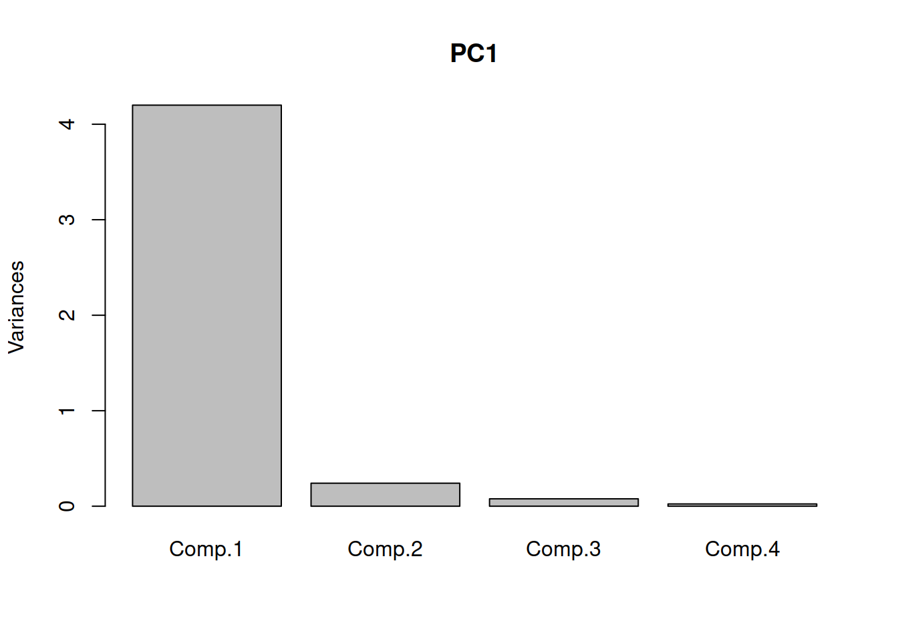


En el ploteo podemos ver que uno de los componentes principales aporta casi el 4 veces más de la información referida al comportamiento de la varianza de todos los casos. Este componente es el que más incluye en la clasificación o posible identificación del comportamiento de cada individuo de la muestra.   

<<sumario_pc1,echo=TRUE>>=


```r
summary(PC1)
#> Importance of components:
#>                           Comp.1     Comp.2     Comp.3
#> Standard deviation     2.0494032 0.49097143 0.27872586
#> Proportion of Variance 0.9246187 0.05306648 0.01710261
#> Cumulative Proportion  0.9246187 0.97768521 0.99478782
#>                             Comp.4
#> Standard deviation     0.153870700
#> Proportion of Variance 0.005212184
#> Cumulative Proportion  1.000000000
```


Si observamos bien el reporte que nos entrega el comando summary nos podemos dar cuenta que con los dos primeros componentes podríamos explicar 97.768521% del comportamiento de las muestras de la población. En nuestro caso del total de empresas contratistas analizadas.

¿Qué pasaría si representamos a las empresas en un gŕafico en el que las variables de los ejes sean los dos componentes principales? , pues tendríamos un primer indicio de la bondad de las dimensiones o variables para agrupar a las muestras
Esto lo podemos realizar con el comando bilot. [@liu_enhanced_2022]


```r
biplot(PC1)
```

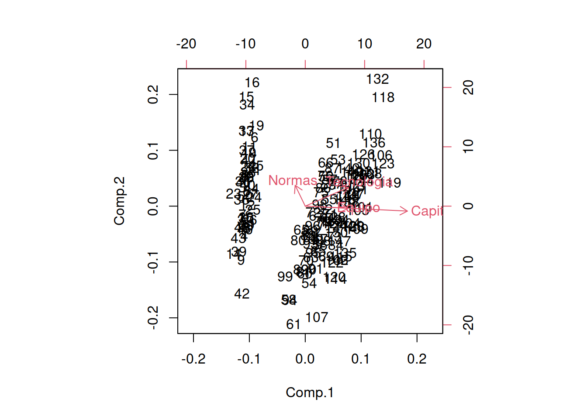


Los ńumeros que aparecen el el diagrama son el caso de estudio (renglón en que se encuentra la empresa contratista).
A simple vista observamos que hay como tres tipos distintos empresas (tres nubes claramente diferenciadas). Aquí nos queda claro que el principal componente que ordena o divide a estas colonias es indistintamente el CAPITAL o el EQUIPAMIENTO con que cuentas. 

También podemos ver que hay empresas como la 15, 16, 132, 118, 61, 107 sobre las que el gráfico nos recomienda estudiarlas más pues no es capaz de clasificarlas bien (son casos extremos o anómalos). Tal vez con poco capital o sin equipo pueden llegar a ser competitivas o interesantes para las grandes constructoras.[@moosavian_comparison_2013]

Por último la dimensión referida a la cetificación de NORMAS es la dimensión que menos valor aporta. Esto no implica que no certificar sea poco importante, sino que probablemente sea una pregunta irrelevante si todos contestaron que SI certificaron ISO 9000.

## Scores

Si el comportamiento del componente va hacia el lado positivo, se debe interpretar como que a mayor desempeño mejor resultado o calificación. Si algún componente apunta para el lado negativo  tendremos que pensar que a mayor calificación en esa dimensión pero sería el desempeño.
La variable PC1 que usamos tiene mucha información valiosa.
Revise todo el contenido, voy a mostrar una dimensión que es el score que indica como se comportarían todos los individuos si sólo los analizásemos con los componentes 1 y 2.


```r
acp1 <- PC1$scores
acp1 [1:10 , ]
#>          Comp.1      Comp.2      Comp.3       Comp.4
#>  [1,] -2.684126  0.31939725  0.02791483  0.002262437
#>  [2,] -2.714142 -0.17700123  0.21046427  0.099026550
#>  [3,] -2.888991 -0.14494943 -0.01790026  0.019968390
#>  [4,] -2.745343 -0.31829898 -0.03155937 -0.075575817
#>  [5,] -2.728717  0.32675451 -0.09007924 -0.061258593
#>  [6,] -2.280860  0.74133045 -0.16867766 -0.024200858
#>  [7,] -2.820538 -0.08946138 -0.25789216 -0.048143106
#>  [8,] -2.626145  0.16338496  0.02187932 -0.045297871
#>  [9,] -2.886383 -0.57831175 -0.02075957 -0.026744736
#> [10,] -2.672756 -0.11377425  0.19763272 -0.056295401
```


Voy a realizar el mismo score pero ahora solo con los componentes 1 y 2


```r
acp2 <-PC1$scores[ ,1:2]
plot(acp2)
```

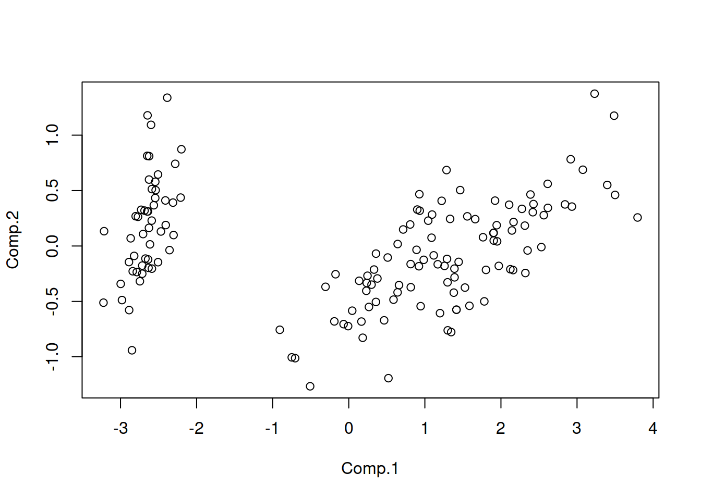


Aquí ya podemos ver más claramente la división que se produce entre distintos clusters. Para poder diferencias aún más recurriremos a un nuevo tipo de análisis diferenciado que se llama análisis de clusters


## Análisis de Clusters o Conglomerados

Para realizar este análisis recurriremos a cargar la biblioteca clusters

En el análisis de conglomerados existen dos formas clásicas de estudio. Ambas recurren a las distancias euclídeas entre las muestras. Tenemos aproximaciones Jerárquicas  y No Jerárquicas 
**AGNES, CLARA, DIANA, MORA, PAM** son nombres de las técnicas que la biblioteca Clusters usa. Todas las técnicas se caracterizan por ser un acrónimo de la combinación de aproximaciones que usan (Single Linkage, Complete Linkage, Average Linkage) .


Todas tienen nombre de mujer, pero esto no quiere necesariamente decir que se trate de una técnica con complicaciones inesperadas, sino más bien que si quieres lo mejor de una de ellas es mejor que la entiendas e indagues en la página del manual.


```r
library(cluster)
agp1 = agnes(acp2,method="single")
agp2 = agnes(acp2,method="complete")
agp3 = agnes(acp2,method="average")
```

Con la clasificacion terminada procederemos a ver gráficamente el resultado.


```r
par(mfrow=c(2,2))
plot(acp2)
plot(agp1)
plot(agp2)
```

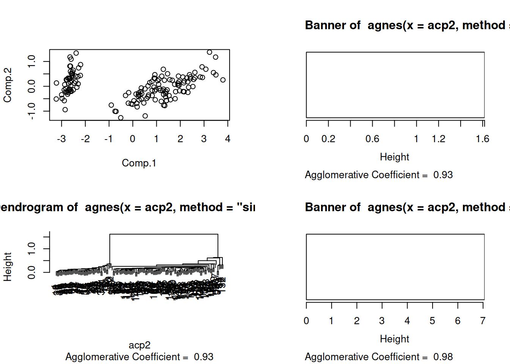

```r
plot(agp3)
```

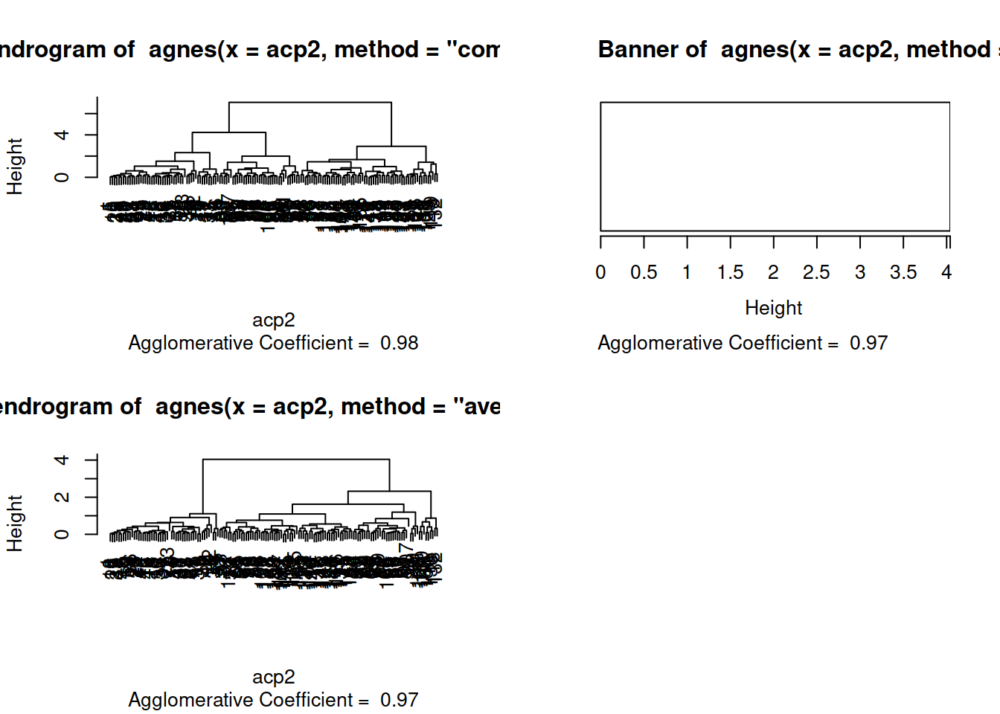


Pasa asignar las muestras a grupos usaré el comendo cuttree que me permite valerme de las franjas blancas de corte del los gráficos para armar los clusters


```r
agpcut <- cutree(agp3,3)
par(mfrow=c(1,1))
plot(acp2,col=agpcut)
```

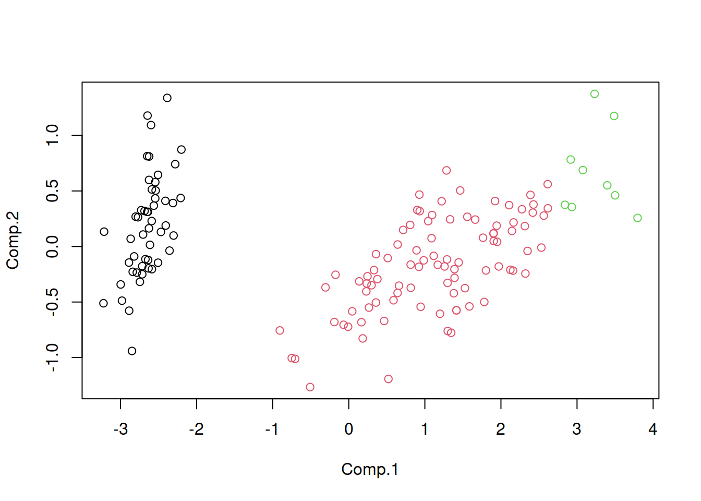


### Otros gráficos de agrupamiento


Método Clara


```r
plot(clara(BSC_Rawdata,5))
```

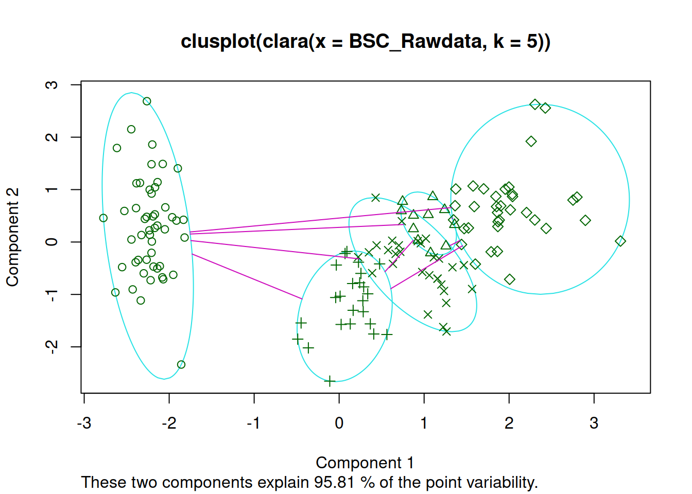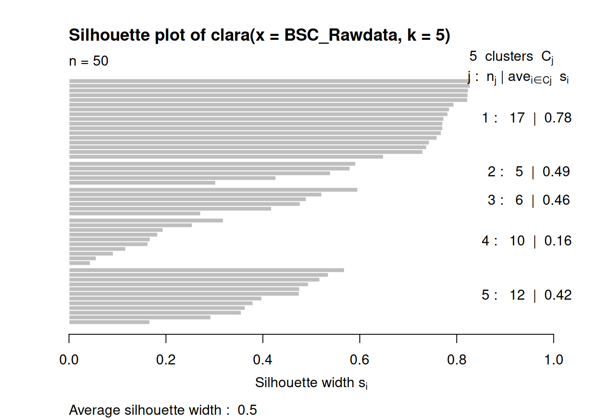

## Método Melisa


```r
plot(diana(BSC_Rawdata),ask = FALSE)
```

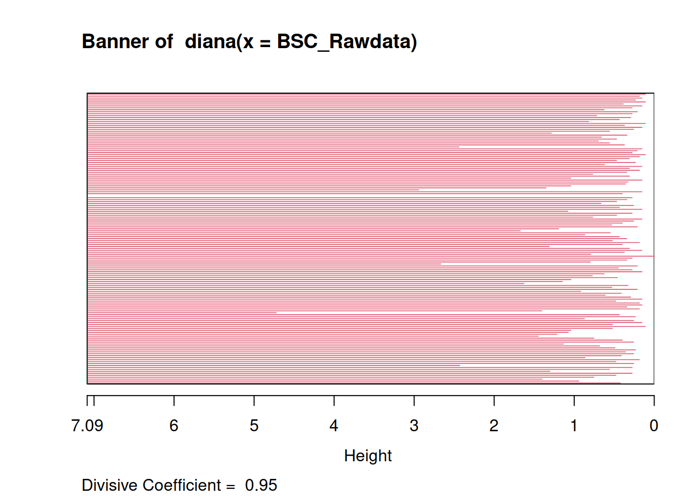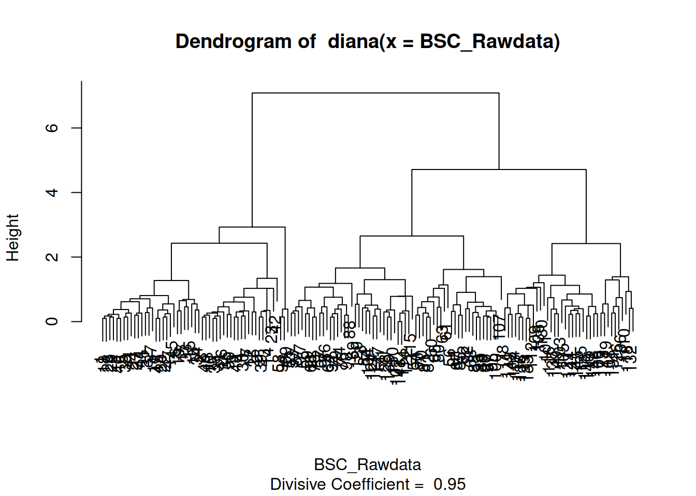

