# Redes Neuronales artificiales

Las redes neuronales artificiales son modelos computacionales inspirados en el funcionamiento del cerebro humano. Están compuestas por una serie de unidades llamadas neuronas artificiales, que están conectadas entre sí a través de conexiones ponderadas. Estas conexiones permiten a las redes neuronales procesar información y realizar tareas de aprendizaje y predicción.


En ingeniería industrial, las redes neuronales artificiales se utilizan en una amplia variedad de aplicaciones, como:

1. Pronóstico de demanda: Las redes neuronales pueden utilizarse para predecir la demanda futura de productos o servicios en función de datos históricos, ayudando así a la planificación de la producción y la gestión de inventarios.

2. Control de procesos: Las redes neuronales pueden utilizarse para controlar y optimizar procesos industriales. Pueden aprender de los datos recopilados en tiempo real y ajustar los parámetros del sistema para maximizar la eficiencia y minimizar los errores.

3. Mantenimiento predictivo: Las redes neuronales pueden utilizarse para predecir fallos y realizar mantenimiento predictivo en maquinaria y equipos industriales. Al analizar datos de sensores y patrones de fallas anteriores, las redes neuronales pueden identificar señales de advertencia temprana y ayudar a evitar costosas interrupciones en la producción.

4. Control de calidad: Las redes neuronales pueden utilizarse para realizar inspección y control de calidad en productos manufacturados. Pueden identificar defectos o anomalías en imágenes, señales o datos sensoriales, ayudando a mejorar la calidad del producto final.

5. Optimización de la cadena de suministro: Las redes neuronales pueden utilizarse para optimizar la gestión de la cadena de suministro, analizando grandes volúmenes de datos y tomando decisiones óptimas en tiempo real sobre inventario, distribución y logística.

La ventaja de las redes neuronales artificiales en ingeniería industrial radica en su capacidad para modelar relaciones complejas y no lineales entre variables, así como en su capacidad de aprendizaje a partir de datos. Sin embargo, es importante tener en cuenta que el uso de redes neuronales artificiales requiere una adecuada preparación y procesamiento de los datos, así como una validación y ajuste adecuados de los modelos para garantizar resultados confiables y precisos.[@zermane_development_2022]


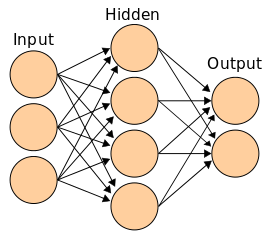

* Si la ANN (Artificial Neural Net) tiene sólo una neurona de salida actua como clasificador dicotómico de la entrada.

* Si tiene varios niveles o categorías del tipo binario puede actuar como clasificador categórico

* Si tiene una salida de doble precisión puede actuar como predictor (clustering)

## Bibliografía recomendada

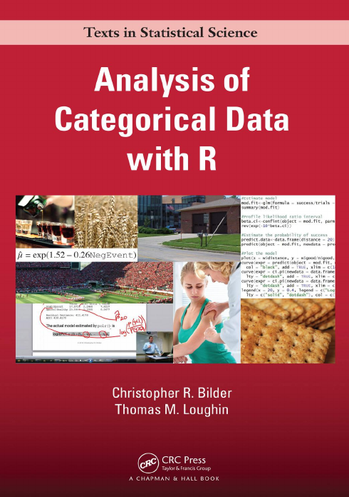


## Redes Neuronales en R-Cran

En R-Cran, puedes implementar redes neuronales artificiales utilizando la biblioteca "neuralnet". Esta biblioteca proporciona funciones para construir y entrenar redes neuronales de una o varias capas en R.

Aquí hay un ejemplo básico de cómo construir y entrenar una red neuronal artificial utilizando la biblioteca "neuralnet" en R-Cran:

1. Instalación del paquete "neuralnet":


    install.packages("neuralnet")


2. Carga del paquete "neuralnet":


    library(neuralnet)


3. Preparación de los datos de entrenamiento y prueba:

Supongamos que tienes un conjunto de datos con variables de entrada (predictoras) llamadas "x1" y "x2" y una variable de salida (objetivo) llamada "y". Debes dividir tus datos en conjuntos de entrenamiento y prueba. Aquí hay un ejemplo de cómo puedes hacerlo:


    set.seed(123)  # Establecer una semilla aleatoria para reproducibilidad

      # Dividir datos en conjuntos de entrenamiento y prueba

    train_indices <- sample(1:nrow(tus_datos), nrow(tus_datos)*0.8)  # 80% de los datos para entrenamiento
    train_data <- tus_datos[train_indices, ]
    test_data <- tus_datos[-train_indices, ]


4. Construcción de la red neuronal:

Aquí puedes definir la arquitectura de tu red neuronal especificando el número de nodos en cada capa oculta. Por ejemplo, una red con una capa oculta de 5 nodos se puede definir de la siguiente manera:

  
    # Definir la fórmula de la red neuronal
    formula <- y ~ x1 + x2

Crear la red neuronal

    nn <- neuralnet(formula, data = train_data, hidden = c(5))


En este ejemplo, "formula" especifica la relación entre las variables de entrada y salida, y "hidden" indica el número de nodos en la capa oculta.

5. Entrenamiento de la red neuronal:

Utiliza la función "train" para entrenar la red neuronal con los datos de entrenamiento:


Entrenar la red neuronal

    trained_nn <- train(nn)


6. Predicción con la red neuronal entrenada:

Utiliza la función "compute" para realizar predicciones con la red neuronal entrenada:


Realizar predicciones con la red neuronal

    predictions <- compute(trained_nn, test_data[, c("x1", "x2")])


En este ejemplo, "test_data[, c("x1", "x2")]" son las variables de entrada para las cuales deseas realizar predicciones.

Este es solo un ejemplo básico para construir y entrenar una red neuronal artificial en R-Cran utilizando la biblioteca "neuralnet". Puedes consultar la documentación de la biblioteca para obtener más información sobre las funciones y opciones disponibles.[@morizet_classification_2016]

## Caso de estudio: Cargar de bibliotecas


```r
library(neuralnet)  # regression

library(nnet) # classification 

library(NeuralNetTools)

library(plyr)
```


## Carga de Datos


```r
library(readr)
Startups <- read_csv("/home/rpalma/AAA_Datos/2020/Posgrado/Di3/Datasets/50 Start Ups/50_Startups_LAC.csv")
#> Rows: 50 Columns: 6
#> ── Column specification ────────────────────────────────────
#> Delimiter: ","
#> chr (1): Pais
#> dbl (5): R_D_Spend, POM, Logist_Market, Profit, Superviv...
#> 
#> ℹ Use `spec()` to retrieve the full column specification for this data.
#> ℹ Specify the column types or set `show_col_types = FALSE` to quiet this message.
```


```r
Categoric <- read_csv("/home/rpalma/AAA_Datos/2020/Posgrado/Di3/Datasets/50 Start Ups/50_Startups_Categoric_LAC.csv")
#> Rows: 50 Columns: 6
#> ── Column specification ────────────────────────────────────
#> Delimiter: ","
#> chr (2): Pais, Supervivencia
#> dbl (4): R_D_Spend, POM, Logist_Market, Profit
#> 
#> ℹ Use `spec()` to retrieve the full column specification for this data.
#> ℹ Specify the column types or set `show_col_types = FALSE` to quiet this message.
```

La columna supervivencia de la tabla Categoric tiene etiquetas que identifican la situación en la que terminaron los emprendimientos, a saber:

* **SpinOf** La empresa se separó de una principal y logró su independencia económica

* **RevEq** La empresa alcanzó su punto de equilibrio canceló su deuda con el banco y fue comprada por la competencia.

* **BankR** La empresa no prosperó y el banco se quedó con los activos que vendidos no compensaron el preśtamo inicial (Banca Rota).


## Tratamiento de variables categóricas


```r
tabla1 <- table(Categoric$Pais)
tabla2 <- table(Categoric$Supervivencia)
tabla3 <- table(Categoric$Pais,Categoric$Supervivencia)
```


```r
plot(tabla1, col=c("red","green","blue"))
```

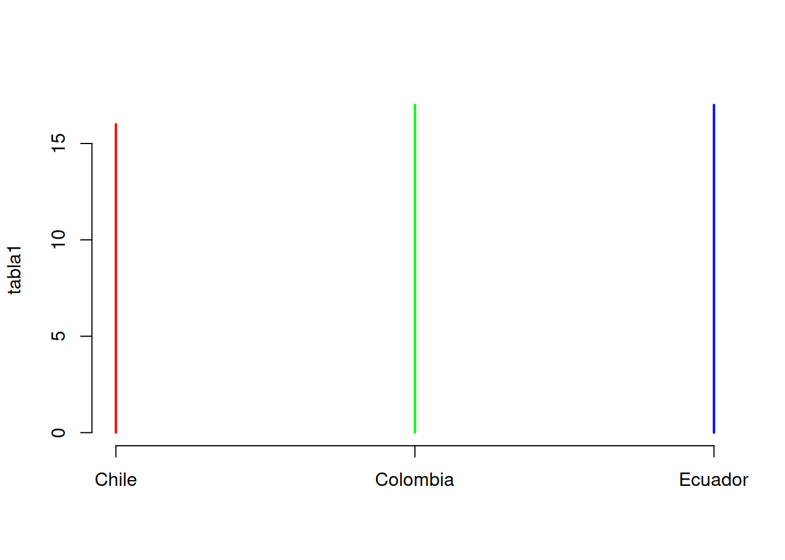


```r
plot(tabla2, col=c("red","green","blue"))
```

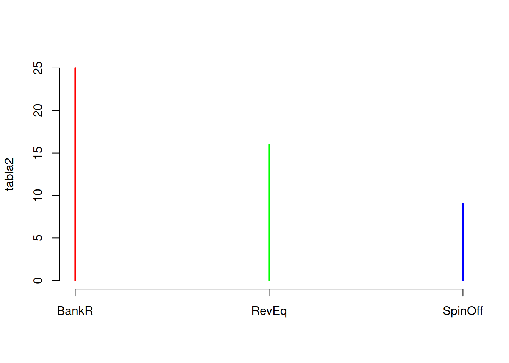


```r
plot(tabla3, col=c("red","green","blue"))
```

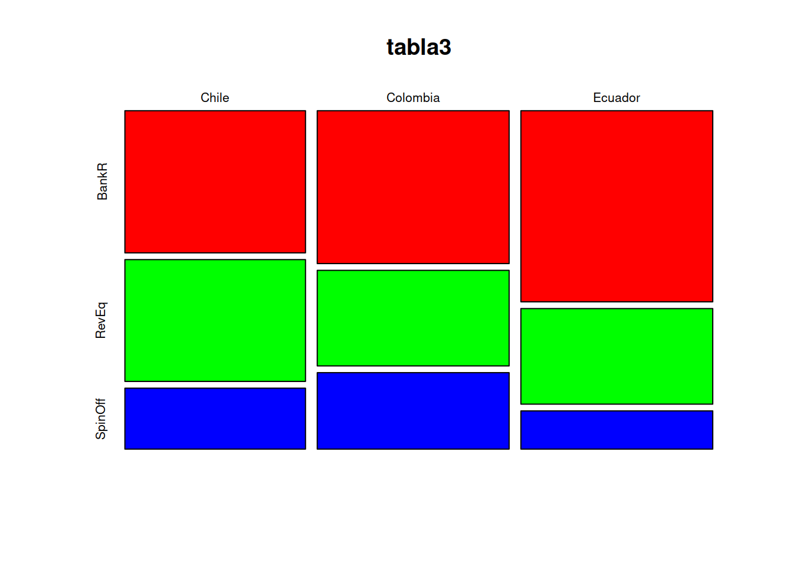


## Histogramas superpuestos


```r
ind_1 <- which(Categoric$Pais=="Colombia")
p1 <- as.matrix(Categoric[ind_1,5])

ind_2 <- which(Categoric$Pais=="Ecuador")
p2 <- as.matrix(Categoric[ind_2,5])

ind_3 <- which(Categoric$Pais=="Chile")
p3 <- as.matrix(Categoric[ind_3,5])
```


```r
hp1 <- hist(p1)
```


```r
hp2 <- hist(p2)
```

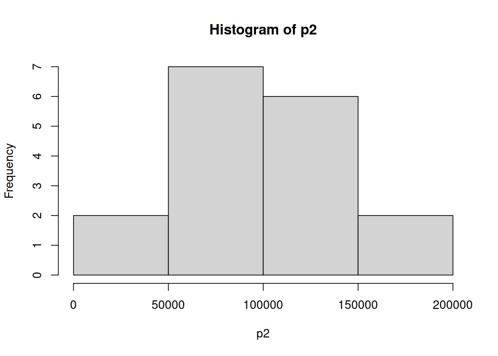

```r
hp3 <- hist(p3)
```

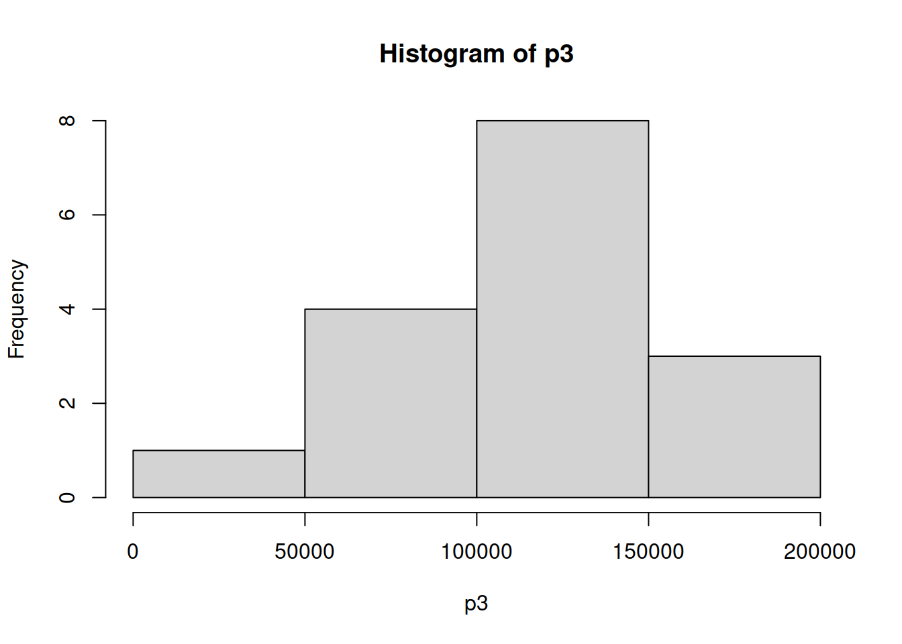

```r

par(mfrow=c(3,1))
plot( hp1, col=rgb(0,0,1,1/4), xlim=c(30000,200000),ylim=c(0,5),main="Ecuador")
plot( hp2, col=rgb(1,0,0,1/4),xlim=c(30000,200000),ylim=c(0,10),main="Colombia") 
plot( hp3, col=rgb(1,0,0,1/4),xlim=c(30000,200000),ylim=c(0,10),main="Chile") 
```

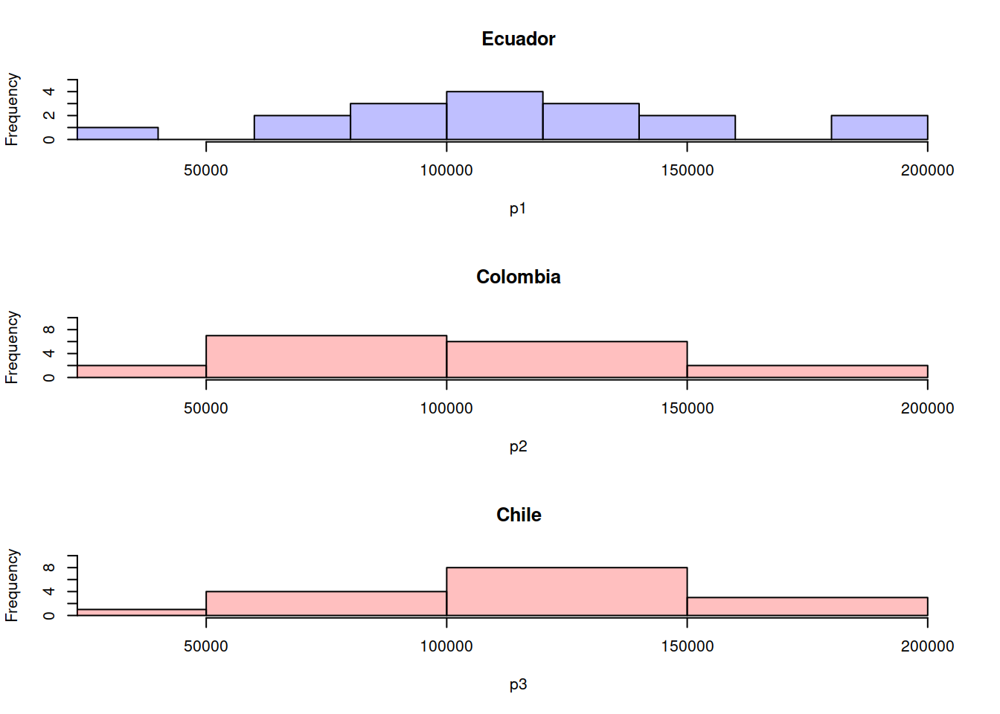


```r
par(mfrow=c(1,3))
plot( hp1, col=rgb(0,0,1,1/4), xlim=c(30000,200000),ylim=c(0,5),main="Ecuador")
plot( hp2, col=rgb(1,0,0,1/4),xlim=c(30000,200000),ylim=c(0,10),main="Colombia") 
plot( hp3, col=rgb(1,0,0,1/4),xlim=c(30000,200000),ylim=c(0,10),main="Chile") 
```

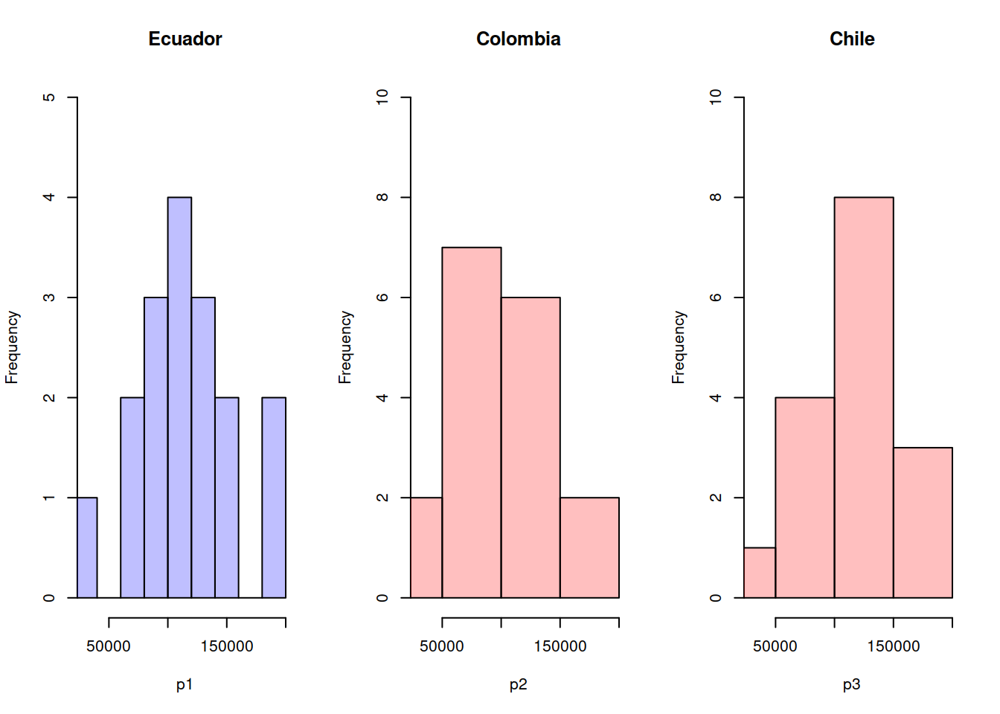


```r
pairs(Categoric[ ,1:3])
```

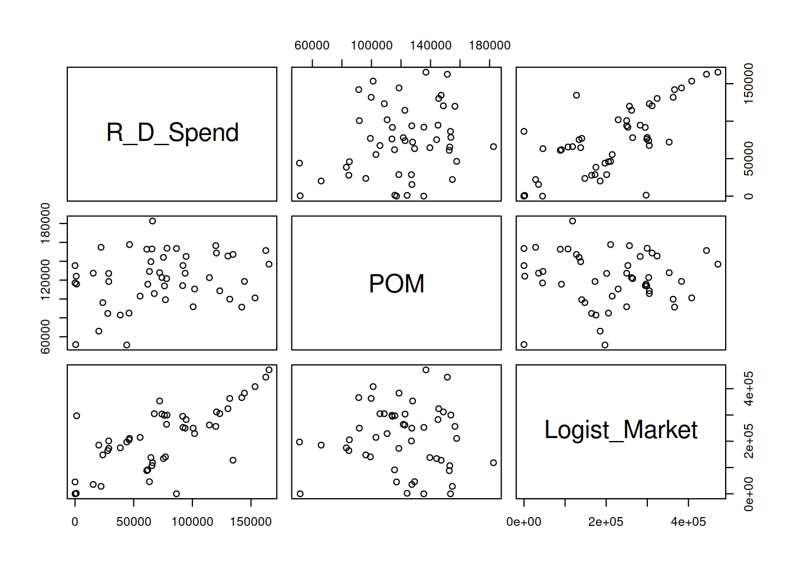


```r
boxplot(Categoric[ ,1:3])
```

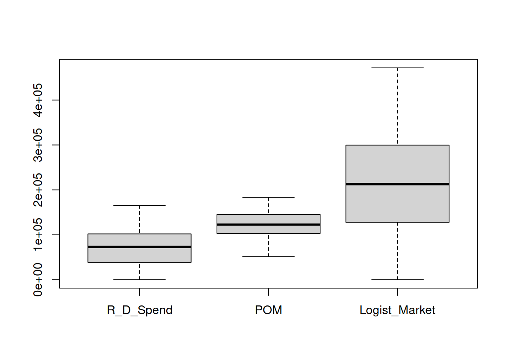


```r
Categoric$Pais <- as.numeric(revalue(Categoric$Pais,
                          c("Colombia"="0", "Ecuador"="1",
                            "Chile"="2")))
```

## Cuadro de campos categóricos


```r
Categoric$Supervivencia <- as.numeric(revalue(Categoric$Supervivencia,
                          c("BankR"="0", "RevEq"="1",
                            "SpinOff"="2")))
```

## Profit versus País


```r
plot(Categoric$Pais, Categoric$Profit)
```

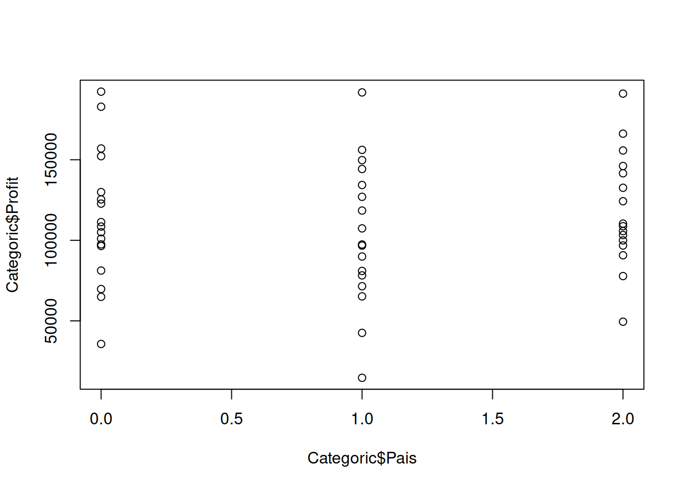


## Visualización de Tablas

Tabla Textual


```r
library(kableExtra)
kable(head(Categoric), "pipe")
```


| R_D_Spend|       POM| Logist_Market| Pais|   Profit| Supervivencia|
|---------:|---------:|-------------:|----:|--------:|-------------:|
|  165349.2| 136897.80|      471784.1|    0| 192261.8|             2|
|  162597.7| 151377.59|      443898.5|    1| 191792.1|             2|
|  153441.5| 101145.55|      407934.5|    2| 191050.4|             2|
|  144372.4| 118671.85|      383199.6|    0| 182902.0|             2|
|  142107.3|  91391.77|      366168.4|    2| 166187.9|             2|
|  131876.9|  99814.71|      362861.4|    0| 156991.1|             2|


Tabla Simple


```r
kable(head(Categoric), "simple")
```


 R_D_Spend         POM   Logist_Market   Pais     Profit   Supervivencia
----------  ----------  --------------  -----  ---------  --------------
  165349.2   136897.80        471784.1      0   192261.8               2
  162597.7   151377.59        443898.5      1   191792.1               2
  153441.5   101145.55        407934.5      2   191050.4               2
  144372.4   118671.85        383199.6      0   182902.0               2
  142107.3    91391.77        366168.4      2   166187.9               2
  131876.9    99814.71        362861.4      0   156991.1               2


## Normailización


```r
normalize<-function(x){
  return ( (x-min(x))/(max(x)-min(x)))
}

Startups_norm<-as.data.frame(lapply(Categoric,FUN=normalize))
summary(Startups_norm$Profit)
#>    Min. 1st Qu.  Median    Mean 3rd Qu.    Max. 
#>  0.0000  0.4249  0.5254  0.5481  0.7044  1.0000
```

Datos Originales y Datos normalizados


```r
head(Categoric$Profit)
#> [1] 192261.8 191792.1 191050.4 182902.0 166187.9 156991.1
head(Startups_norm)
#>   R_D_Spend       POM Logist_Market Pais    Profit
#> 1 1.0000000 0.6517439     1.0000000  0.0 1.0000000
#> 2 0.9833595 0.7619717     0.9408934  0.5 0.9973546
#> 3 0.9279846 0.3795790     0.8646636  1.0 0.9931781
#> 4 0.8731364 0.5129984     0.8122351  0.0 0.9472924
#> 5 0.8594377 0.3053280     0.7761356  1.0 0.8531714
#> 6 0.7975660 0.3694479     0.7691259  0.0 0.8013818
#>   Supervivencia
#> 1             1
#> 2             1
#> 3             1
#> 4             1
#> 5             1
#> 6             1
```


Muestreo para entrenamento


```r
indice <- sample(2, nrow(Startups_norm), replace = TRUE, prob = c(0.7,0.3))
startups_train <- Startups_norm[indice==1,]
startups_test  <- Startups_norm[indice==2,]
```


## Modelo de Neural Net


```r
library(neuralnet)
attach(Categoric)

startups_model <- neuralnet(Profit ~ R_D_Spend+ POM + Logist_Market + Pais , data = startups_train)

str(startups_model)
#> List of 14
#>  $ call               : language neuralnet(formula = Profit ~ R_D_Spend + POM + Logist_Market +      Pais, data = startups_train)
#>  $ response           : num [1:38, 1] 1 0.997 0.993 0.853 0.801 ...
#>   ..- attr(*, "dimnames")=List of 2
#>   .. ..$ : chr [1:38] "1" "2" "3" "5" ...
#>   .. ..$ : chr "Profit"
#>  $ covariate          : num [1:38, 1:4] 1 0.983 0.928 0.859 0.798 ...
#>   ..- attr(*, "dimnames")=List of 2
#>   .. ..$ : chr [1:38] "1" "2" "3" "5" ...
#>   .. ..$ : chr [1:4] "R_D_Spend" "POM" "Logist_Market" "Pais"
#>  $ model.list         :List of 2
#>   ..$ response : chr "Profit"
#>   ..$ variables: chr [1:4] "R_D_Spend" "POM" "Logist_Market" "Pais"
#>  $ err.fct            :function (x, y)  
#>   ..- attr(*, "type")= chr "sse"
#>  $ act.fct            :function (x)  
#>   ..- attr(*, "type")= chr "logistic"
#>  $ linear.output      : logi TRUE
#>  $ data               :'data.frame':	38 obs. of  6 variables:
#>   ..$ R_D_Spend    : num [1:38] 1 0.983 0.928 0.859 0.798 ...
#>   ..$ POM          : num [1:38] 0.652 0.762 0.38 0.305 0.369 ...
#>   ..$ Logist_Market: num [1:38] 1 0.941 0.865 0.776 0.769 ...
#>   ..$ Pais         : num [1:38] 0 0.5 1 1 0 1 0 0.5 1 0.5 ...
#>   ..$ Profit       : num [1:38] 1 0.997 0.993 0.853 0.801 ...
#>   ..$ Supervivencia: num [1:38] 1 1 1 1 1 1 1 0.5 0.5 0.5 ...
#>  $ exclude            : NULL
#>  $ net.result         :List of 1
#>   ..$ : num [1:38, 1] 0.945 0.935 0.925 0.893 0.849 ...
#>   .. ..- attr(*, "dimnames")=List of 2
#>   .. .. ..$ : chr [1:38] "1" "2" "3" "5" ...
#>   .. .. ..$ : NULL
#>  $ weights            :List of 1
#>   ..$ :List of 2
#>   .. ..$ : num [1:5, 1] -1.6037 3.4756 -0.3046 0.2851 0.0369
#>   .. ..$ : num [1:2, 1] 0.057 1.014
#>  $ generalized.weights:List of 1
#>   ..$ : num [1:38, 1:4] 7.37 6.71 6.26 5.32 4.69 ...
#>   .. ..- attr(*, "dimnames")=List of 2
#>   .. .. ..$ : chr [1:38] "1" "2" "3" "5" ...
#>   .. .. ..$ : NULL
#>  $ startweights       :List of 1
#>   ..$ :List of 2
#>   .. ..$ : num [1:5, 1] 0.4884 0.9995 0.8446 0.0553 1.1865
#>   .. ..$ : num [1:2, 1] -0.367 -0.649
#>  $ result.matrix      : num [1:10, 1] 0.06629 0.00832 406 -1.60375 3.47563 ...
#>   ..- attr(*, "dimnames")=List of 2
#>   .. ..$ : chr [1:10] "error" "reached.threshold" "steps" "Intercept.to.1layhid1" ...
#>   .. ..$ : NULL
#>  - attr(*, "class")= chr "nn"
```


## Ploteo de la red Neuronal


```r
plot(startups_model, rep = "best")
```

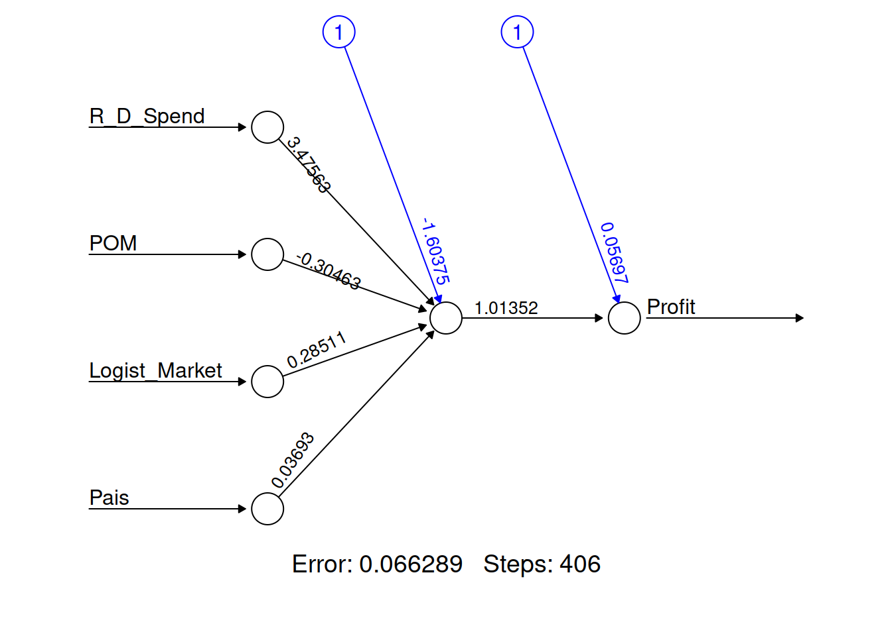

## Ploteo de la red proporcional

Esto me indica cuales son los KPI


```r
par(mar = numeric(4), family = 'serif')
plotnet(startups_model, alpha = 0.6)
```

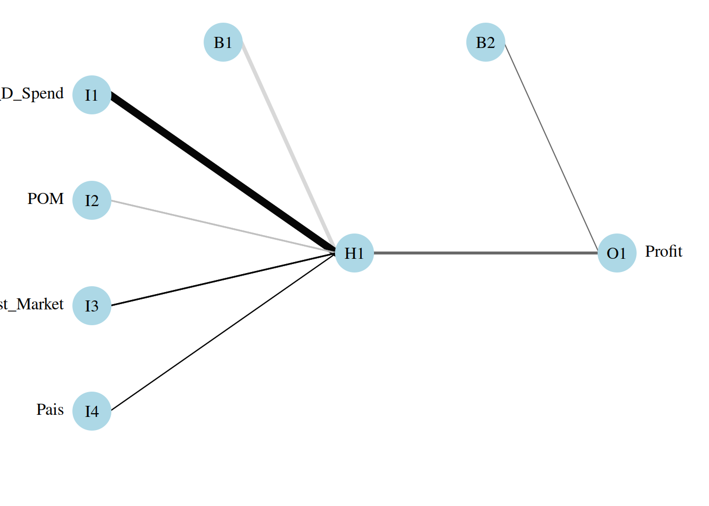


### Evaluación de la performance del modelo


```r
model_results <- compute(startups_model,startups_test[1:4])
predicted_profit <- model_results$net.result
```


##  Predicted profit Vs Actual profit of test data.


```r
cor(predicted_profit,startups_test$Profit)
#>           [,1]
#> [1,] 0.9716114
```


## Desnormalización de los resultados

Dado que hicimos la predicciones con los datos normalizados, ahora deberemos des-normalizarlos [@gholizadeh_prediction_2020]


```r

str_max <- max(Startups$Profit)
str_min <- min(Startups$Profit)

unnormalize <- function(x, min, max) { 
  return( (max - min)*x + min )
}

ActualProfit_pred <- unnormalize(predicted_profit,str_min,str_max)
head(ActualProfit_pred)
#>         [,1]
#> 4  172113.85
#> 7  159799.94
#> 21 117169.88
#> 23 115060.71
#> 26  99314.84
#> 28 112440.55
```


## Mejoramiento de la performance del modelo

Es posible mejorar la performance con el agregado de más capas ocultas.


```r
Startups_model2 <- neuralnet(Profit~R_D_Spend+ POM + Logist_Market + Pais , data = startups_train, hidden = c(2,4))

plot(Startups_model2 ,rep = "best")
```

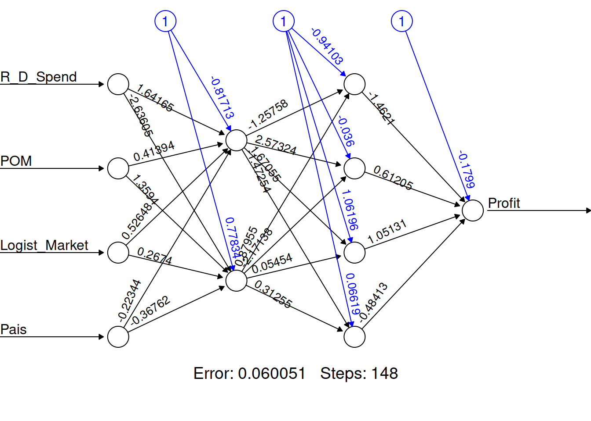


## Performance del modelo mejorado


```r
model_results2<-compute(Startups_model2,startups_test[1:4])
predicted_Profit2<-model_results2$net.result
cor(predicted_Profit2,startups_test$Profit)
#>           [,1]
#> [1,] 0.9743737
```


## Modelo Mejorado KPI


```r
par(mar = numeric(4), family = 'serif')
plotnet(Startups_model2, alpha = 0.6)
```


## Neural Net Clasificación

Armamos el dataset de datos a clasificar


```r
library(nnet)

supervivencia <- as.factor(Categoric$Supervivencia)
R_D_Spend <- as.matrix(Categoric$R_D_Spend)
POM <- as.matrix(Categoric$POM)
Logist_Market <- as.matrix(Categoric$Logist_Market)
Clasificar <- data.frame (supervivencia,R_D_Spend,POM,Logist_Market)
```

## Muestreo


```r
indice <- sample(2, nrow(Clasificar), replace = TRUE, prob = c(0.7,0.3))

clasificar_train <- Startups_norm[indice==1,]
clasificar_test  <- Startups_norm[indice==2,]

supervivientes_clasificados <- factor(clasificar_train$Supervivencia)
```


Entrenamiento de nnet como clasificador


```r
supervivientes_train<-nnet(supervivientes_clasificados~clasificar_train$R_D_Spend + clasificar_train$POM+ clasificar_train$Logist_Market ,data=clasificar_train,size=5, decay=5e-4, maxit=2000)
#> # weights:  38
#> initial  value 59.107806 
#> iter  10 value 14.748014
#> iter  20 value 3.603393
#> iter  30 value 2.820916
#> iter  40 value 1.612401
#> iter  50 value 1.455408
#> iter  60 value 1.296047
#> iter  70 value 1.236838
#> iter  80 value 1.193746
#> iter  90 value 1.166896
#> iter 100 value 1.146649
#> iter 110 value 1.111960
#> iter 120 value 1.097064
#> iter 130 value 1.089686
#> iter 140 value 1.077179
#> iter 150 value 1.069923
#> iter 160 value 1.066188
#> iter 170 value 1.062448
#> iter 180 value 1.054359
#> iter 190 value 1.046659
#> iter 200 value 1.039676
#> iter 210 value 1.033308
#> iter 220 value 1.031089
#> iter 230 value 1.030091
#> iter 240 value 1.029339
#> iter 250 value 1.028950
#> iter 260 value 1.028491
#> iter 270 value 1.027658
#> iter 280 value 1.026666
#> iter 290 value 1.025955
#> iter 300 value 1.025262
#> iter 310 value 1.024848
#> iter 320 value 1.024725
#> iter 330 value 1.024631
#> iter 340 value 1.024528
#> iter 350 value 1.024417
#> iter 360 value 1.024343
#> iter 370 value 1.024279
#> iter 380 value 1.024248
#> iter 390 value 1.024241
#> iter 400 value 1.024234
#> iter 410 value 1.024228
#> iter 420 value 1.024221
#> iter 430 value 1.024219
#> iter 440 value 1.024218
#> iter 450 value 1.024217
#> iter 450 value 1.024217
#> iter 450 value 1.024217
#> final  value 1.024217 
#> converged
```


## Visualización del clasificador


```r
plotnet(supervivientes_train, alpha = 0.6)
```

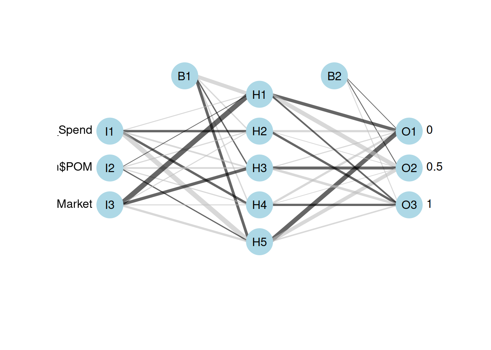


## Aramdos de set de entrenamiento y de predicción


<https://stackoverrun.com/es/q/3338607>

crs$nnet <- nnet(as.factor(Target) ~ .,
                    data=crs$dataset[crs$sample,c(crs$input, crs$target)],
                    size=10, skip=TRUE, MaxNWts=10000, 
                    trace=FALSE, maxit=100)
                    


