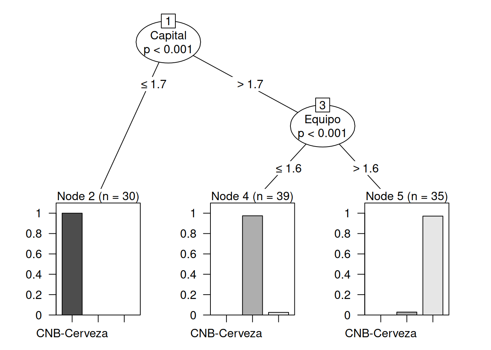

# Árboles de decisión

Los árboles de decisión son modelos de aprendizaje automático que se utilizan para resolver problemas de clasificación y regresión. Se basan en una estructura similar a un árbol, donde cada nodo representa una pregunta o una condición sobre una característica de los datos. A medida que se desciende por el árbol, se toman decisiones basadas en las respuestas a las preguntas, hasta llegar a una hoja que representa la predicción final.

En un árbol de decisión, los datos se dividen en diferentes ramas en función de las características y los valores de las mismas. Estas divisiones se realizan de manera que se maximice la pureza o la homogeneidad de los subconjuntos resultantes. En el caso de problemas de clasificación, los subconjuntos se dividen de forma que se agrupen las instancias con la misma clase, mientras que en problemas de regresión, se busca reducir la varianza de los valores objetivo.

Se trata de un proceso de aprendizaje a partir de datos y se dice que es no supervisado. Necesita datos con etiquetas.


El proceso de construcción de un árbol de decisión implica varios pasos, que incluyen la selección de características, la definición de criterios de división y la poda del árbol para evitar el sobreajuste. Algunos algoritmos populares para la construcción de árboles de decisión son el algoritmo ID3, C4.5, CART y Random Forest.

Los árboles de decisión tienen varias ventajas, como la interpretabilidad y la capacidad de manejar tanto datos numéricos como categóricos. Además, pueden capturar relaciones no lineales entre las características y la variable objetivo. Sin embargo, también tienen limitaciones, como la tendencia al sobreajuste y la sensibilidad a pequeñas variaciones en los datos de entrenamiento.

En resumen, los árboles de decisión son modelos versátiles y ampliamente utilizados en machine learning debido a su capacidad para resolver problemas de clasificación y regresión. Su estructura jerárquica basada en preguntas y decisiones los hace fáciles de interpretar y explicar, lo que los convierte en una herramienta valiosa para tomar decisiones basadas en datos en diferentes dominios.

En esta parte veremos como trabajar con el entrenamiento de árboles para luego comprender mejor el algoritmo ramdom-forest.


## Bibliografía recomendada


## Carga de datos desde la web


```r
library(car)
#> Loading required package: carData
library(readr)
partners <- read_csv("https://themys.sid.uncu.edu.ar/rpalma/R-cran/UCB/BSC_proveedores.csv", 
    col_types = cols(Empresa = col_factor(levels = c("CNB-Cerveza", 
        "FARMACORP", "SOFIA-Avicola"))))
#> New names:
#> • `` -> `...1`
# partners <- read.table("BSC_proveedores.csv",header=TRUE,sep=",")
summary(partners)
#>       ...1          Tecnologia        Normas     
#>  Min.   :  1.00   Min.   :4.300   Min.   :2.000  
#>  1st Qu.: 38.25   1st Qu.:5.100   1st Qu.:2.800  
#>  Median : 75.50   Median :5.800   Median :3.000  
#>  Mean   : 75.50   Mean   :5.843   Mean   :3.057  
#>  3rd Qu.:112.75   3rd Qu.:6.400   3rd Qu.:3.300  
#>  Max.   :150.00   Max.   :7.900   Max.   :4.400  
#>     Capital          Equipo               Empresa  
#>  Min.   :1.000   Min.   :0.100   CNB-Cerveza  :50  
#>  1st Qu.:1.600   1st Qu.:0.300   FARMACORP    :50  
#>  Median :4.350   Median :1.300   SOFIA-Avicola:50  
#>  Mean   :3.758   Mean   :1.199                     
#>  3rd Qu.:5.100   3rd Qu.:1.800                     
#>  Max.   :6.900   Max.   :2.500
```


## Matriz de Covarianza


```r
library(scatterPlotMatrix)
scatterPlotMatrix(partners)
```

```{=html}
<div class="scatterPlotMatrix html-widget html-fill-item-overflow-hidden html-fill-item" id="htmlwidget-10ae955cbb903f562749" style="width:672px;height:480px;"></div>
<script type="application/json" data-for="htmlwidget-10ae955cbb903f562749">{"x":{"data":{"...1":[1,2,3,4,5,6,7,8,9,10,11,12,13,14,15,16,17,18,19,20,21,22,23,24,25,26,27,28,29,30,31,32,33,34,35,36,37,38,39,40,41,42,43,44,45,46,47,48,49,50,51,52,53,54,55,56,57,58,59,60,61,62,63,64,65,66,67,68,69,70,71,72,73,74,75,76,77,78,79,80,81,82,83,84,85,86,87,88,89,90,91,92,93,94,95,96,97,98,99,100,101,102,103,104,105,106,107,108,109,110,111,112,113,114,115,116,117,118,119,120,121,122,123,124,125,126,127,128,129,130,131,132,133,134,135,136,137,138,139,140,141,142,143,144,145,146,147,148,149,150],"Tecnologia":[5.1,4.9,4.7,4.6,5,5.4,4.6,5,4.4,4.9,5.4,4.8,4.8,4.3,5.8,5.7,5.4,5.1,5.7,5.1,5.4,5.1,4.6,5.1,4.8,5,5,5.2,5.2,4.7,4.8,5.4,5.2,5.5,4.9,5,5.5,4.9,4.4,5.1,5,4.5,4.4,5,5.1,4.8,5.1,4.6,5.3,5,7,6.4,6.9,5.5,6.5,5.7,6.3,4.9,6.6,5.2,5,5.9,6,6.1,5.6,6.7,5.6,5.8,6.2,5.6,5.9,6.1,6.3,6.1,6.4,6.6,6.8,6.7,6,5.7,5.5,5.5,5.8,6,5.4,6,6.7,6.3,5.6,5.5,5.5,6.1,5.8,5,5.6,5.7,5.7,6.2,5.1,5.7,6.3,5.8,7.1,6.3,6.5,7.6,4.9,7.3,6.7,7.2,6.5,6.4,6.8,5.7,5.8,6.4,6.5,7.7,7.7,6,6.9,5.6,7.7,6.3,6.7,7.2,6.2,6.1,6.4,7.2,7.4,7.9,6.4,6.3,6.1,7.7,6.3,6.4,6,6.9,6.7,6.9,5.8,6.8,6.7,6.7,6.3,6.5,6.2,5.9],"Normas":[3.5,3,3.2,3.1,3.6,3.9,3.4,3.4,2.9,3.1,3.7,3.4,3,3,4,4.4,3.9,3.5,3.8,3.8,3.4,3.7,3.6,3.3,3.4,3,3.4,3.5,3.4,3.2,3.1,3.4,4.1,4.2,3.1,3.2,3.5,3.6,3,3.4,3.5,2.3,3.2,3.5,3.8,3,3.8,3.2,3.7,3.3,3.2,3.2,3.1,2.3,2.8,2.8,3.3,2.4,2.9,2.7,2,3,2.2,2.9,2.9,3.1,3,2.7,2.2,2.5,3.2,2.8,2.5,2.8,2.9,3,2.8,3,2.9,2.6,2.4,2.4,2.7,2.7,3,3.4,3.1,2.3,3,2.5,2.6,3,2.6,2.3,2.7,3,2.9,2.9,2.5,2.8,3.3,2.7,3,2.9,3,3,2.5,2.9,2.5,3.6,3.2,2.7,3,2.5,2.8,3.2,3,3.8,2.6,2.2,3.2,2.8,2.8,2.7,3.3,3.2,2.8,3,2.8,3,2.8,3.8,2.8,2.8,2.6,3,3.4,3.1,3,3.1,3.1,3.1,2.7,3.2,3.3,3,2.5,3,3.4,3],"Capital":[1.4,1.4,1.3,1.5,1.4,1.7,1.4,1.5,1.4,1.5,1.5,1.6,1.4,1.1,1.2,1.5,1.3,1.4,1.7,1.5,1.7,1.5,1,1.7,1.9,1.6,1.6,1.5,1.4,1.6,1.6,1.5,1.5,1.4,1.5,1.2,1.3,1.4,1.3,1.5,1.3,1.3,1.3,1.6,1.9,1.4,1.6,1.4,1.5,1.4,4.7,4.5,4.9,4,4.6,4.5,4.7,3.3,4.6,3.9,3.5,4.2,4,4.7,3.6,4.4,4.5,4.1,4.5,3.9,4.8,4,4.9,4.7,4.3,4.4,4.8,5,4.5,3.5,3.8,3.7,3.9,5.1,4.5,4.5,4.7,4.4,4.1,4,4.4,4.6,4,3.3,4.2,4.2,4.2,4.3,3,4.1,6,5.1,5.9,5.6,5.8,6.6,4.5,6.3,5.8,6.1,5.1,5.3,5.5,5,5.1,5.3,5.5,6.7,6.9,5,5.7,4.9,6.7,4.9,5.7,6,4.8,4.9,5.6,5.8,6.1,6.4,5.6,5.1,5.6,6.1,5.6,5.5,4.8,5.4,5.6,5.1,5.1,5.9,5.7,5.2,5,5.2,5.4,5.1],"Equipo":[0.2,0.2,0.2,0.2,0.2,0.4,0.3,0.2,0.2,0.1,0.2,0.2,0.1,0.1,0.2,0.4,0.4,0.3,0.3,0.3,0.2,0.4,0.2,0.5,0.2,0.2,0.4,0.2,0.2,0.2,0.2,0.4,0.1,0.2,0.2,0.2,0.2,0.1,0.2,0.2,0.3,0.3,0.2,0.6,0.4,0.3,0.2,0.2,0.2,0.2,1.4,1.5,1.5,1.3,1.5,1.3,1.6,1,1.3,1.4,1,1.5,1,1.4,1.3,1.4,1.5,1,1.5,1.1,1.8,1.3,1.5,1.2,1.3,1.4,1.4,1.7,1.5,1,1.1,1,1.2,1.6,1.5,1.6,1.5,1.3,1.3,1.3,1.2,1.4,1.2,1,1.3,1.2,1.3,1.3,1.1,1.3,2.5,1.9,2.1,1.8,2.2,2.1,1.7,1.8,1.8,2.5,2,1.9,2.1,2,2.4,2.3,1.8,2.2,2.3,1.5,2.3,2,2,1.8,2.1,1.8,1.8,1.8,2.1,1.6,1.9,2,2.2,1.5,1.4,2.3,2.4,1.8,1.8,2.1,2.4,2.3,1.9,2.3,2.5,2.3,1.9,2,2.3,1.8],"Empresa":["CNB-Cerveza","CNB-Cerveza","CNB-Cerveza","CNB-Cerveza","CNB-Cerveza","CNB-Cerveza","CNB-Cerveza","CNB-Cerveza","CNB-Cerveza","CNB-Cerveza","CNB-Cerveza","CNB-Cerveza","CNB-Cerveza","CNB-Cerveza","CNB-Cerveza","CNB-Cerveza","CNB-Cerveza","CNB-Cerveza","CNB-Cerveza","CNB-Cerveza","CNB-Cerveza","CNB-Cerveza","CNB-Cerveza","CNB-Cerveza","CNB-Cerveza","CNB-Cerveza","CNB-Cerveza","CNB-Cerveza","CNB-Cerveza","CNB-Cerveza","CNB-Cerveza","CNB-Cerveza","CNB-Cerveza","CNB-Cerveza","CNB-Cerveza","CNB-Cerveza","CNB-Cerveza","CNB-Cerveza","CNB-Cerveza","CNB-Cerveza","CNB-Cerveza","CNB-Cerveza","CNB-Cerveza","CNB-Cerveza","CNB-Cerveza","CNB-Cerveza","CNB-Cerveza","CNB-Cerveza","CNB-Cerveza","CNB-Cerveza","FARMACORP","FARMACORP","FARMACORP","FARMACORP","FARMACORP","FARMACORP","FARMACORP","FARMACORP","FARMACORP","FARMACORP","FARMACORP","FARMACORP","FARMACORP","FARMACORP","FARMACORP","FARMACORP","FARMACORP","FARMACORP","FARMACORP","FARMACORP","FARMACORP","FARMACORP","FARMACORP","FARMACORP","FARMACORP","FARMACORP","FARMACORP","FARMACORP","FARMACORP","FARMACORP","FARMACORP","FARMACORP","FARMACORP","FARMACORP","FARMACORP","FARMACORP","FARMACORP","FARMACORP","FARMACORP","FARMACORP","FARMACORP","FARMACORP","FARMACORP","FARMACORP","FARMACORP","FARMACORP","FARMACORP","FARMACORP","FARMACORP","FARMACORP","SOFIA-Avicola","SOFIA-Avicola","SOFIA-Avicola","SOFIA-Avicola","SOFIA-Avicola","SOFIA-Avicola","SOFIA-Avicola","SOFIA-Avicola","SOFIA-Avicola","SOFIA-Avicola","SOFIA-Avicola","SOFIA-Avicola","SOFIA-Avicola","SOFIA-Avicola","SOFIA-Avicola","SOFIA-Avicola","SOFIA-Avicola","SOFIA-Avicola","SOFIA-Avicola","SOFIA-Avicola","SOFIA-Avicola","SOFIA-Avicola","SOFIA-Avicola","SOFIA-Avicola","SOFIA-Avicola","SOFIA-Avicola","SOFIA-Avicola","SOFIA-Avicola","SOFIA-Avicola","SOFIA-Avicola","SOFIA-Avicola","SOFIA-Avicola","SOFIA-Avicola","SOFIA-Avicola","SOFIA-Avicola","SOFIA-Avicola","SOFIA-Avicola","SOFIA-Avicola","SOFIA-Avicola","SOFIA-Avicola","SOFIA-Avicola","SOFIA-Avicola","SOFIA-Avicola","SOFIA-Avicola","SOFIA-Avicola","SOFIA-Avicola","SOFIA-Avicola","SOFIA-Avicola","SOFIA-Avicola","SOFIA-Avicola"]},"rowLabels":["1","2","3","4","5","6","7","8","9","10","11","12","13","14","15","16","17","18","19","20","21","22","23","24","25","26","27","28","29","30","31","32","33","34","35","36","37","38","39","40","41","42","43","44","45","46","47","48","49","50","51","52","53","54","55","56","57","58","59","60","61","62","63","64","65","66","67","68","69","70","71","72","73","74","75","76","77","78","79","80","81","82","83","84","85","86","87","88","89","90","91","92","93","94","95","96","97","98","99","100","101","102","103","104","105","106","107","108","109","110","111","112","113","114","115","116","117","118","119","120","121","122","123","124","125","126","127","128","129","130","131","132","133","134","135","136","137","138","139","140","141","142","143","144","145","146","147","148","149","150"],"categorical":[null,null,null,null,null,null],"inputColumns":null,"cutoffs":null,"keptColumns":null,"zAxisDim":null,"distribType":2,"regressionType":0,"corrPlotType":"Circles","corrPlotCS":null,"rotateTitle":false,"columnLabels":null,"continuousCS":"Viridis","categoricalCS":"Category10","eventInputId":null,"controlWidgets":false,"cssRules":null,"plotProperties":null,"slidersPosition":null},"evals":[],"jsHooks":[]}</script>
```
Como vemos la columna 1, PK, (primary key) no es parte de los datos. Se trata de un número secuencial que no está relacionado con la muestra.


## Entrenamiento de árbol de decisión


Esta técnica utiliza un set de datos representativos de una situaci\'on y utilizando recursivamente el teoréma de Bayes puede armar un pronosticador o clasificador de datos. Es una t\'ecnica parecida a la de clustering, pero m\'as refinada, pues no se basa en reglas sino en parendizaje del set de datos usado como entrenamento. En el paquete party existen dos funciones ctree  que se utiliza para entrenar y predict que se usa para pronosticar o generar la regla de decici\'on que debemos usar. 


```r
library(party)
#> Loading required package: grid
#> Loading required package: mvtnorm
#> Loading required package: modeltools
#> Loading required package: stats4
#> 
#> Attaching package: 'modeltools'
#> The following object is masked from 'package:car':
#> 
#>     Predict
#> Loading required package: strucchange
#> Loading required package: zoo
#> 
#> Attaching package: 'zoo'
#> The following objects are masked from 'package:base':
#> 
#>     as.Date, as.Date.numeric
#> Loading required package: sandwich
attach(partners)
str(partners)    
#> spc_tbl_ [150 × 6] (S3: spec_tbl_df/tbl_df/tbl/data.frame)
#>  $ ...1      : num [1:150] 1 2 3 4 5 6 7 8 9 10 ...
#>  $ Tecnologia: num [1:150] 5.1 4.9 4.7 4.6 5 5.4 4.6 5 4.4 4.9 ...
#>  $ Normas    : num [1:150] 3.5 3 3.2 3.1 3.6 3.9 3.4 3.4 2.9 3.1 ...
#>  $ Capital   : num [1:150] 1.4 1.4 1.3 1.5 1.4 1.7 1.4 1.5 1.4 1.5 ...
#>  $ Equipo    : num [1:150] 0.2 0.2 0.2 0.2 0.2 0.4 0.3 0.2 0.2 0.1 ...
#>  $ Empresa   : Factor w/ 3 levels "CNB-Cerveza",..: 1 1 1 1 1 1 1 1 1 1 ...
#>  - attr(*, "spec")=
#>   .. cols(
#>   ..   ...1 = col_double(),
#>   ..   Tecnologia = col_double(),
#>   ..   Normas = col_double(),
#>   ..   Capital = col_double(),
#>   ..   Equipo = col_double(),
#>   ..   Empresa = col_factor(levels = c("CNB-Cerveza", "FARMACORP", "SOFIA-Avicola"), ordered = FALSE, include_na = FALSE)
#>   .. )
#>  - attr(*, "problems")=<externalptr>
# describe al objeto transit y muestras las columna que tiene

ind <- sample(2, nrow(partners), replace=TRUE, prob=c(0.7, 0.3))  
# toma una muestra  
ind  
#>   [1] 1 2 2 1 1 1 2 1 2 1 1 2 2 2 1 1 1 1 2 2 1 1 2 1 2 2 1
#>  [28] 1 1 2 1 2 1 2 2 1 1 2 2 1 1 1 1 1 2 1 1 1 1 2 1 1 1 1
#>  [55] 1 1 1 1 1 1 1 1 2 2 1 1 1 2 1 1 1 2 1 1 1 1 1 2 1 2 2
#>  [82] 1 1 1 1 1 2 2 2 1 1 1 1 1 1 1 2 1 1 1 2 2 1 2 1 1 2 1
#> [109] 1 1 1 1 1 1 1 2 1 1 2 2 1 1 1 1 1 2 1 1 1 2 1 2 2 1 2
#> [136] 1 1 1 2 1 1 1 1 2 1 1 2 1 1 1
# nos imprime la muestra tomada.
```


```r
trainData <- partners [ind==1,]    
# genero un set de entrenamiento 
testData <- partners [ind==2,]    
# genero un set de datos de prueba
myFormula <- Empresa ~ Normas + Tecnologia + Capital + Equipo 
transit_ctree <- ctree(myFormula, data=trainData)    
# creo el motor de entrenamiento
# Verificar las prediciones 
table(predict(transit_ctree), trainData$Empresa) 
#>                
#>                 CNB-Cerveza FARMACORP SOFIA-Avicola
#>   CNB-Cerveza            30         0             0
#>   FARMACORP               0        38             1
#>   SOFIA-Avicola           0         1            34
print(transit_ctree) 
#> 
#> 	 Conditional inference tree with 3 terminal nodes
#> 
#> Response:  Empresa 
#> Inputs:  Normas, Tecnologia, Capital, Equipo 
#> Number of observations:  104 
#> 
#> 1) Capital <= 1.7; criterion = 1, statistic = 96.529
#>   2)*  weights = 30 
#> 1) Capital > 1.7
#>   3) Equipo <= 1.6; criterion = 1, statistic = 54.04
#>     4)*  weights = 39 
#>   3) Equipo > 1.6
#>     5)*  weights = 35
```


```r
library(party)
attach(partners)
#> The following objects are masked from partners (pos = 3):
#> 
#>     ...1, Capital, Empresa, Equipo, Normas,
#>     Tecnologia
str(partners)    
#> spc_tbl_ [150 × 6] (S3: spec_tbl_df/tbl_df/tbl/data.frame)
#>  $ ...1      : num [1:150] 1 2 3 4 5 6 7 8 9 10 ...
#>  $ Tecnologia: num [1:150] 5.1 4.9 4.7 4.6 5 5.4 4.6 5 4.4 4.9 ...
#>  $ Normas    : num [1:150] 3.5 3 3.2 3.1 3.6 3.9 3.4 3.4 2.9 3.1 ...
#>  $ Capital   : num [1:150] 1.4 1.4 1.3 1.5 1.4 1.7 1.4 1.5 1.4 1.5 ...
#>  $ Equipo    : num [1:150] 0.2 0.2 0.2 0.2 0.2 0.4 0.3 0.2 0.2 0.1 ...
#>  $ Empresa   : Factor w/ 3 levels "CNB-Cerveza",..: 1 1 1 1 1 1 1 1 1 1 ...
#>  - attr(*, "spec")=
#>   .. cols(
#>   ..   ...1 = col_double(),
#>   ..   Tecnologia = col_double(),
#>   ..   Normas = col_double(),
#>   ..   Capital = col_double(),
#>   ..   Equipo = col_double(),
#>   ..   Empresa = col_factor(levels = c("CNB-Cerveza", "FARMACORP", "SOFIA-Avicola"), ordered = FALSE, include_na = FALSE)
#>   .. )
#>  - attr(*, "problems")=<externalptr>
# describe al objeto transit
ind <- sample(2, nrow(partners), replace=TRUE, prob=c(0.7, 0.3))  
# toma una muestra 
ind  
#>   [1] 1 1 1 1 1 1 1 1 2 1 1 1 1 1 1 2 1 1 2 1 1 1 2 1 2 2 2
#>  [28] 2 1 1 1 1 1 1 1 1 1 2 2 1 2 1 1 1 2 1 1 1 2 1 1 1 1 2
#>  [55] 1 2 2 1 2 2 2 2 1 1 1 2 1 1 2 1 1 2 1 2 1 1 1 1 2 1 1
#>  [82] 1 1 1 2 1 2 1 2 1 2 1 2 1 1 1 1 2 1 1 2 1 1 1 1 1 1 2
#> [109] 2 1 2 1 1 1 1 2 1 1 1 1 1 1 1 1 1 1 1 2 1 2 1 1 1 2 2
#> [136] 1 2 1 1 1 2 1 1 2 1 1 1 1 2 1
# nos imprime la muestra tomada.
```


```r
table(predict(transit_ctree), trainData$Empresa) 
#>                
#>                 CNB-Cerveza FARMACORP SOFIA-Avicola
#>   CNB-Cerveza            30         0             0
#>   FARMACORP               0        38             1
#>   SOFIA-Avicola           0         1            34
```


Impresión del Árbol de Decisión


```r
plot(transit_ctree, las=2)
```




```r
summary(trainData$Empresa)
#>   CNB-Cerveza     FARMACORP SOFIA-Avicola 
#>            30            39            35
```


 


