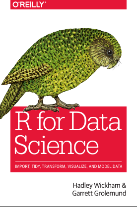
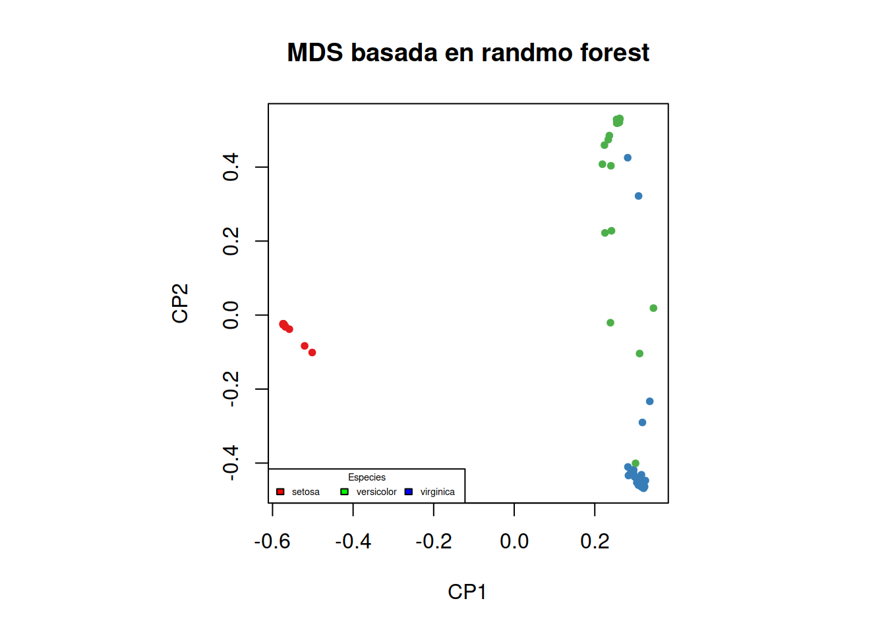
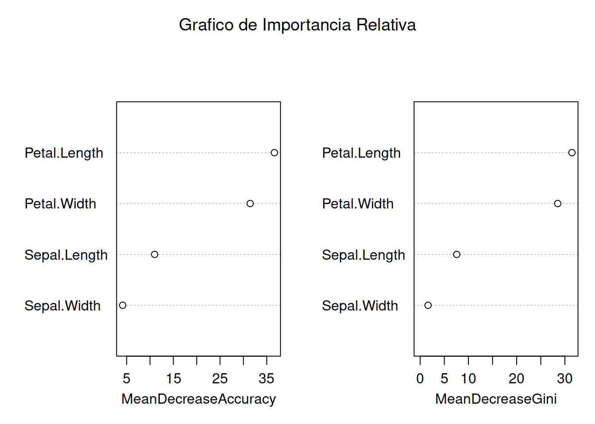
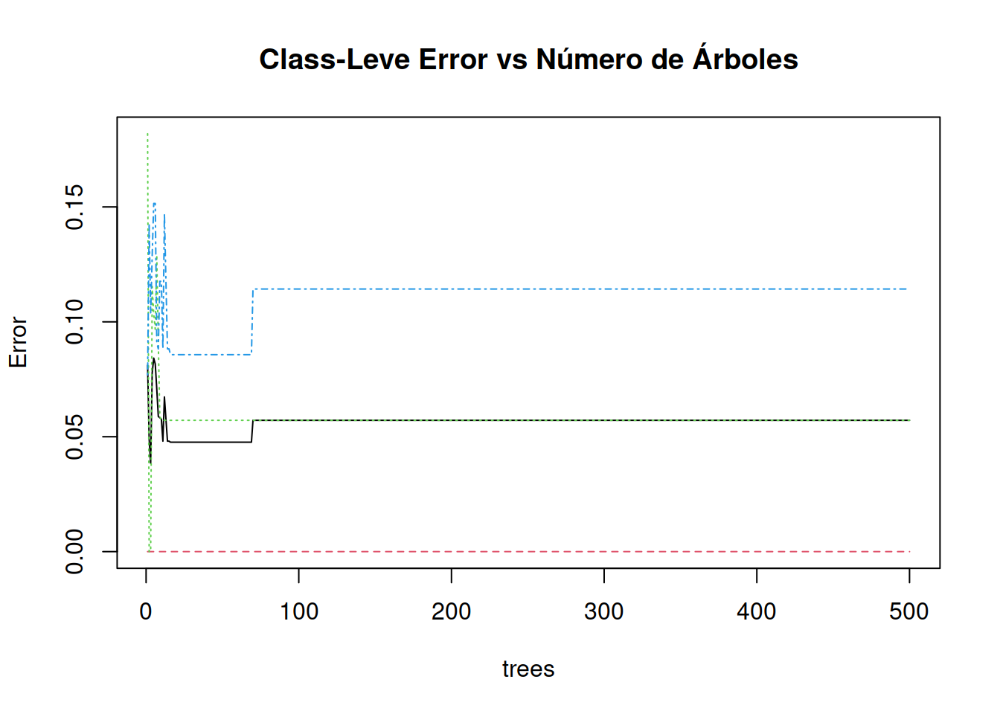
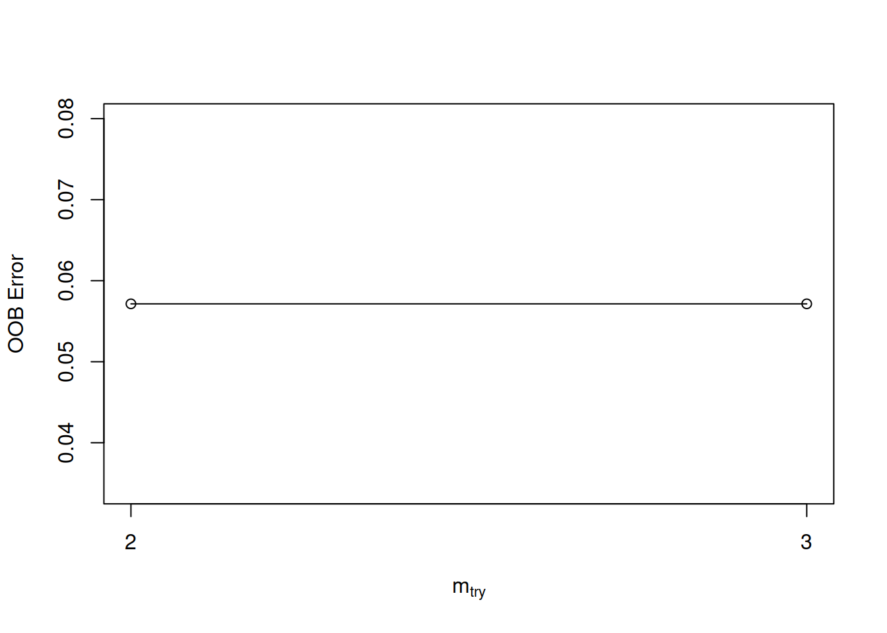

# Random Forest
Es una técnica que utiliza un conjunto de árboles predictores.
Cada árbol depende de un vector randómicamiente generado y con árboles que tienen entre sí como factor común una misma estructura (Breiman 2001.1). Su uso implica construir múltiples árboles de decisión que conforman un bosque o colección de árboles. Cada bosque a su vez utiliza un técnica de votación para hacer la clasificación y la solución más botada es la que se toma por cierta o verdadera.

Utilizaremos la función ramdonForest() de la biblioteca que lleva el mismo nombre para construir el modelo del bosque. Especificaremos que en el bosque hay 500 árboles que serán informados en el parámetro **ntree** que le pasaremos a la función. 

***Nota:*** La salida de la función nos proporcionará una muestra "out-of-bag" más conocida como **OOB**  como resultado, que es una muestra reforzada aproximada del conjunto de datos de entrenamiento.[@moosavian_comparison_2013]


## Bibliografía recomendada



Creación del conjunto de datos


```r
library(randomForest)
#> randomForest 4.7-1.1
#> Type rfNews() to see new features/changes/bug fixes.
library(caret) # Tienen la función de partición 
#> Loading required package: ggplot2
#> 
#> Attaching package: 'ggplot2'
#> The following object is masked from 'package:randomForest':
#> 
#>     margin
#> Loading required package: lattice
in.Train.C <- createDataPartition (iris$Species, p=0.7 , list=FALSE)
```

Separación de índices


```r
training <- iris[in.Train.C, ]
test <- iris[-in.Train.C, ]
```


```r
set.seed(831)
rf.mod.C <- randomForest(Species~., data= training, importance=TRUE, proximity=TRUE, ntree=500 )
rf.mod.C
#> 
#> Call:
#>  randomForest(formula = Species ~ ., data = training, importance = TRUE,      proximity = TRUE, ntree = 500) 
#>                Type of random forest: classification
#>                      Number of trees: 500
#> No. of variables tried at each split: 2
#> 
#>         OOB estimate of  error rate: 5.71%
#> Confusion matrix:
#>            setosa versicolor virginica class.error
#> setosa         35          0         0  0.00000000
#> versicolor      0         33         2  0.05714286
#> virginica       0          4        31  0.11428571
```

Podemos observar una representación multidimensional escalada de la proximidad de los conjuntos clasificados según la muestra o **MDS**.


```r
MDSplot(rf.mod.C, training$Species, xlab="CP1", ylab="CP2", main="MDS basada en randmo forest") 
legend("bottomleft", title = "Especies", c("setosa","versicolor","virginica"), fill=c("red","green","blue"), horiz=TRUE, cex=0.45)
```



Podemos también ver las variables que más peso tienen en la clasificación del randmoforest construyendo un gráfica de *"promedio de exactitud decreciente"*
o **Average Decrease Accuracy (ADC)** y otro gráfico semejante denominado *"promedio decreciente de nodo de impuridad"* o **Mean Decrease in Node Impurity ** esta técnica coincide con el análisis del **índice Gini**. Ambos gráficos deben producir  

```r
varImpPlot(rf.mod.C, main="Grafico de Importancia Relativa")
```



## Medición de la preformance

Cada vez que implementamos un método lo indicado es proceder a evaluar que tan bueno son los resultados que podemos obtener y esto podemos hacerlo con el ser de entrenamiento o con el de verificación.[@chai_enhanced_2019]


```r
rf.train <- predict(rf.mod.C, training[ ,1:4], type = "class")
rf.train.confmat <- confusionMatrix(rf.train, training$Species, mode="prec_recall")
rf.train.confmat
#> Confusion Matrix and Statistics
#> 
#>             Reference
#> Prediction   setosa versicolor virginica
#>   setosa         35          0         0
#>   versicolor      0         35         0
#>   virginica       0          0        35
#> 
#> Overall Statistics
#>                                      
#>                Accuracy : 1          
#>                  95% CI : (0.9655, 1)
#>     No Information Rate : 0.3333     
#>     P-Value [Acc > NIR] : < 2.2e-16  
#>                                      
#>                   Kappa : 1          
#>                                      
#>  Mcnemar's Test P-Value : NA         
#> 
#> Statistics by Class:
#> 
#>                      Class: setosa Class: versicolor
#> Precision                   1.0000            1.0000
#> Recall                      1.0000            1.0000
#> F1                          1.0000            1.0000
#> Prevalence                  0.3333            0.3333
#> Detection Rate              0.3333            0.3333
#> Detection Prevalence        0.3333            0.3333
#> Balanced Accuracy           1.0000            1.0000
#>                      Class: virginica
#> Precision                      1.0000
#> Recall                         1.0000
#> F1                             1.0000
#> Prevalence                     0.3333
#> Detection Rate                 0.3333
#> Detection Prevalence           0.3333
#> Balanced Accuracy              1.0000
```

## Prueba de performance utilizando dataset de prueba
Al utilizar el dataset de prueba y tener las columna previamente etiquetadas podemos medir la eficacia del algoritmo utilizado


```r
rf.test <- predict(rf.mod.C, test[ ,1:4], type = "class")
rf.test.confmat <- confusionMatrix(rf.test, test$Species, mode="prec_recall")
rf.test.confmat
#> Confusion Matrix and Statistics
#> 
#>             Reference
#> Prediction   setosa versicolor virginica
#>   setosa         15          0         0
#>   versicolor      0         14         2
#>   virginica       0          1        13
#> 
#> Overall Statistics
#>                                          
#>                Accuracy : 0.9333         
#>                  95% CI : (0.8173, 0.986)
#>     No Information Rate : 0.3333         
#>     P-Value [Acc > NIR] : < 2.2e-16      
#>                                          
#>                   Kappa : 0.9            
#>                                          
#>  Mcnemar's Test P-Value : NA             
#> 
#> Statistics by Class:
#> 
#>                      Class: setosa Class: versicolor
#> Precision                   1.0000            0.8750
#> Recall                      1.0000            0.9333
#> F1                          1.0000            0.9032
#> Prevalence                  0.3333            0.3333
#> Detection Rate              0.3333            0.3111
#> Detection Prevalence        0.3333            0.3556
#> Balanced Accuracy           1.0000            0.9333
#>                      Class: virginica
#> Precision                      0.9286
#> Recall                         0.8667
#> F1                             0.8966
#> Prevalence                     0.3333
#> Detection Rate                 0.2889
#> Detection Prevalence           0.3111
#> Balanced Accuracy              0.9167
```

## Ajuste del modelo

Comparando los resultados anteriores podemos estimar la exactitud del modelo (Accuracy).


```r
rbind(rf.train.confmat$overall[1], rf.test.confmat$overall[1])
#>       Accuracy
#> [1,] 1.0000000
#> [2,] 0.9333333
```
Como vemos la exactitud con el set de entrenamiento es del 100% y con el de prueba es bastante aceptable 97%.[@liu_generalising_2017]


## Buenas prácticas en RandomForest

### Ajuste del número de árboles en el bosque

        * number of trees **(ntree)**

Deberían existir suficiente árboles como para garantizar la estabilidad de la soluciones, pero no tanto como para que el costo computacional crezca más allá de la capacidad de la computadora que utilizas. Te darás cuenta si estás utilizando muchos árboles porque no llegarás al resultado y tendrás la pantalla azul que aparece cuando Windows se cuelga.
Puede ayudarte el gráfico de abajo que muestre la nivel de clase de error, que se estabiliza para este ejemplo con 100 árboles. Luego cualquier modelo semejante que tenga resultados mejores debería utilizar más árboles que estos.[@santur_random_2016]


```r
plot(rf.mod.C, main = "Class-Leve Error vs Número de Árboles")
```




      * Ajuste de variables aleatoriamente muestreadas 
$$ mtry = \sqrt {n_{features}} $$

Por defecto **mtry* tomará el valor entero más próximo a la raíz cuadrada de la cantidad de columnas que tenga el dataset. 


```r
set.seed(831)
tuneR <- tuneRF(x=training[ ,1:4], y=training$Species, ntreeTry = 500, stepFactor = 1.5)
#> mtry = 2  OOB error = 5.71% 
#> Searching left ...
#> Searching right ...
#> mtry = 3 	OOB error = 5.71% 
#> 0 0.05
```



