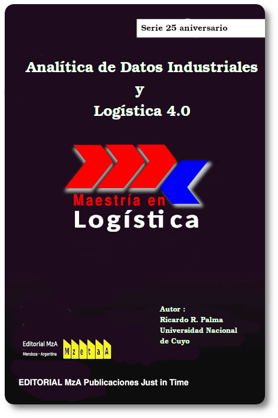

--- 
title: "Analítica de Datos 4.0"
author: "Ricardo R. Palma"
date: "2023-06-30"
site: bookdown::bookdown_site
documentclass: book
bibliography: [book.bib, packages.bib]
# url: your book url like https://bookdown.org/yihui/bookdown
# cover-image: path to the social sharing image like images/cover.jpg
description: |
  Analítica de Datos Industriales aplicados a la logística 4.0 en Latinoamérica y Caribe
biblio-style: apalike
csl: chicago-fullnote-bibliography.csl
---

# Acerca de este curso {-}

## Requerimiento y competencias

No se requieren conocimiento previos de programación para trabajar en este curso.
Es solamente necesario un repaso de algunos conceptos de estadística y algo de experiencia en gestión de la cadena de suministros

Este curso tendrá más valor agragado para ti si en logar de utilizar los datos que te entregamos utilizas tus propios datos. Esto es lo que llamaremos datasets. En general tus datos pueden venir de hojas de cálculo, pero la tecnología que utilizaremos puede manejar volúnemes de información cientos o miles de veces más extensas que tu hoja de excel más grande que puedas concebir.

## Software utilizado

Utilizaremos R-Cran

Que puedes bajarlo de este sitio:

[Descargar R-Cran](https://cran.r-project.org/bin/windows/)
Hay versiones para Mac y Linux

Complementaremos el trabajo con R-Studio (hoy llamado Posit)

Finalmente es conveniente (no absolutamente necesario) que sepas trabajar en github.

